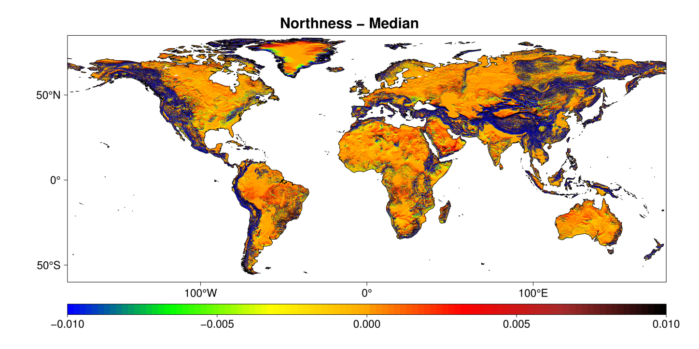

# Geomorpho90m: technical documentation

Amatulli, G., McInerney, D., Sethi, T., Strobl, P., & Domisch, S. (2020). [Geomorpho90m, empirical evaluation and accuracy assessment of global high-resolution geomorphometric layers](https://www.nature.com/articles/s41597-020-0479-6). Scientific Data, 7(1), 1-18.

**Download Procedure**

Geomorpho90m is a set of geomorphometric variables derived from [MERIT-DEM](http://hydro.iis.u-tokyo.ac.jp/~yamadai/MERIT_DEM/ ).
The are available at 3 resolutions:

- 100 m resolution, under Equi7 projection.\
- 3 arc-second (~90m) resolution, under WGS84 Geographic Coordinate System.\
- 7.5 arc-second (~250m) resolution, under WGS84 Geographic Coordinate System.

The layers can be downloaded from [ OpenTopography
](https://portal.opentopography.org/dataspace/dataset?opentopoID=OTDS.012020.4326.1) or from a [Public Goodle Drive Repository](https://drive.google.com/drive/folders/1D4YHUycBBhNFVVsz4ohaJI7QXV9BEh94).

This [Public Goodle Drive Repository](https://drive.google.com/drive/folders/1D4YHUycBBhNFVVsz4ohaJI7QXV9BEh94) contains:

- **gemgeomorphometry_90m_wgs84**
contains 26 subfolders labelled in accordance to the geomorphometry layer name (see table 1 in publication). 
Each subfolder contains 57 tar. In each tar there are from 1 to 37 tif. Each tif (90m resolution; extend 5x5 degree) contain one band. 
The full size for a global geomorphometry variable is 4-80G for a total of 1148 tiles. The data type for the tif is Float32, which ensure maximum precision.
- **gemgeomorphometry_pangaea250m_wgs84**
contains 26 tif (250m resolution; extend full globe). These files are prepared for global analysis and or to be ingested in webGIS platform. The file size for each tif can is 100M-6G. The data type for this file is Int16 or UInt16 and the pixel value has been multiplied by a scaling factor reported in the geotif as metadata. 
It is possible to obtain the scaling factor using gdalinfo. To obatain the orginal value multiply the tif by the scaling factor. Nonetheless, for maximum precision use 90m or 100m resolutions that are stored as data type Float32.
- **gemgeomorphometry_100m_equi7**
contains 26 subfolders labelled in accordance to the geomorphometry layer name (see table 1 in publication). The full size for one geomorphometry variable is 5-53G for a total of 863 tif tiles. The data type for the tif is Float32, which ensure maximum precision.

Global visualization of the 250m is visible at [OpenLandMap.org](ttps://openlandmap.org/) under Relief/Geology Item, 
starting from 1.7 Cosine of the aspect. All the data layers are distributed under: [Creative Commons Attribution 4.0
International](https://creativecommons.org/licenses/by/4.0/). The download can be done by clicking procedure or by command
line scripting routine. The last one can be achieved by [https://rclone.org](https://rclone.org) by following the Google Drive procedure authentification at [https://rclone.org/drive/](https://rclone.org/drive/). You will need to authenticate reclone with your Google Drive account and then share the geomorphometry_v.1.0 folder with your own Google Drive. Afterwards, you will be able to mount your Google Drive and access directly to the geomorphometry_v.1.0 archive. You will need a fast connection to download the full archive. The download of the 90m resolution in WGS84 can be also done from [www.opentopography.org](https://portal.opentopography.org/dataspace/dataset?opentopoID=OTDS.012020.4326.1). Using the [opentopography_tiles.txt](https://github.com/selvaje/spatial-ecology-codes/blob/master/docs/source/GEODATA/geomorpho90m/opentopography_tiles.txt)
it possible to download the full globe. 

    wget https://github.com/selvaje/spatial-ecology-codes/blob/master/docs/source/GEODATA/geomorpho90m/opentopography_tiles.txt
    for tile in $(cat opentopography_tiles.txt); do
    wget https://cloud.sdsc.edu/v1/AUTH_opentopography/hosted_data/OTDS.012020.4326.1/raster/aspect-cosine/aspect-cosine_90M_$tile.tar.gz
    done

**Tiling System under WGS84 Geographic Coordinate System**

The Tiling System under WGS84 follows the same nomenclature and tile
extent of the MERIT-DEM. Detail information can be found in [http://hydro.iis.u-tokyo.ac.jp/~yamadai/MERIT_DEM/](http://hydro.iis.u-tokyo.ac.jp/~yamadai/MERIT_DEM/)> (see Data Description).  MERIT-DEM Tiling System (source Day Yamazaki)

**Elevation**

[MERIT-DEM](http://hydro.iis.u-tokyo.ac.jp/~yamadai/MERIT_DEM/)

 

**Slope and aspect**

**Roughness**

**Curvature**

**Compound index**

