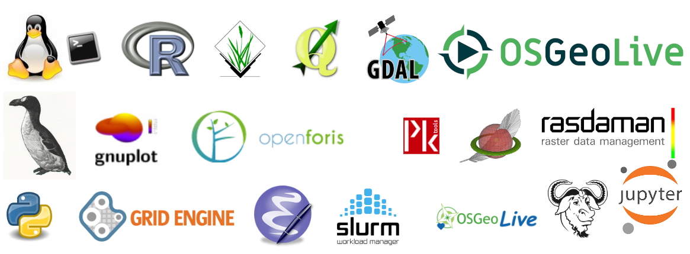

.. SE documentation documentation master file, created by
   sphinx-quickstart on Wed Dec 16 11:37:57 2020.
   You can adapt this file completely to your liking, but it should at least
   contain the root `toctree` directive.

	    
Free & OpenSource Software Documentation for BigGeoData Processing.
===================================================================

**Welcome to the Spatial Ecology's documentation!** The content of this documentation is free and open source, (CC-BY-SA license) it can be used, but WITHOUT ANY WARRANTY. You can remix, tweak, and build upon our work as long as you credit us and license your new creations under the identical terms. Software we use have a GNU General Public License GPL or GPL / MIT compatible licenses.

============================================

Documentation Contents
----------------------

.. toctree::
   :maxdepth: 2
   :caption: GEO DATA

   GEODATA/geomorpho90m/geomorpho90m.md

.. toctree::
   :maxdepth: 1
   :caption: LINUX VIRTUAL MACHINE

   VIRTUALMACHINE/00_Setting_Colab_for_for_Spatial_Ecology_course.ipynb
   VIRTUALMACHINE/00_Setting_OSGeoLive_for_for_Spatial_Ecology_course.md
   
.. toctree::
   :maxdepth: 1
   :caption: WEB SEMINARS

   WEBSEMINAR/webseminar.md

.. toctree::
   :maxdepth: 1
   :caption: BASH

   BASH/starting-with-bash

.. toctree::
   :maxdepth: 1
   :caption: AWK

   AWK/

.. toctree::
   :maxdepth: 1
   :caption: GNUPLOT

   GNUPLOT/

.. toctree::
   :maxdepth: 1
   :caption: R

.. toctree::
   :maxdepth: 1
   :caption: GDAL

   GDAL/01_gdal.ipynb

.. toctree::
   :maxdepth: 1
   :caption: PKTOOLS

   PKTOOLS/02_pktools.ipynb

.. toctree::
   :maxdepth: 1
   :caption: R

   R/

.. toctree::
   :maxdepth: 2
   :caption: PYTHON

   PYTHON/01_Python_Intro
   PYTHON/02_Geo_Python

.. toctree::
   :maxdepth: 1
   :caption: GRASS

   GRASS/

Indices and tables
==================

* :ref:`genindex`
* :ref:`modindex`
* :ref:`search`

