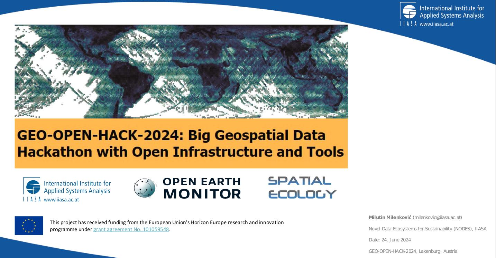

# GEO-OPEN-HACK-2024

## 24 - 28 Jun 2024 - IIASA - Vienna

 - [IIASA GEO-OPEN-HACK-2024 announcement agenda - pdf](http://spatial-ecology.net/docs/source/COURSESAROUNDTHEWORLD/doc_GEO-OPEN-HACK-2024.pdf)
 - [IIASA GEO-OPEN-HACK-2024 announcement agenda - html](https://iiasa.ac.at/events/jun-2024/geo-open-hack-2024-big-geospatial-data-hackathon-with-open-infrastructure-and-tools)

## Day 1st Monday:
### GEO-OPEN-HACK opening 
Milutin Milenkovic, International Institute for Applied Systems Analysis (IIASA)
 - [presentation](http://spatial-ecology.net/docs/source/COURSESAROUNDTHEWORLD/course_GEO-OPEN-HACK-2024_06_2024_pdf/Day1a_GEO-OPEN-HACK_opening.pdf)
 - [Opening session- video](https://youtu.be/TCTybjEdOUs)

### HPC and current European developments: European data spaces, EuroHPC, and DestinE 
Raymond Oonk, SURF (Collaborating University Computing Facilities), The Netherlands
 - [presentation](http://spatial-ecology.net/docs/source/COURSESAROUNDTHEWORLD/course_GEO-OPEN-HACK-2024_06_2024_pdf/Day1b_HPC_and_current_EU_developments.pdf)
 - [video](https://youtu.be/3FexK-xWI1c?si=RekV3ewxWymQ71Kt)

### Geo-Processing with HPC 
Giuseppe Amatulli, Spatial Ecology, UK; Yale University, USA
 - [Geocomputation at High Performance Computing Cluster (HPC) - material](https://spatial-ecology.net/docs/build/html/HPC/hpc_setting.html)
 - [Geocomputation at High Performance Computing Cluster (HPC) - video](https://youtu.be/31SXOR6o2gw?si=fh51PmAh0gIccngZ)

 - [Use of GRASS in HPC - material](https://spatial-ecology.net/docs/build/html/HPC/hpc_setting_grass.html)
 - [Use of GRASS in HPC - video](https://youtu.be/4i1Fs29D0-A?si=jA_dUxVhmRTBq6rW)

## Day 2nd Tuesday:

### Open Earth Monitor Cyberinfrastructure (OEMC): modern open source solutions for HPC and open science
Tom Hengl, OpenGeoHub Foundation, The Netherlands

 - [presentation](http://spatial-ecology.net/docs/source/COURSESAROUNDTHEWORLD/course_GEO-OPEN-HACK-2024_06_2024_pdf/Day2a_Open_Earth_Monitor_Cyberinfrastructure.pdf)
 - [video](https://youtu.be/KPR0R_bgRTU?si=fWFI8a94TmOLZkHq)

### Introduction to Apptiner
Francesco Lovergine, National Council of Research (CNR), Italy)

 - [Use of apptainer for pyjeo - material](https://github.com/fpl/apptainer4pyjeo) 
 - [Use of apptainer for conda - material](https://github.com/fpl/apptainer4conda)
 - [Use of apptainer - video](https://youtu.be/mZzhp3nIF5g?si=hozRHeEtEetaD5Lv)

### Geo-python with HPC 
Pieter Kempeneers, European Commission, Joint Research Centre, Italy

 - [pyjeo: an open source image processing library in Python - material](https://spatial-ecology.net/docs/build/html/PKTOOLS/pyjeo_introduction2.html)
 - [Scaling-up: batch processing on the cluster with pyjeo - material](https://spatial-ecology.net/docs/build/html/PKTOOLS/pyjeo_upscaling_surf.html)
 - [video](https://youtu.be/2gCgA7q_54w?si=nouHFIC1h3a_A7u9)

### Citizen science mobile app for measuring trees and forests
Milutin Milenković International Institute for Applied Systems Analysis (IIASA)

 - [presentation](http://spatial-ecology.net/docs/source/COURSESAROUNDTHEWORLD/course_GEO-OPEN-HACK-2024_06_2024_pdf/Day2b_Citizen_science_BiomassApp.pdf)
 - [video](https://youtu.be/JBUHs5WV9Uo)

## Day 3rd Wednesday:

### Evolution of BFAST functions for characterizing land change using satellite image time series
Jan Verbesselt, Belgian Science Policy Office, Belgium \
Dainius Masiliunas, Wageningen University, The Netherlands)]

 - [presentation](http://spatial-ecology.net/docs/source/COURSESAROUNDTHEWORLD/course_GEO-OPEN-HACK-2024_06_2024_pdf/Day3a_BFAST.pdf)
 - [video](https://youtu.be/6QOymB_J17E?si=NlysADhPGrmkWDAW)

### Streamlining operationalisation of EO based solutions for the Green Transition using interoperability best-practices
Patrick Griffiths, European Space Agency, Italy

 - [presentation](http://spatial-ecology.net/docs/source/COURSESAROUNDTHEWORLD/course_GEO-OPEN-HACK-2024_06_2024_pdf/Day3b_Streamlining_operationalisation_of_EO-based_solutions.pdf)
 - [video](https://youtu.be/EN_reYFFyiE?si=wAUwrDTmd4a2ZlIn) 

### ML with HPC 
Antonio Fonseca, www.gensaic.com

 - [Fundation model - Prithvi 100M model - material](https://spatial-ecology.net/docs/build/html/CASESTUDY/foundation_model_IIASA2024.html)
 - [Fundation model - Prithvi 100M model - video](https://youtu.be/-6t_rwPSftQ?si=ELnkNxCGo7-bkCzE)

### Accessing Big Vector Data on the Cloud using Arrow Parquet 
Johannes Heisig, Münster University, Germany \
Yu-Feng Ho, OpenGeoHub Foundation, The Netherlands

 - [presentation](http://spatial-ecology.net/docs/source/COURSESAROUNDTHEWORLD/course_GEO-OPEN-HACK-2024_06_2024_pdf/Day3c_Accessing_BigVectorData.pdf)
 - [video](https://youtu.be/Xt2F452e0As?si=yoAbTfJx7631Tfio)

## Day 4th Thursday:

### openEO: open science for Earth Observation compute platforms
Prof. Edzer Pebesma, Münster University, Germany 

 - [presentation](http://spatial-ecology.net/docs/source/COURSESAROUNDTHEWORLD/course_GEO-OPEN-HACK-2024_06_2024_pdf/Day4_openEO_openscience4EarthObservationcomputeplatforms.pdf)
 - [video](https://youtu.be/BLAYqG4Jef8?si=ifC_Xdg1V_741brg)

### Introduction openEO
Michele Claus, Eurac Research, Italy 

 - [openEO Community Examples - material ](https://github.com/Open-EO/openeo-community-examples.git)
 - [Cubes and Clouds - material](https://github.com/EO-College/cubes-and-clouds.git)
 - [video](https://youtu.be/IQZjiTKU_Is?si=NF7G88WffsN-MSCo)

### Leveraging Satellite Data for High-Resolution Snow Monitoring: Scaling with openEO
Valentina Premier, Eurac Research, Italy 

 - [presentation](http://spatial-ecology.net/docs/source/COURSESAROUNDTHEWORLD/course_GEO-OPEN-HACK-2024_06_2024_pdf/Day4b_SnowMonitoring.pdf)
 - [video](https://youtu.be/gGv1QXLBQY4?si=fROaDOgMoltcmdo_)

## Day 4th, Friday: 

### Global-scale analysis of Sentinel-1 satellite data at the Earth Observation Data Centre
Prof. Wolfgang Wagner TU Vienna & Earth Observation Data Centre GmbH, Austria

 - [presentation](http://spatial-ecology.net/docs/source/COURSESAROUNDTHEWORLD/course_GEO-OPEN-HACK-2024_06_2024_pdf/Day5a_Global-scale_analysis_of_Sentinel-1.pdf)
 - [video](https://youtu.be/gsiJTXGvb5o?si=Qrh2asdllnNeoBet)

### Pangeo 
Anne Fouilloux, SIMULA, Norway\
Tina Odaka, CNRS-Ifremer-IRD-UBO, France

 - [presentation](http://spatial-ecology.net/docs/source/COURSESAROUNDTHEWORLD/course_GEO-OPEN-HACK-2024_06_2024_pdf/Day4c_pangeo.pdf)
 - [material](https://pangeo-data.github.io/geo-open-hack-2024/intro.html)
 - [video](https://youtu.be/g6M14hJbxvk?si=aNj-AsNPtAgoJW8e)

### Optimizing Global Time Series ML Predictions From Modeling to Production Deployment
Leandro Parente, OpenGeoHub Foundation, The Netherlands

 - [presentation](http://spatial-ecology.net/docs/source/COURSESAROUNDTHEWORLD/course_GEO-OPEN-HACK-2024_06_2024_pdf/Day5b_OptimizingGlobalTimeSeriesML_Predictions_FromModelingtoProductionDeployment.pdf)
 - [video](https://youtu.be/aiM_9r5strw?si=XWRtm82d2cJm_5d-)

### OEMC App demo
Santiago Ferrer
 - [presentation missing]()
 - [video](https://youtu.be/PCY4ogR-BgE?si=U4YuYzwjz0bdFAU0)

### Acknowledgments

GEO-OPEN-HACK-2024 is an initiative under the Open-Earth-Monitor Cyberinfrastructure (OEMC) project aiming to lower the barrier and transfer knowledge to users dealing with big geospatial data analytics. The OEMC has received funding from the European Union's Horizon Europe research and innovation programme (grant agreement No. 101059548). 

GEO-OPEN-HACK-2024 is also an initiative in the framework of NSF-funded POSE project TI-2303651: Growing GRASS OSE for Worldwide Access to Multidisciplinary Geospatial Analytics.