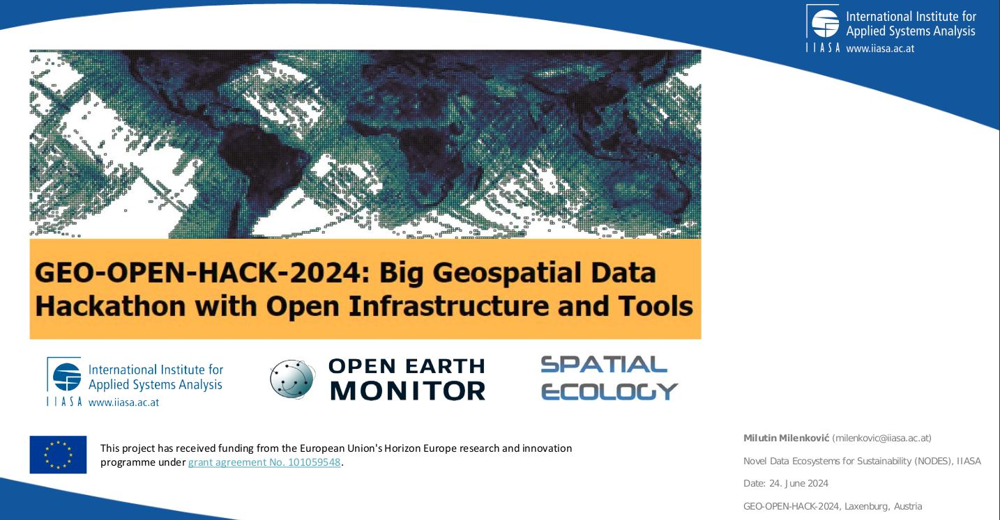

# GEO-OPEN-HACK-2024

## 24 - 28 Jun 2024 - IIASA - Vienna

 [IIASA GEO-OPEN-HACK-2024 announcement agenda](http://spatial-ecology.net/docs/source/COURSESAROUNDTHEWORLD/doc_GEO-OPEN-HACK-2024.pdf)

## Day 1st Monday:
### GEO-OPEN-HACK opening (Milutin Milenkovic)
 - [presentation](http://spatial-ecology.net/docs/source/COURSESAROUNDTHEWORLD/course_GEO-OPEN-HACK-2024_06_2024_pdf/Day1a_GEO-OPEN-HACK_opening.pdf)
 - [video]()

### HPC and current European developments: European data spaces, EuroHPC, and DestinE (Raymond Oonk)
 - [presentation](http://spatial-ecology.net/docs/source/COURSESAROUNDTHEWORLD/course_GEO-OPEN-HACK-2024_06_2024_pdf/Day1b_HPC_and_current_EU_developments.pdf)
 - [video](https://youtu.be/3FexK-xWI1c?si=RekV3ewxWymQ71Kt)

### Geo-Processing with HPC (Giuseppe Amatulli)
 - [Geocomputation at High Performance Computing Cluster (HPC) - material](https://spatial-ecology.net/docs/build/html/HPC/hpc_setting.html)
 - [Geocomputation at High Performance Computing Cluster (HPC) - video](https://youtu.be/31SXOR6o2gw?si=fh51PmAh0gIccngZ)

 - [Use of GRASS in HPC - material](https://spatial-ecology.net/docs/build/html/HPC/hpc_setting_grass.html)
 - [Use of GRASS in HPC - video](https://youtu.be/4i1Fs29D0-A?si=jA_dUxVhmRTBq6rW)

## Day 2nd Tuesday:
### Introduction to Apptiner (Francesco Lovergine)

 - [Use of apptainer for pyjeo - material](https://github.com/fpl/apptainer4pyjeo) 
 - [Use of apptainer for conda - material](https://github.com/fpl/apptainer4conda)
 - [Use of apptainer - video](https://youtu.be/mZzhp3nIF5g?si=hozRHeEtEetaD5Lv)

### Geo-python with HPC (Pieter Kempeneers)

* [pyjeo: an open source image processing library in Python](https://spatial-ecology.net/docs/build/html/PKTOOLS/pyjeo_introduction2.html)
* [Scaling-up: batch processing on the cluster with pyjeo](https://spatial-ecology.net/docs/build/html/PKTOOLS/pyjeo_upscaling_surf.html)


```
wget https://raw.githubusercontent.com/selvaje/SE_data/master/exercise/pyjeo_calculate_ndvi.sh
wget https://raw.githubusercontent.com/selvaje/SE_data/master/exercise/pyjeo_calculate_ndvi.py
wget https://raw.githubusercontent.com/selvaje/SE_data/master/exercise/pyjeo_extract_parcels.sh
wget https://raw.githubusercontent.com/selvaje/SE_data/master/exercise/pyjeo_extract_parcels.py
```

* apptainer container for pyjeo https://github.com/fpl/apptainer4pyjeo

### Wednesday: ML with HPC (Antonio Fonseca)

* [Fundation model - Prithvi 100M model](https://spatial-ecology.net/docs/build/html/CASESTUDY/foundation_model_IIASA2024.html)

```
    wget https://raw.githubusercontent.com/selvaje/SE_data/master/exercise/foundation_model_IIASA2024.py
```

* apptainer container for fundation model at https://github.com/fpl/apptainer4conda 

### Thursday: openEO (Michele Claus)

* [openEO Community Examples](https://github.com/Open-EO/openeo-community-examples.git)
* [Cubes and Clouds](https://github.com/EO-College/cubes-and-clouds.git)


### Friday: Pangeo (Anne Fouilloux)

[pangeo](https://pangeo-data.github.io/geo-open-hack-2024/intro.html)