# Spatial Ecology's 2022 course
## Geocomputación para aplicaciones ambientales: uso de GDAL y GRASS
### 

#### Student roster ####

(1)  **Paul León (Ecuador)**

Fundación Charles Darwin, Ecuador 

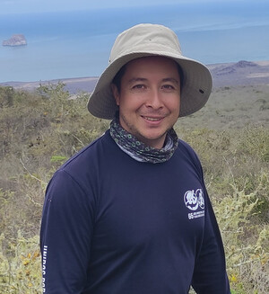

---
(2)	**Gabriel Tedone (España)**

Instituto de Investigación Vitivinícola y Agroalimentaria (IVAGRO)

Universidad de Cádiz, España

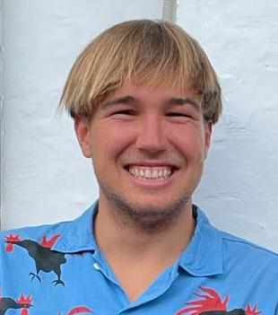)

---
(3)	**Osiris Diaz Torres  (Mexico)**

Istituto Tecnologico de Monterrey Campus Guadalajara, Mexico

---
(4)	**Mario Reyes (El Salvador)**

Observatory of Natural Hazards and Natural Resources-Ministry of Environment, El Salvador

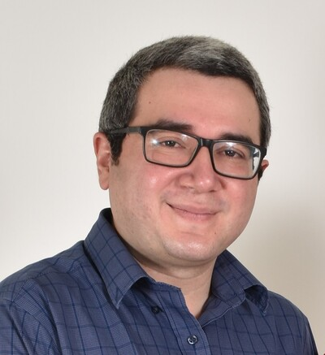

---
(5)	**Ana Maria	Bastidas Urrutia (España)**

Technical University of Munich, Germany

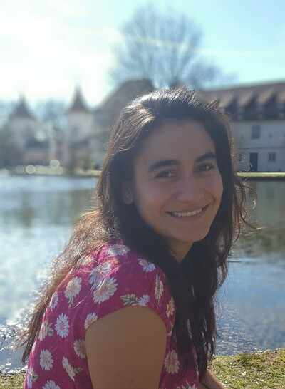

---
(6)	**Laura Elisa Quiroz Rosas (México)**

Universidad Nacioanal Autónoma de México

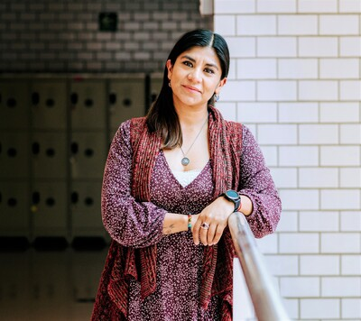

---
(7)	**Gustavo Herrera de Lamo (Spain)**

GRAFCAN, Spain

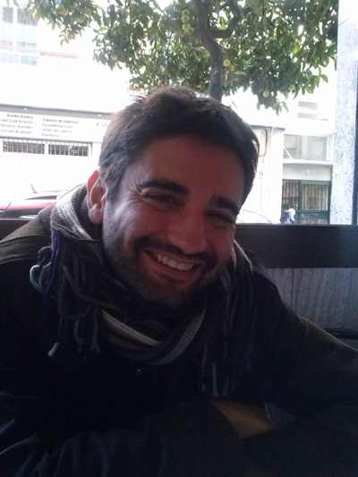

---
(8) **Dania Marlene Ceballos Vazquez (Mexico)**

Istituto Tecnologico de Monterrey Campus Guadalajara, Mexico

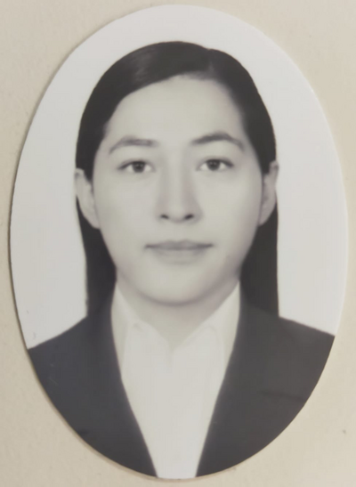

---
(9) **Maria Esther Jimenez Lopez (Mexico)**

University of Baja California Sur, Mexico

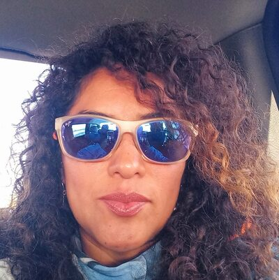

---
(10)	 **Alexander	 Cotrina Sánchez  ()**

University of Tuscia, Italy

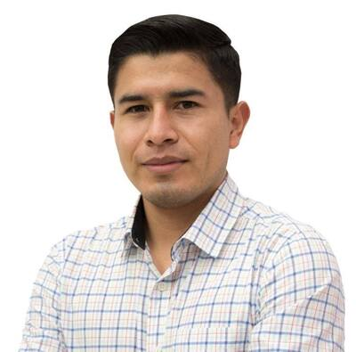

---
(11)	**Hugo	Herrador (España)**

Geoinquietos, España

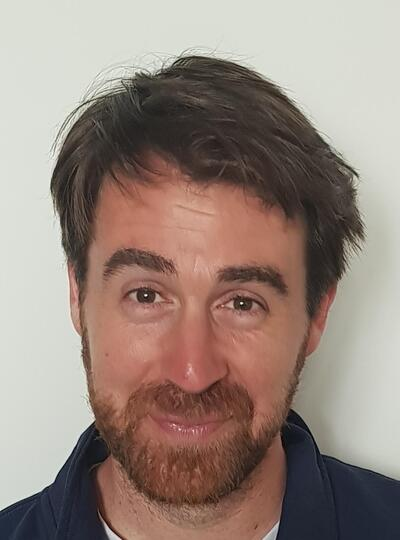

---
(12)	**Irantzu	Alvarez (España)**

University of the Basque Country (UPV/EHU), España

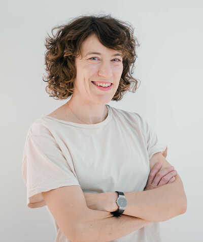

---
(13)	**Alejandra	Lopez (Mexico)**

CentroGeo, Mexico 

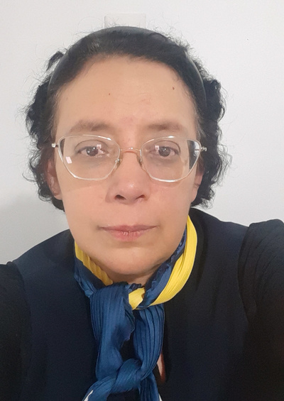

---
(14)	**Virginia	Herrera Cruz (España)**

Airbus Defence and Space, Germany

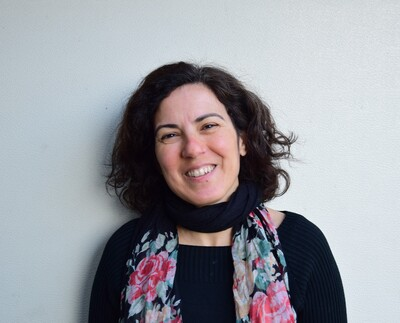

---
(15)	**Sridhar Chandramouli (India)**

Freelance, España

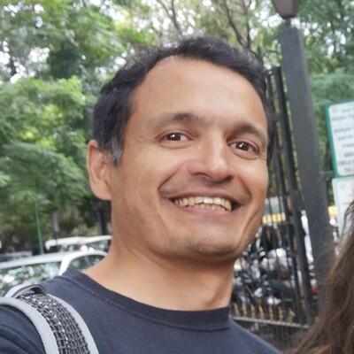

---
(16)	**Pablo Moncayo Silva (Ecuador)**

Food Agriculture Organization, Ecuador

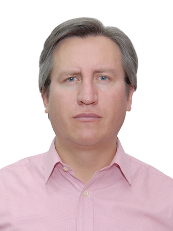

---
(17)	** Raquel Daza (España)**

Proterra enginyeria, Andorra

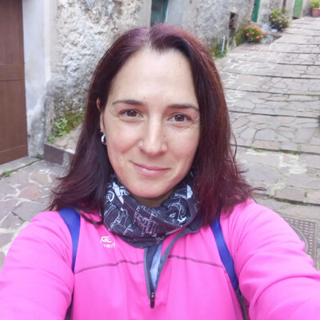
