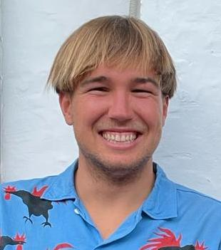

# Spatial Ecology's 2022 course
## Geocomputación para aplicaciones ambientales: uso de GDAL y GRASS
### 

#### Student affiliation and their origin  ####

#### Student roster ####

(1)  **Paul León (Ecuador)**

Fundación Charles Darwin, Ecuador 

---
()	** Gabriel Tedone (España)**

IVAGRO, España

)

---
()	** Osiris Diaz Torres  (Mexico)**

TECNOLOGICO DE MONTERREY CAMPUS GUADALAJARA 

---
()	** Mario Reyes (El Salvador)**

Observatory of Natural Hazards and Natural Resources-Ministry of Environment, El Salvador

---
()	**  ()**

---
()	**  ()**

---
()	**  ()**

---
()	**  ()**

---
()	**  ()**

---
()	**  ()**

---
()	**  ()**

---
()	**  ()**

---
()	**  ()**

---
()	**  ()**

---
()	**  ()**

---