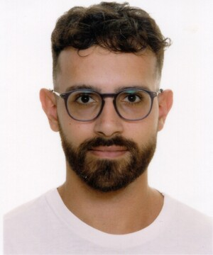
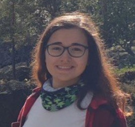
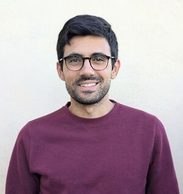

# Spatial Ecology's 2025 course
## Geocomputation and geospatial analysis
 

### Spatial Ecology course trainers ####

[Giuseppe Amatulli](https://spatial-ecology.net/docs/build/html/COURSETRAINERS/trainers.html#giuseppe-amatulli-phd) (geocomputation teacher - course organizer)   
[Saverio Mancino](https://spatial-ecology.net/docs/build/html/COURSETRAINERS/trainers.html#saverio-mancino-msc) (geospatial analysis teacher) 

### Student roster ####

---

**1) Angelo Sozio**

Department of Earth and Geo-Environmental Science - University of Bari - Italy

---

**2) Alessandro Fiore**

University of Salento, Italy

---

**3) Fabio Blaso**

University of Salerno, Italy

---

4) **Carmen Leone**	

University of Naples - Italy

---

**5) Chiara Zabeo**

---

**6) Davide Raho**

Research Institute on Terrestrial Ecosystems (IRET)  
National Research Council of Italy (CNR)

---

**7) Enrica Nestola**

Research Institute on Terrestrial Ecosystems (IRET)  
National Research Council of Italy (CNR)

---

**8) Fatemeh Abdi**

National Institute of Oceanography and Applied Geophysics

---

**9) Franco Pettenati**

National Institute of Oceanography and Applied Geophysics

---

**10) Francesco	Cozzoli**

Research Institute on Terrestrial Ecosystems (IRET)  
National Research Council of Italy (CNR)

---

**11) Francesco	De Leo**

Research Institute on Terrestrial Ecosystems (IRET)  
National Research Council of Italy (CNR)

---

**12) Francesco	Giangrande**

University of Salento, Italy

---

**13) Giulia Pignatiello**

Department of Earth and Geo-Environmental Science - University of Bari - Italy

---

**14) Giuseppe Calamita**

Institute of Methodologies for Environmental Analysis (IMAA) 
National Research Council of Italy (CNR)

---

**15) Giusy	Dimola**

Basilicata University

---

**16) Grazia Bramato**

University of Salento, Italy

---

**17) Gregorio Sgrigna**

Research Institute on Terrestrial Ecosystems (IRET)  
National Research Council of Italy (CNR)

---

**18) Lorenza Spirito**

University of Tuscia, Italy

---

**19) Lorenzo Liberatore**

Research Institute on Terrestrial Ecosystems (IRET)
National Research Council of Italy (CNR)

---

**20) Luca Di Fiore**

University of Salento, Italy

---

**21) Ludovico Lezzi**

University of Salento, Italy

---

**22) Mara Remi**

Department of Earth and Geo-Environmental Science - University of Bari - Italy

---

**23) Marco	Elia**

University of Salento, Italy

---

**24) Giuseppe Pirulli**

Department of Earth and Geo-Environmental Science - University of Bari - Italy

---

**25) Rita Paudice**

Department of Earth and Geo-Environmental Science - University of Bari - Italy

---

**26) Sofia Rossi**

Institute for Electromagnetic Sensing of the Environment (IREA)  
National Research Council of Italy (CNR)

---

**27) Serena Panebianco**

Institute of Methodologies for Environmental Analysis (IMAA)   
National Research Council of Italy (CNR)

---

**28) Teodoro Semeraro**

Research Institute on Terrestrial Ecosystems (IRET)  
National Research Council of Italy (CNR)

---

**29) Zeinab Arianpouya**

University of Salento, Italy

---

**30) Rocco Fracchiolla**

Department of Earth and Geo-Environmental Science - University of Bari - Italy

---