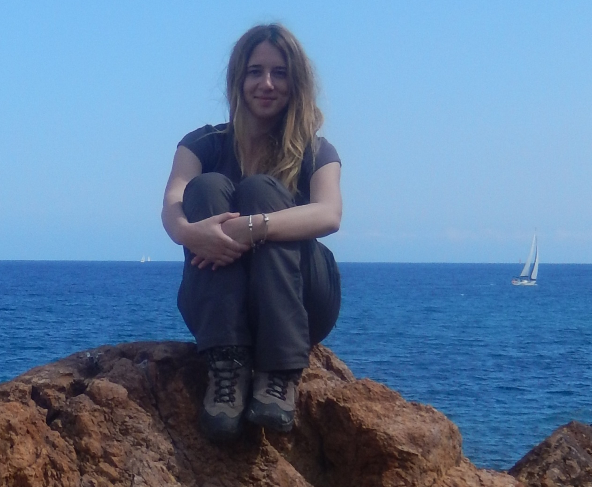
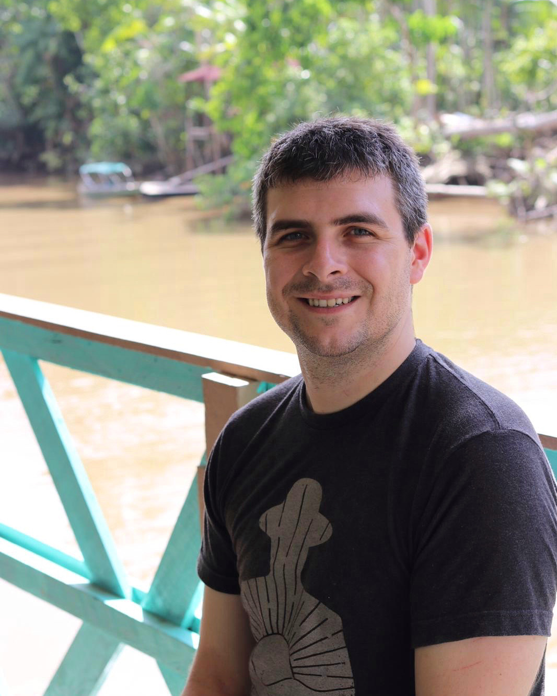
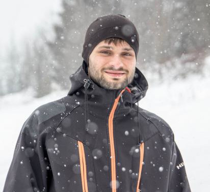

# Spatial Ecology's 2022 course
## Geocomputation and Machine Learning for environmental applications
### 

#### Student roster ####

Rosa Colacicco; Department of Earth and Environmental Sciences; Bari University, Italy.

Vincent Lecours; School of Forest, Fisheries, & Geomatics Sciences, University of Florida, USA.

Hyeyoung_Sim; Seoul National University, South Korea.

Janusz	Godziek; Institute of Earth Sciences; University of Silesia, Poland.

Txomin Bornaetxea; Department of Geography, Prehistory and archaeology; University of the Basque Country (UPV/EHU), Spain.
