# Spatial Ecology's 2023 course
## Geocomputation and Machine Learning for environmental applications
### 

#### Spatial Ecology course trainers ####

[Tushar Sethi](https://spatial-ecology.net/team/) (administrator - course organizer)  
[Giuseppe Amatulli](https://spatial-ecology.net/docs/build/html/COURSETRAINERS/trainers.html#giuseppe-amatulli-phd) (geocomputation teacher - course organizer)  
[Antonio Fonseca](https://spatial-ecology.net/docs/build/html/COURSETRAINERS/trainers.html#antonio-fonseca-m-sc-almost-phd) (machine learning teacher)  
Francesco Lovergine (geopython teacher)  
Pieter Kempeneers (pyjeo teacher)  
[Longzhu Shen](https://spatial-ecology.net/docs/build/html/COURSETRAINERS/trainers.html#longzhu-shen-phd) (math/stat advisor)  

#### Student affiliation and their origin  ####

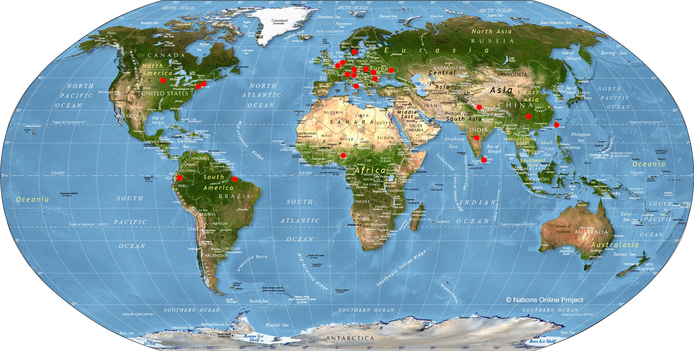

---

#### Student roster ####

(1_1) **Bibek Raj Shrestha (Nepal)**

Global Institute for Interdisciplinary Studies (GIIS) - Nepal

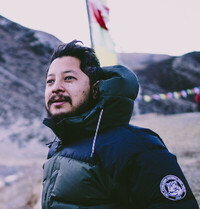

---

(2_2) **Amanda	Cutler (USA)**

Brown University, USA

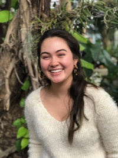

---

(3_3) **Carola Stolle (Germany)**

METER Group AG, Germany/US

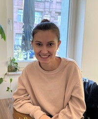

---

(4_4) **Linn_Yiqi (China)**

Swedish University of Agricultural Sciences - Sweden

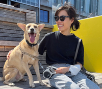

---

(5_5) **Olivia Anderson (USA)**

Swedish University for Agricultural Sciences - Sweden

---

(6_6) **Charlotte Weinstein (USA)**

Chesapeake Conservancy - USA

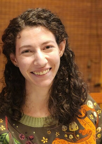

---

(7_7) **Fernanda Desimon (Brasil)** 

Forest Engineer & Software Engineer Student - Brasil  
Researcher at Palmtech, a startup affiliated  
to Universidade Estadual do Maranhão (UEMA)

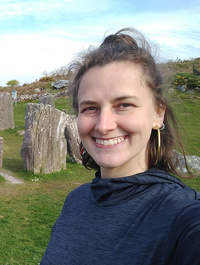

---

(8_9) **Oliver-Valentin Dinter (Romania)**

Alexandru Ioan Cuza University of Iasi - Romania
University of Tours - France

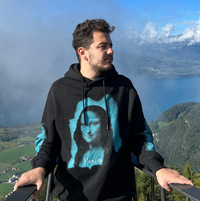

---

(9_10) **Samuel Tsao (Taiwan)**

School of the Environment, Yale University - USA

---

(10_11) **Juana Mercedes Perlaza Rodriguez (Ecuador)**

University of Basilicata (DiCEM) - School of Architecture, Italy

---

(11_13)  **Jan-Markus Homberger (Germany)**

Wageningen University and Research - Netherlands.

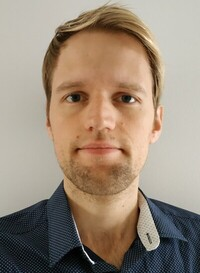

---

(12_16)  **Cassandra Follett (Cassie) (USA)**

DePaul University, University of Illinois-Chicago - USA

---

(13_17) **Alexander Mkrtchian (Alex) (Ukraine)**

Leibniz Institute of Agricultural Development in Transition Economies (Germany)

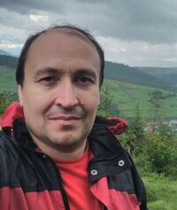

---

(14_15)	**Taiwo Adekunle Adenike (Nigeria)**

Lecturer / PhD candidate  
Human Resources Development and Lifelong Learning  
Computer Science Department  
Osun State University

---

(15_18)  **Hannah Weiser (Germany)**

Heidelberg University - Germany

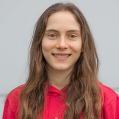

---

(16_20) **Roisin Stanbrook (USA)**

Dung Beetle Conservation And Ecology - USA  
https://roisinstanbrook.com/  

---

(17_21) **Olaitan Omitola (Nigeria)**

Federal University of Agriculture, Abeokuta - Nigeria  
Research assistant / Parasitologist and epidemiologist

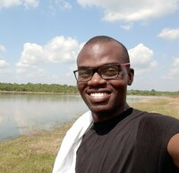

---
(18_22) **Omolola Olojede (Lola) (Nigeria)**

Public health official, Intervention coordinator  
Federal Ministry of Health - Nigeria  
Coordination of public health interventions in the country  

---

(19_25) **Abimbola Modupe Adedeji (Bimbo) (Nigeria)** 

Statistician/ Public Health Professional 
Nigerian Institute of Medical Research, Lagos - Nigeria. 

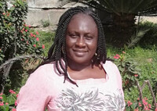

---

(20_28) **Adigun Abbas (Nigeria)**

Statistician / Epidemiologist / Public health professional  
National Centre for Remote Sensing, Jos, Nigeria

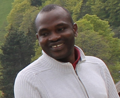

---

(21_26) **Judith Idemili Chidumebi (Judith) (Nigeria)** 

Epidemiologist / Public health professional  
eHealth For Everyone

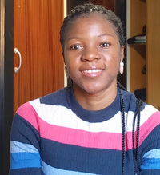

---

(22_27) **Eric	Carvalho (Brasil)** 

RADAMBRASIL Herbarium - Brasil

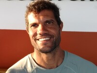

---

(23_29) **Nils Ratnaweera (Sri Lanka)**

Zurich Universtiy of Applied Sciences - Switzerland

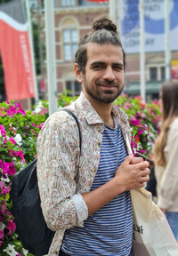

---

(24_30) **Fengchao Sun (China)** 

School of the Environment, Yale University - USA

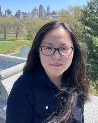

---

(25_31) **Olha Kachalova (Ukraine)**

The Silva Tarouca Research Institute for Landscape and Ornamental Gardening -  Czech Republic

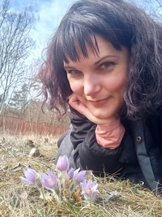

---

(26_32) **Laurent Bataille (Belgium)**

Wageningen University and Research - Netherlands

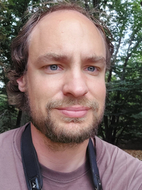

---

(27_34) **Valdrich Fernandes (India)**

Wageningen University and Research - Netherlands

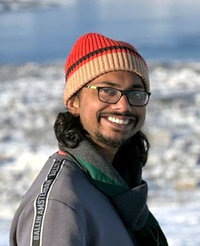

---

(28_35)	**Ayodele Samuel Babalola (Nigeria)**

Malarial Research Unit  
Department of pure and applied zoology  
Federal University of Agriculture, Abeokuta, Nigeria  

Nigerian Institute of Medical Research (NIMR),  
Molecular and medical entomology laboratory,  
Parasitologist and epidemiologist

---

(29_37)	**Milutin Milenkovic (Serbia)**

International Institute for Applied Systems Analysis (IIASA) - Austria  
Advancing Systems Analysis (ASA) Program,  
Novel Data Ecosystems for Sustainability (NoDES) Research Group  

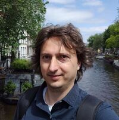

---

(30_38)	**Martin Hofer (Austria)**

International Institute for Applied Systems Analysis (IIASA) - Austria  
Advancing Systems Analysis (ASA) Program,  
Novel Data Ecosystems for Sustainability (NoDES) Research Group  

---