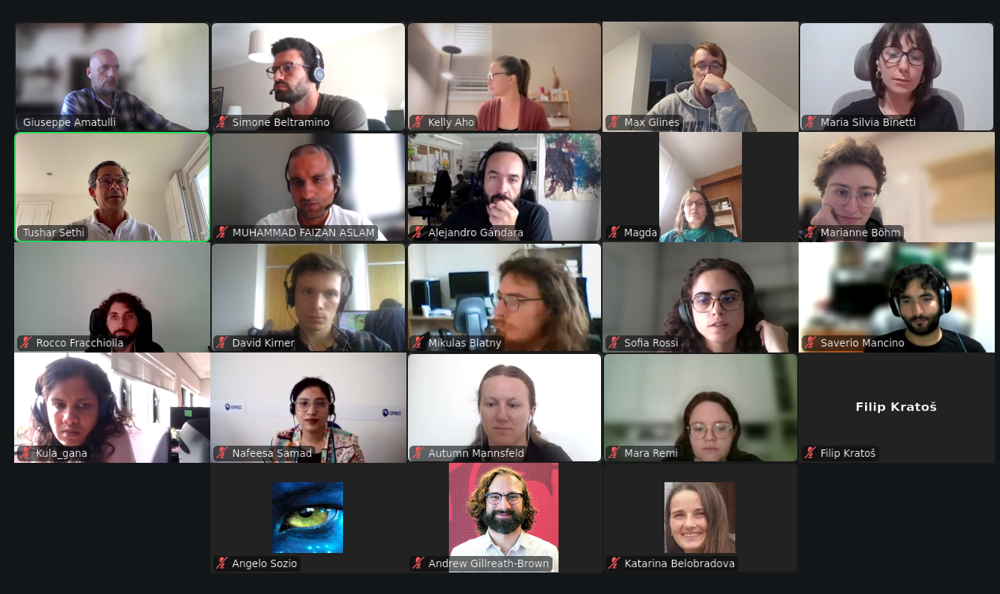
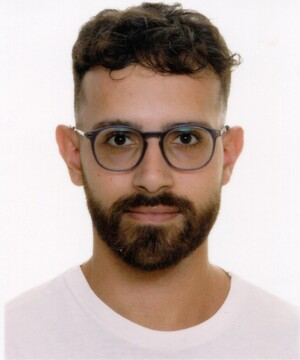

# Spatial Ecology's 2025 course
## Geocomputation and Machine Learning for environmental applications
### 

#### Spatial Ecology course trainers ####

[Tushar Sethi](https://spatial-ecology.net/team/) (administrator - course organizer)  
[Giuseppe Amatulli](https://spatial-ecology.net/docs/build/html/COURSETRAINERS/trainers.html#giuseppe-amatulli-phd) (geocomputation teacher - course organizer)  
[Antonio Fonseca](https://spatial-ecology.net/docs/build/html/COURSETRAINERS/trainers.html#antonio-fonseca-m-sc-almost-phd) (machine learning teacher)  
Francesco Lovergine (geopython teacher)  

#### Student affiliation and their origin  ####

---

#### Student roster ####

(1) **Marianne Böhm**

---

(2) **Mingyu Zhang**

---

(3) **Simone Beltramino**

---

(4) **Rocco Fracchiolla**

Department of Earth and Geo-Environmental Science - University of Bari - Italy

(5) **Muhammad Faizan Aslam**

---

(6) **Max Glines**

---

(7) **Rita Paudice - Italy**

Department of Earth and Geo-Environmental Science - University of Bari - Italy

---

(8) **Autumn Mannsfeld**

---

(9) **Nafeesa Samad**

---

(10) **Angelo Sozio - Italy**

Department of Earth and Geo-Environmental Science - University of Bari - Italy

---

(11) **Andrew Gillreath-Brown**

---

(12) **Kulankana Theivendrarajah**

---

(13) **Mikulas Blatny**

---

(14) **David Kirner**

---

(15) **Alejandro Gándara**

---

(16) **Cassandra Follett (Cassie) - USA**

DePaul University, University of Illinois-Chicago - USA

---

(17) **Katarina	Belobradova**

---

(18) **Filip Kratoš**

---

(19) **Magdalena Guńka**

---

(20) **Hager Khalil**

---

(21) **Maria Silvia	Binetti**

---

(22) **Sofia Rossi - Italy**

Institute for Electromagnetic Sensing of the Environment (IREA)
National Research Council of Italy (CNR) - Bari - Italy

(23) **Francesco Ottaviani**

---

(24) **Fabio Blaso** 

---
