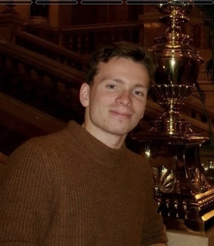

# Spatial Ecology's 2025 course
## Geocomputation and Machine Learning for environmental applications
### 

#### Spatial Ecology course trainers ####

[Tushar Sethi](https://spatial-ecology.net/team/) (administrator - course organizer)  
[Giuseppe Amatulli](https://spatial-ecology.net/docs/build/html/COURSETRAINERS/trainers.html#giuseppe-amatulli-phd) (geocomputation teacher - course organizer)  
[Antonio Fonseca](https://spatial-ecology.net/docs/build/html/COURSETRAINERS/trainers.html#antonio-fonseca-m-sc-almost-phd) (machine learning teacher)
[Saverio Mancino](https://spatial-ecology.net/docs/build/html/COURSETRAINERS/trainers.html#saverio-mancino-msc) (geopython)  
Francesco Lovergine (sw installation and Linux troubleshooting)  

#### Student affiliation and their origin  ####

---

#### Student roster ####

(1) **Marianne Böhm - Germany**

Stockholm University, Sweden

---

(2) **Mingyu Zhang - China**

Yale University - USA

---

(3) **Simone Beltramino - Italy**

Euro-Mediterranean Center on Climate Change (CMCC) - Italy 

---

(4) **Rocco Fracchiolla**

Department of Earth and Geo-Environmental Science - University of Bari - Italy

---

(5) **Muhammad Faizan Aslam (Faizan) - Pakistan**

University of Sassari, Italy

---

(6) **Max Glines - USA**

Cary Institute of Ecosystem Studies - USA

---

(7) **Rita Paudice - Italy**

Department of Earth and Geo-Environmental Science - University of Bari - Italy

---

(8) **Autumn Mannsfeld - USA**

Euro-Mediterranean Center on Climate Change (CMCC) - Italy

 
---

(9) **Nafeesa Samad - Pakistan**

Euro-Mediterranean Center on Climate Change (CMCC) - Italy 

---

(10) **Angelo Sozio - Italy**

Department of Earth and Geo-Environmental Science - University of Bari - Italy

---

(11) **Andrew Gillreath-Brown - USA**

Yale University - USA

---

(12) **Kulankana Theivendrarajah - Sri Lanka**

University of Leeds - UK 

---

(13) **Mikulas Blatny**

Landscape Research Institute/Masaryk University, Czech Republic

---

(14) **David Kirner - Czech**

Landscape Research Institute/Masaryk University, Czech Republic

---

(15) **Alejandro Gándara - Guatemala**

SLU, Swedish University of Agricultural Sciences, Sweden

---

(16) **Cassandra Follett (Cassie) - USA**

DePaul University, University of Illinois-Chicago - USA

---

(17) **Katarina	Belobradova - Slovakia**

Constantine the Philosopher University, Slovakia

---

(18) **Filip Kratoš**

Landscape Research Institute/Masaryk University, Czech Republic

---

(19) **Magdalena Guńka**

Landscape Research Institute/Masaryk University, Czech Republic

---

(20) **Hager Khalil - Egypt**

Insect Pest Control Laboratory (IPCL) at International Atomic Energy Agency(IAEA), Austria.

---

(21) **Maria Silvia Binetti Italy**

Department of Earth and Geo-Environmental Science - University of Bari - Italy

---

(22) **Sofia Rossi - Italy**

Institute for Electromagnetic Sensing of the Environment (IREA)
National Research Council of Italy (CNR) - Bari - Italy

(23) **Francesco Ottaviani - Italy**

---

(24) **Fabio Blaso - Italy**

Tetide APS [https://www.tetide.org](https://www.tetide.org)

---

(25) **Kelly Aho - USA**

Department of Biology, Boston University, USA .

 

---

(26) **Olha	Kachalova - ucrenia**

Landscape Research Institute/Masaryk University, Czech Republic

 

---

(27) **Mara 	Remi - Italy**

Department of Earth and Geo-Environmental Science - University of Bari - Italy

 

---

(28) **Quinn	Asena - USA**

Cary Institute of Ecosystem Studies - USA

---
