# Spatial Ecology's 2025 course
## Geocomputation and Machine Learning for environmental applications
###
#### Spatial Ecology course trainers ####

[Tushar Sethi](https://spatial-ecology.net/team/) (administrator - course organizer)  
[Giuseppe Amatulli](https://spatial-ecology.net/docs/build/html/COURSETRAINERS/trainers.html#giuseppe-amatulli-phd) (geocomputation teacher - course organizer)  
[Antonio Fonseca](https://spatial-ecology.net/docs/build/html/COURSETRAINERS/trainers.html#antonio-fonseca-m-sc-almost-phd) (machine learning teacher)
[Saverio Mancino](https://spatial-ecology.net/docs/build/html/COURSETRAINERS/trainers.html#saverio-mancino-msc) (geopython)  
Francesco Lovergine (sw installation and Linux troubleshooting)  

#### Student online class  ####
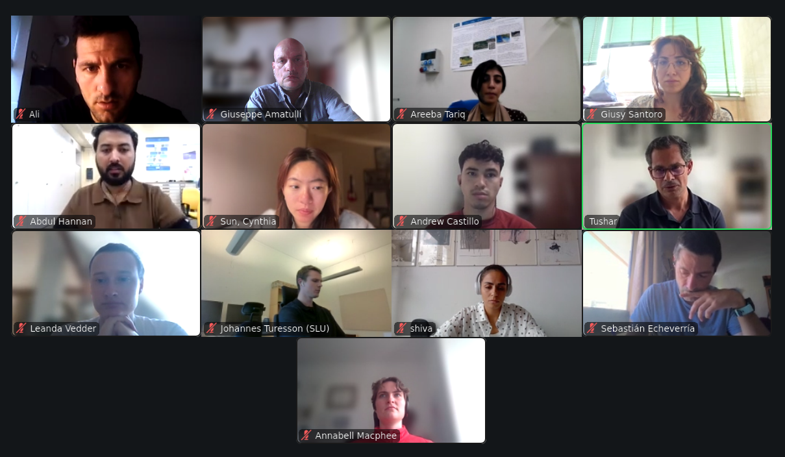

---

#### Student roster ####

(1) **Areeba	Tariq - ????**	

University of Basilicata, Potenza, Italy 

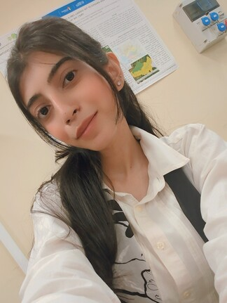

---

(2) **Cynthia Sun - China**

Texas A&M University, U.S.

---

(3) **Andrew  Castillo - Mexico** 

University of California, Santa Barbara

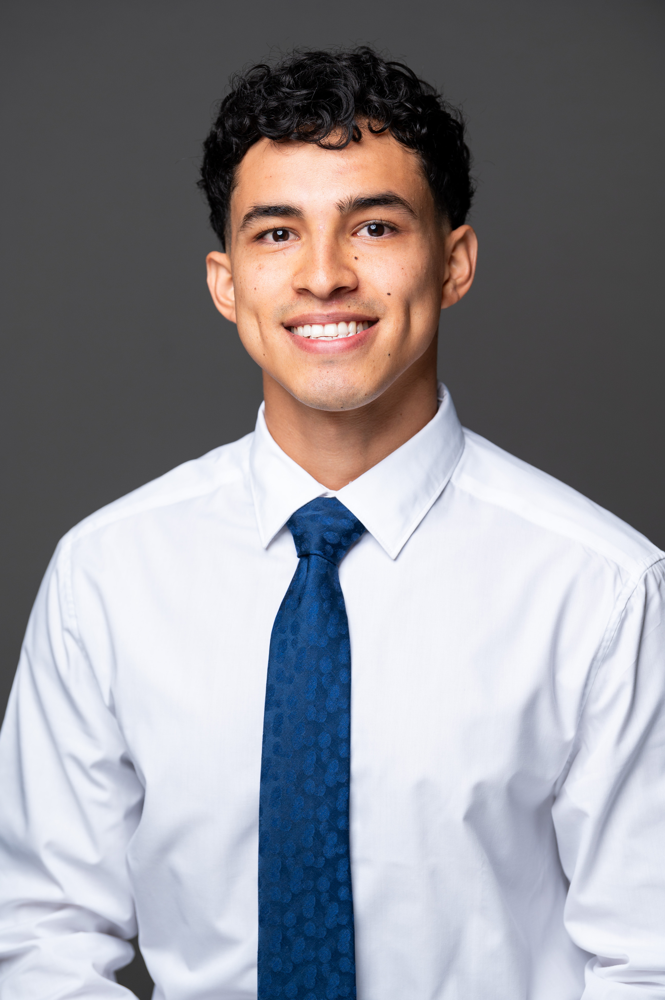

---

(4) **Abdul Hannan Abdul**
 
Università degli Studi della Basilicata, Italy

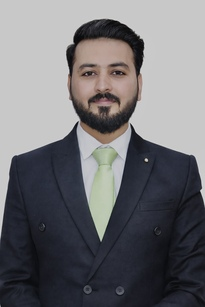

---

(5) **Sebastián	Echeverría**	

Division on Impacts on Agriculture, Forests and Ecosystem Services

Euro-Mediterranean Centre on Climate Change 

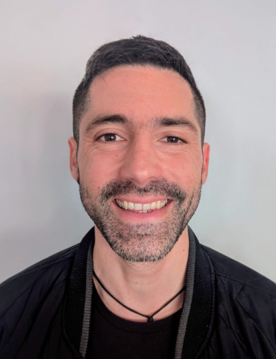

---

(6) **Johannes Turesson**

Swedish University of Agricultural Sciences, Department of Forest Ecology and Management, Sweden. 

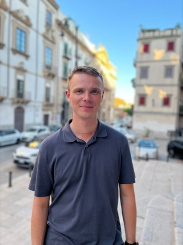

---

(7) **Andrea Giuseppe Vitali - Italy**	

Rome Tor Vergata University, Italy 
Basque Country University, Spain

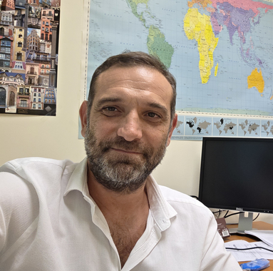

---

(8) **Leanda	Vedder**	

Utrecht University

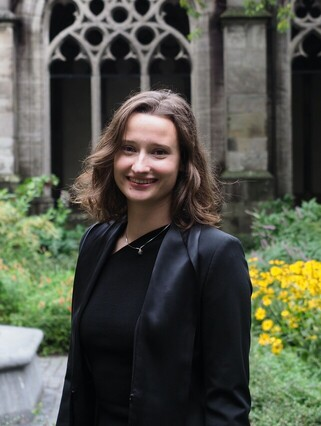

---

(9) **Hsing-Hsuan Chen** 	

Utrecht University

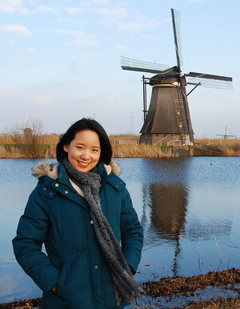

---

(10) **Giusy	Santoro - Italy**

Dipartimento di Scienze della Terra e Geoambientali
Università degli Studi di Bari (Italy)

---

(11) **Ali Rostami**	

PhD student at Memorial university, Canada

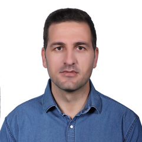

---

(12) **Eva	Sevillano Marco** 

University of Luxembourg - LCSES

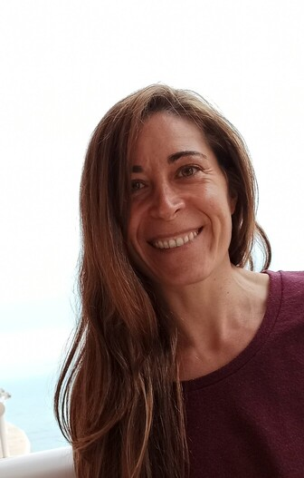

---

(13) **My Strömgren**	

Swedish University of Agricultural Sciences, Sweden

---
(14) **Francesco	Ottaviani**	

Università degli Studi di Urbino

---
(15) **Katarina	Belobradova** 

Constantine the Philosopher University, Slovakia

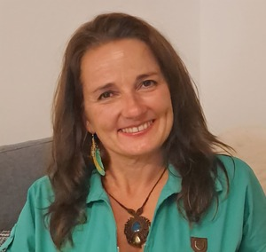

---

(16) **SHIVA	RAHMANI**	

CNR, Italy

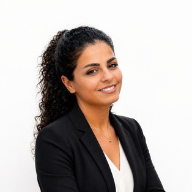

---

(17) **Annabell	Macphee** 

Independent contractor, Germany

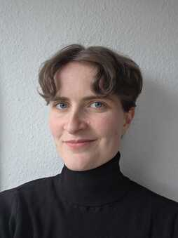

---
# In-Person Coding Hackathon week: November 24-28 2025, Matera, Italy

