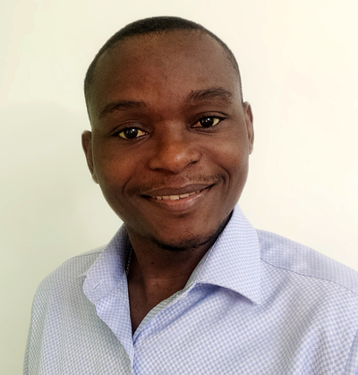
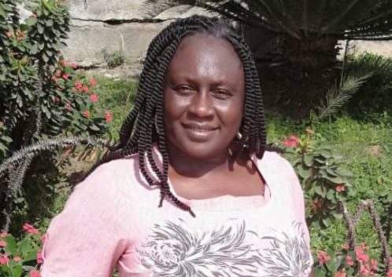
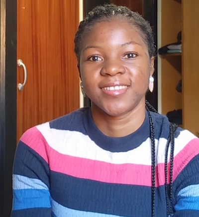

# Spatial Ecology's 2022 course
## Geocomputation and Modelling for Vector-borne Disease
### 

#### Student roster ####

(1) **Olaitan Omitola (Olaitan)**

Federal University of Agriculture, Abeokuta - Nigeria  
Research assistant / Parasitologist and epidemiologist

Olaitan has a background in parasitology and has worked on various projects on the epidemiology and control of tropical diseases such as NTDs and malaria in Nigeria including the use of spatial analyses for disease mapping. He has more than five years’ experience conducting tropical disease research and data analyses with tools such SPSS, ArcGIS, R and Excel. Olaitan has an interest in vector biology and control, and is presently a research assistant at the Federal University of Agriculture Abeokuta.

---
(2)	**Ayodele Samuel Babalola (Ayodele)**

Malarial Research Unit  
Department of pure and applied zoology  
Federal University of Agriculture, Abeokuta, Nigeria  

Nigerian Institute of Medical Research (NIMR),  
Molecular and medical entomology laboratory,  
Parasitologist and epidemiologist

Babalola Ayodele Samuel is a parasitologist and epidemiologist, with keen interest in modeling of vectors of medical importance and vector -borne diseases . Currently Samuel is working at the Molecular and medical entomology laboratory of the Nigerian Institute of Medical Research (NIMR), Lagos where he’s working on ecological niche modelling of Anopheles and Aedes mosquitoes in Nigeria. He has a good knowledge of Vector biology, transmission of disease, biostatistics (using various packages such as SPSS, SAS) with a basic understanding of R-Programming language). He is very conversant with the use of ArcGIS software for mapping of infectious diseases.  He also teaches part-time undergraduate courses in zoology and statistics. He bagged his PhD from Federal University of Agriculture, Abeokuta with a degree in Parasitology.

---
(3)	**Taiwo Adekunle Adenike (Taiwo)**

Lecturer / PhD candidate  
Human Resources Development and Lifelong Learning  
Computer Science Department  
Osun State University

Adenike, Taiwo Adekunle holds a Bachelor of science in computer science and master of science in computer science from the University of Ibadan Nigeria. She is currently a part time lecturer at the center for Human Resources Development and lifelong learning (computer science department) of Osun State University, Nigeria where is undergoing her PhD program. She specialises In Bioinformatics and Artificial Intelligence with special interest in Computational Epidemiology

---
(4)	**Elia Muhima Adrien (Elia)**

Information Management Officer, Data Analyst and Project manager  
ESPEN, WHO

Information Management Officer, Data Analyst and Project manager  with more than 6 years of experience using mobile data collection tools such as Kobo Toolbox, ODK, ESPEN Collect, ONA… advanced data analysis using R, Power BI, Tableau, Excel, SPSS… map designing with QGIS and ArcGIS. I have proven experience in management of technology projects development, integration and staff, For several organizations as a consultant I coordinate several, nutrition, epidemiological, WASH, Socio-economic surveys, cleaned data, … designed training materials for data collection and visualization.

---
(5) **Omolola Olojede (Lola)**

Public health official, Intervention coordinator  
Federal Ministry of Health - Nigeria  
Coordination of public health interventions in the country  

With up to 15 years work experience in the onchocerciasis elimination programme, I am involved in
planning and implementing entomological and epidemiological assessments for the elimination of
onchocerciasis in Nigeria. During these years, I was trained on basic ArcGIS and QGIS by the African
Programme for Onchocerciasis Control (APOC).  
Through my training in public health (undergraduate and postgraduate) and on-the-job experience, I
have a good understanding of the importance of modelling for making predictions in health-related
programmes especially as it concerns the elimination of onchocerciasis. My skills amongst others
include excellent use of the computer, both iOS and Windows.

---
(6) **Joseph Anumba (Joseph)**

Senior scientific officer, NTDs  
Federal Ministry of Health - Nigeria

oseph Anumba is an interdisciplinary researcher with core competence and certifications in public health parasitology, entomology, geoinformatics (GIS & remote sensing), education, ICT integration and computer programming.

His research interest is in the use of cloud computing, geospatial analytics, and advanced statistical modelling methods in health research. He has led and been part of several interdisciplinary research teams answering key research questions in the field of parasitology/epidemiology, entomology, and the built environment. He is currently a senior scientific officer in the department of public health, Federal Ministry of Health and is responsible for research in the NTDs Control and Eliminations Programme- Nigeria.

---
(7) **Dyesse Yumba (Dyesse)**

Data Manager  
ESPEN, WHO

Dyesse YUMBA is the data manager of ESPEN collect. He holds a professional license from the “Ecole Supérieur de Gestion et d’Administration des Entreprises” (ESGAE) and has 5 years of experience as a data manager at WHO AFRO and 3 years of experience as an enterprise application developer. Dyesse YUMBA contributed to the creation of ESPEN Collect which is a set of mobile data collection services that ESPEN makes available to countries organizing mapping and impact assessment surveys.

---
(8) **Adigun Abbas (Adigun)**

Statistician / Epidemiologist / Public health professional  
National Centre for Remote Sensing, Jos, Nigeria

---
(9) **Ime Asangansi (Ime)**

eHealth For Everyone  
Epidemiologist/ Public health professional

---
(10) **Abimbola Modupe Adedeji (Abimbola)** 

Statistician/ Public Health Professional 
Nigerian Institute of Medical Research, Lagos - Nigeria. 

Abimbola has a background in statistics with more than ten years working experience. She has managed and analyzed many projects’ data, such as HIV, tuberculosis, hepatitis B and C, malaria, schistosomiasis, serological prevalence of Covid-19 in selected states in Nigeria, helicobacter pylori, cholera, hypertension and diabetes. Abimbola is proficient in the use of Stata, SPSS, Excel, Access, Oracle, RedCap, Survey CTO and Open Data Kit (ODK).

---
(11) **Judith Idemili Chidumebi (Judith)** 

Epidemiologist / Public health professional  
eHealth For Everyone

Chidumebi Judith Idemili studied Master of Science in Applied Mathematical Sciences with Climate Change Impacts Modelling at Heriot-Watt University, Edinburgh, United Kingdom under the Commonwealth Scholarship Commission. She also holds a Bachelor of Science in Education/ Mathematics from the University of Nigeria, Nsukka. Her research interest focuses on mathematical modelling of infectious diseases, climate change and generally, Epidemiology. She is particularly interested in disease modelling for the mitigation of the impacts of climate-driven disease emergence and to redesign a pathway to quell future pandemics.

