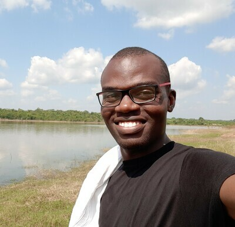

# Spatial Ecology's 2022 course
## Geocomputation and Modelling for Vector-borne Disease
### 

#### Student roster ####

(1) **Olaitan Omitola**

Olaitan has a background in parasitology and has worked on various projects on the epidemiology and control of tropical diseases such as NTDs and malaria in Nigeria including the use of spatial analyses for disease mapping. He has more than five years’ experience conducting tropical disease research and data analyses with tools such SPSS, ArcGIS, R and Excel. Olaitan has an interest in vector biology and control, and is presently a research assistant at the Federal University of Agriculture Abeokuta.

---
(2)	**Ayodele Samuel Babalola**

Malarial Research Unit
Department of pure and applied zoology
Federal University of Agriculture, Abeokuta, Nigeria

Babalola Ayodele Samuel is a parasitologist and epidemiologist, with keen interest in modeling of vectors of medical importance and vector -borne diseases . Currently Samuel is working at the Molecular and medical entomology laboratory of the Nigerian Institute of Medical Research (NIMR), Lagos where he’s working on ecological niche modelling of Anopheles and Aedes mosquitoes in Nigeria. He has a good knowledge of Vector biology, transmission of disease, biostatistics (using various packages such as SPSS, SAS) with a basic understanding of R-Programming language). He is very conversant with the use of ArcGIS software for mapping of infectious diseases.  He also teaches part-time undergraduate courses in zoology and statistics. He bagged his PhD from Federal University of Agriculture, Abeokuta with a degree in Parasitology.

---
(3)	**Taiwo Adekunle Adenike**

Human Resources Development and Lifelong Learning
Computer Science Department 
Osun State University

Adenike, Taiwo Adekunle holds a Bachelor of science in computer science and master of science in computer science from the University of Ibadan Nigeria. She is currently a part time lecturer at the center for Human Resources Development and lifelong learning (computer science department) of Osun State University, Nigeria where is undergoing her PhD program. She specialises In Bioinformatics and Artificial Intelligence with special interest in Computational Epidemiology

---
(4)	**Elia Muhima Adrien**

Information Management Officer, Data Analyst and Project manager  with more than 6 years of experience using mobile data collection tools such as Kobo Toolbox, ODK, ESPEN Collect, ONA… advanced data analysis using R, Power BI, Tableau, Excel, SPSS… map designing with QGIS and ArcGIS. I have proven experience in management of technology projects development, integration and staff, For several organizations as a consultant I coordinate several, nutrition, epidemiological, WASH, Socio-economic surveys, cleaned data, … designed training materials for data collection and visualization.

---
(5) **Omolola Olojede**

---
(6) **Joseph_Anumba**

---
(7) **Dyesse Yumba**

---
(8) **Adigun Abbas**

---
(9) **Ime Asangansi**

---
(11) **Judith Idemili Chidumebi** 

---
(10) **Abimbola Modupe Adedeji** 