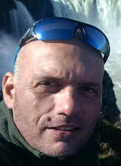
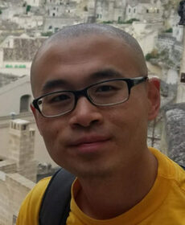
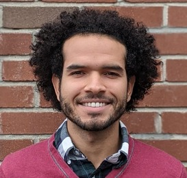
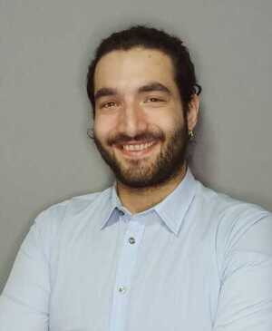

# Spatial Ecology course trainers

## Giuseppe Amatulli, PhD

Geo-data Scientist, Spatial Ecology; g.amatulli at spatial-ecology.net

[Publications](https://scholar.google.com/citations?hl=en&user=LSxTtpMAAAAJ&view_op=list_works&sortby=pubdate)

[Video Interview](https://youtu.be/1jcZAY-ZJmk) 

Giuseppe is the lead scientist at Spatial-Ecology for data analysis and product development. He is an accredited GIS data expert with deep expertise in spatial modelling and coding with open source software for environmental applications. His current focus is on hydrological modelling at a global scale, in addition to researching species distribution under climate change scenarios.

Giuseppe has a breadth of experience in GIS technologies, remote sensing, informatics, cluster and parallel computing, and statistics. He is proficient in applying complex modelling techniques to automate the analysis of high-resolution data under Linux-based platforms.

Giuseppe holds a research scientist position at Yale University in the US, and has previously worked at the European Commission Joint Research Centre, and at the University of Zaragoza. His coverage of the forestry and environmental sectors entails wildfire occurrence risk and pattern recognition, ecological shifts under climate geo-engineering scenarios. Notably, he runs geocomputation training courses worldwide on the latest data programming techniques.

Giuseppe has a PhD from the University of Basilicata in Italy, an MSc in Geo-Information Science from Wageningen University, and MSc in Forestry from Bari University. His time away from coding is spent leading adventure trips in remote locations, which involve canyoning, caving, rafting and hiking.

## Longzhu Shen, PhD 

Scientific Advisor, Spatial Ecology; l.shen at spatial-ecology.net

[Publications](https://scholar.google.com/citations?hl=en&user=sAyCqOYAAAAJ&view_op=list_works&sortby=pubdate)

Longzhu is a mathematical modeller with a specialisation in quantum mechanics and statistical learning algorithms. At Spatial Ecology, he is leading the development of water chemistry analytics by integrating water quality assessment into a global hydrological model using machine learning techniques.

Longzhu’s breadth of experience ranges from spatial modelling for charting nutrient distribution in freshwater to the development of algorithms to engineer chemicals with a lower toxicity potential. He is proficient in electronic structure calculations, chemical reaction mechanism investigations, and multiscale modeling for complex biological systems.

Longzhu has previously worked as research scientist position at Cambridge University in the UK, where he was developing mathematical models to predict the molecular evolution of prominent viruses, which can be used to advance vaccine design.

Longzhu has a PhD in Chemistry from Carnegie Mellon University, and did his post-doctoral research in toxicology and molecular design at Yale University. In his spare time, he enjoys hiking, skateboarding and traveling.

## Antonio Fonseca, PhD 

[website](https://ahof1704.github.io/)
[Publications](https://scholar.google.com/citations?user=G2irlNcAAAAJ&hl=en)

Antonio is a machine learning scientist working at the intersection of Computational Biology and Deep Learning. His expertise encompasses robotics (software and hardware development), signal processing, computational vision, behavioral neuroscience, protein design, and deep learning algorithms. He specializes in developing and applying machine learning frameworks to solve complex problems.

Currently, Antonio is developing machine learning frameworks to design de-novo proteins with enhanced drug properties using diffusion models. Previously, he worked on developing neural operators using Transformers to model dynamics in biomedical data.

Antonio earned his doctorate in Neuroscience from Yale University. He also holds a bachelor’s degree in Robotics Engineering and a master’s in Microelectronics. When not focused on biological or artificial neural networks, Antonio enjoys rock climbing and hiking, often combining both activities on the same trip.

## Saverio Mancino, MSc

Saverio PhD Candidate in Geology and Geotechnologies at the Department of Earth and Geoenvironmental Sciences at the University of Bari. He is a dedicated researcher specialising in landslide susceptibility modelling and early warning systems for large-scale transboundary programmes.

His work combines advanced ML techniques with high-performance computing systems to tackle continental-scale geospatial problems. His expertise spans GIS technologies, remote sensing, spatial data analysis, and open-source software development with experience in the context of geological and environmental modeling and statistical analysis. His principal aim is to provide actionable insights on geohazards in a changing climate to decision makers in geo-environmental safety and urban planning.

