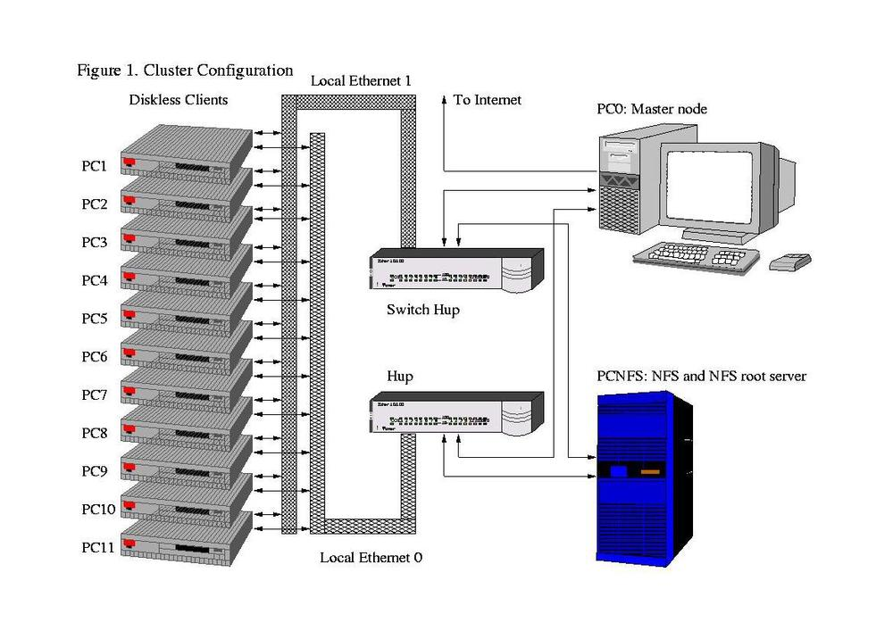
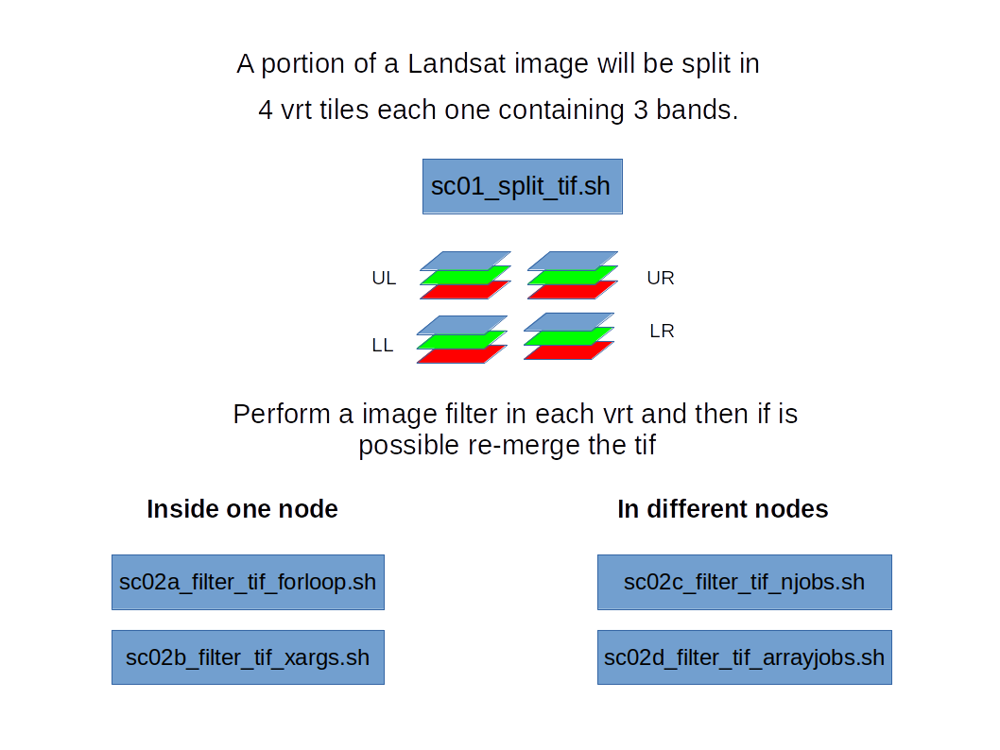

# Geocomputation at High Performance Computing Cluster (HPC)




## Prepare your working environment. 

create folders to save sbatch jobs standard outputs and standard errors


    cd
    mkdir /home/$USER/stdout/
    mkdir /home/$USER/stderr

Building up some specific alias and save to $HOME/.bashrc:

    emacs -nw $HOME/.bashrc  # or use vi $HOME/.bashrc

and copy paste the following lines 

    # create alias
    alias myq='squeue -u $USER   -o "%.9F %.8K%.4P%.50j %3D%2C%.8m %.1T %.5M  %.5l %.S %R"'
    alias err='ll -rt    /home/$USER/stderr/*'
    alias errl='ll -rt    /home/$USER/stderr/* | tail '
    alias errlless=' less  $(ls  -rt    /home/$USER/stderr/* | tail -1 ) '
    alias errlmore=' more  $(ls  -rt    /home/$USER/stderr/* | tail -1 ) '
    alias out='ll -rt    /home/$USER/stdout/*'
    alias outl='ll -rt    /home/$USER/stdout/* | tail '
    alias outlless=' less  $(ls  -rt    /home/$USER/stdout/* | tail -1 ) '
    alias outlmore=' more  $(ls  -rt    /home/$USER/stdout/* | tail -1 ) '
    
    # sw setting
    export PATH=/project/geocourse/Software/bin:$PATH
    export EB_PYTHON=python3.9
	export PYTHONPATH=/project/geocourse/Software/lib/python3.9/site-packages:$PYTHONPATH
	module use /project/geocourse/Software/easybuild/modules/all     

save emacs and close it. Run source to re-load the $HOME/.bashrc  

    source $HOME/.bashrc

Now that the working environment is ready we can submit jobs to the slurm queue. Let's first monitoring what is already running.  

Status of the jobs in slurm can be seen by:

    squeue --all
    sacct
    sinfo 

## Resampling an image

 

## Download raster dataset

The file [http://www.spatial-ecology.net/ost4sem/exercise/geodata/cloud/SA_intra.tif](cloud)


    mkdir /home/$USER/glad_ard
    cd /home/$USER/glad_ard
    wget http://www.spatial-ecology.net/ost4sem/exercise/geodata/cloud/SA_intra.tif

will be used for the following scripts.

### Download scripts


```
mkdir $HOME/scripts
cd $HOME/scripts

wget https://raw.githubusercontent.com/selvaje/SE_data/master/exercise/hpc01_split_tif.sh
wget https://raw.githubusercontent.com/selvaje/SE_data/master/exercise/hpc02a_resampling_tif_forloop.sh
wget https://raw.githubusercontent.com/selvaje/SE_data/master/exercise/hpc02b_resampling_tif_ampersand.sh
wget https://raw.githubusercontent.com/selvaje/SE_data/master/exercise/hpc02c_resampling_tif_xargs.sh
wget https://raw.githubusercontent.com/selvaje/SE_data/master/exercise/hpc02d_resampling_tif_njobs.sh
wget https://raw.githubusercontent.com/selvaje/SE_data/master/exercise/hpc02e_resampling_tif_arrayjobs.sh
```


The tif file will be divided in 4 vrt tiles each one containing 1 band. Each vrt will be then used in the following scripting procedures.   

### hpc01_split_tif.sh: split the raster in 4 tiles

    sbatch /project/geocourse/Software/scripts/hpc01_split_tif.sh    
    
**hpc01_split_tif.sh**

    #!/bin/bash
    #SBATCH -p normal
    #SBATCH --reservation=geo_course_cpu
	#SBATCH -J hpc01_split_tif.sh
    #SBATCH -N 1 -c 1 -n 1
    #SBATCH -t 1:00:00 
    #SBATCH -o /home/geocourse-teacher01/stdout/hpc01_split_tif.sh.%J.out
    #SBATCH -e /home/geocourse-teacher01/stderr/hpc01_split_tif.sh.%J.err
    #SBATCH --mem=500
    
    #### sbatch /project/geocourse/Software/scripts/hpc01_split_tif.sh
    
    module load GDAL/3.3.2-foss-2021b
    IN=/project/geocourse/Data/glad_ard
    OUT=/home/$USER/glad_ard
    mkdir -p $OUT
    
    gdal_translate -of VRT  -srcwin 0       0 2940 4200 $IN/SA_intra.tif $OUT/SA_intra_UL.vrt
    gdal_translate -of VRT  -srcwin 0    4200 2940 4200 $IN/SA_intra.tif $OUT/SA_intra_UR.vrt
    gdal_translate -of VRT  -srcwin 2940    0 2940 4200 $IN/SA_intra.tif $OUT/SA_intra_LL.vrt
    gdal_translate -of VRT  -srcwin 2940 4200 2940 4200 $IN/SA_intra.tif $OUT/SA_intra_LR.vrt

### hpc02a_resampling_tif_forloop.sh: process 4 tiles in one node using 1 cpu with the *bash for loop*

This is the easiest procedure to perform a geocomputation operation. Lunch a job that use a normal for loop to iterate on the 4 tiles. After the iterations (resampling) the for tiles can be re-merged by gdalbuildvrt followed by gdal_translate.

    sbatch /gpfs/loomis/home.grace/$USER/geocomputation/scripts/hpc02a_resampling_tif_forloop.sh

**hpc02a_resampling_tif_forloop.sh**

	#!/bin/bash
	#SBATCH -p normal
	#SBATCH -J hpc02a_resampling_tif_forloop.sh
	#SBATCH -N 1 -c 1 -n 1
	#SBATCH -t 1:00:00 
	#SBATCH -o /home/geocourse-teacher01/stdout/hpc02a_resampling_tif_forloop.sh.%J.out
	#SBATCH -e /home/geocourse-teacher01/stderr/hpc02a_resampling_tif_forloop.sh.%J.err
	#SBATCH --mem-per-cpu=8000
	
	#### sbatch  /project/geocourse/Software/scripts/hpc02a_resampling_tif_forloop.sh
	
	module load GDAL/3.3.2-foss-2021b
	
	IN=/project/geocourse/Data/glad_ard 
	OUT=/home/$USER/glad_ard
	
	mkdir -p $OUT 
	rm -f $OUT/SA_intra_res.tif $OUT/stack.vrt $OUT/SA_intra_LL_res.tif $OUT/SA_intra_LR_res.tif $OUT/SA_intra_UL_res.tif $OUT/SA_intra_UR_res.tif # remove the outputs
	  
	echo resampling the SA_intra_??.vrt files within a for loop 
	
	
	for file in $OUT/SA_intra_??.vrt   ; do 
	echo processing $file
	filename=$(basename $file .vrt)
	GDAL_CACHEMAX=5000
	gdal_translate -co COMPRESS=DEFLATE -co ZLEVEL=9  -tr 0.002083333333333 0.002083333333333  -r bilinear  $file  $OUT/${filename}_res.tif 
	done 
	
	echo reassembling the large tif 
	
	gdalbuildvrt -overwrite $OUT/stack.vrt   $OUT/SA_intra_LL_res.tif   $OUT/SA_intra_LR_res.tif     $OUT/SA_intra_UL_res.tif   $OUT/SA_intra_UR_res.tif
	gdal_translate -co COMPRESS=DEFLATE -co ZLEVEL=9  $OUT/stack.vrt $OUT/SA_intra_res.tif 
	rm -f $OUT/SA_intra_LL_res.tif   $OUT/SA_intra_LR_res.tif     $OUT/SA_intra_UL_res.tif   $OUT/SA_intra_UR_res.tif   $OUT/stack.vrt 
	


Check by 

	sacct -j ???? --format=JobID,Start,End,Elapsed,NCPUS
	seff -j ???? 

### hpc02b_resampling_tif_ampersand: Multi-process inside one node using 4 cpu with the ampersand

	sbatch  /project/geocourse/Software/scripts/hpc02b_resampling_tif_ampersand.sh

**hpc02b_resampling_tif_ampersand.sh**

	#!/bin/bash
	#SBATCH -p normal
	#SBATCH -J hpc02b_resampling_tif_ampersand.sh
	#SBATCH -N 1 -c 1 -n 4
	#SBATCH --cpus-per-task=1
	#SBATCH -t 1:00:00 
	#SBATCH -o /home/geocourse-teacher01/stdout/hpc02b_resampling_tif_ampersand.sh.%J.out
	#SBATCH -e /home/geocourse-teacher01/stderr/hpc02b_resampling_tif_ampersand.sh.%J.err
	#SBATCH --mem-per-cpu=2000
		
	#### sbatch  /project/geocourse/Software/scripts/hpc02b_resampling_tif_ampersand.sh
	
	module load GDAL/3.3.2-foss-2021b
		
	IN=/project/geocourse/Data/glad_ard 
	OUT=/home/$USER/glad_ard
		
	rm -f $OUT/SA_intra_res.tif $OUT/stack.vrt $OUT/SA_intra_LL_res.tif $OUT/SA_intra_LR_res.tif $OUT/SA_intra_UL_res.tif $OUT/SA_intra_UR_res.tif # remove the outputs
		
	echo resampling the SA_intra_??.vrt files using the ampersand 
		
	export GDAL_CACHEMAX=1500
	
	gdal_translate -co COMPRESS=DEFLATE -co ZLEVEL=9 -tr 0.002083333333333 0.002083333333333 -r bilinear $OUT/SA_intra_UL.vrt $OUT/SA_intra_UL_res.tif &
	gdal_translate -co COMPRESS=DEFLATE -co ZLEVEL=9 -tr 0.002083333333333 0.002083333333333 -r bilinear $OUT/SA_intra_UR.vrt $OUT/SA_intra_UR_res.tif &	
	gdal_translate -co COMPRESS=DEFLATE -co ZLEVEL=9 -tr 0.002083333333333 0.002083333333333 -r bilinear $OUT/SA_intra_LL.vrt $OUT/SA_intra_LL_res.tif &
	gdal_translate -co COMPRESS=DEFLATE -co ZLEVEL=9 -tr 0.002083333333333 0.002083333333333 -r bilinear $OUT/SA_intra_LR.vrt $OUT/SA_intra_LR_res.tif &
	wait 
			
	echo reassembling the large tif 
		
	gdalbuildvrt -overwrite $OUT/stack.vrt   $OUT/SA_intra_LL_res.tif   $OUT/SA_intra_LR_res.tif     $OUT/SA_intra_UL_res.tif   $OUT/SA_intra_UR_res.tif
	gdal_translate -co COMPRESS=DEFLATE -co ZLEVEL=9  $OUT/stack.vrt $OUT/SA_intra_res.tif 
	rm -f $OUT/SA_intra_LL_res.tif   $OUT/SA_intra_LR_res.tif     $OUT/SA_intra_UL_res.tif   $OUT/SA_intra_UR_res.tif   $OUT/stack.vrt
	

Check by 

	sacct -j ???? --format=JobID,Start,End,Elapsed,NCPUS

### hpc02d Multi-process inside one node using 4 cpu using xargs

This is one of the most efficient ways to perform a geocomputation operation. Lunch a job that use xargs to compute the iterations in a multicore (4 cpu in this case). After the iterations (gdal resampling) the 4 tiles can be re-merged by gdalbuildvrt followed by gdal_translate. The use of xargs allows to constrains all the iterations in one node using different cpus. The advantage is that after xargs all the tiles will be ready to be merged back. A disadvantage can be that in case you are requesting many cpu (e.g. 24) you have to wait that one node will have 24 cpu free. A good compromise can be just requested 8-12 cpu and add more time to the wall time (-t) 

	sbatch /project/geocourse/Software/scripts/hpc02d_resampling_tif_xargs.sh

**hpc02d_resampling_tif_xargs.sh**

	#!/bin/bash
	#SBATCH -p normal
	#SBATCH -J hpc02c_resampling_tif_xargs.sh
	#SBATCH -n 1 -c 4 -N 1
	#SBATCH -t 1:00:00 
	#SBATCH -o /home/geocourse-teacher01/stdout/hpc02c_resampling_tif_xargs.sh.%J.out
	#SBATCH -e /home/geocourse-teacher01/stderr/hpc02c_resampling_tif_xargs.sh.%J.err
	#SBATCH --mem-per-cpu=2000
	
	#### sbatch /project/geocourse/Software/scripts/hpc02c_resampling_tif_xargs.sh
	
	module load GDAL/3.3.2-foss-2021b
	
	export IN=/project/geocourse/Data/glad_ard 
	export OUT=/home/$USER/glad_ard
	
	mkdir -p $OUT
	rm -f $OUT/SA_intra_res.tif $OUT/stack.vrt $OUT/SA_intra_LL_res.tif $OUT/SA_intra_LR_res.tif $OUT/SA_intra_UL_res.tif $OUT/SA_intra_UR_res.tif # remove the outputs
	
	echo resampling the SA_intra_??.vrt files within a multicore loop 
	
	ls $OUT/SA_intra_??.vrt | xargs -n 1 -P 4 bash -c $'  
	file=$1
	echo processing $file
	filename=$(basename $file .vrt)
	export GDAL_CACHEMAX=1500
	gdal_translate -co COMPRESS=DEFLATE -co ZLEVEL=9  -tr 0.002083333333333 0.002083333333333  -r bilinear  $file  $OUT/${filename}_res.tif
	' _ 
	
	echo reassembling the large tif 
	
	gdalbuildvrt -overwrite $OUT/stack.vrt   $OUT/SA_intra_LL_res.tif   $OUT/SA_intra_LR_res.tif     $OUT/SA_intra_UL_res.tif   $OUT/SA_intra_UR_res.tif
	gdal_translate -co COMPRESS=DEFLATE -co ZLEVEL=9  $OUT/stack.vrt $OUT/SA_intra_res.tif
	rm -f $OUT/SA_intra_LL_res.tif $OUT/SA_intra_LR_res.tif $OUT/SA_intra_UL_res.tif $OUT/SA_intra_UR_res.tif $OUT/stack.vrt


### hpc02d_resampling_tif_njobs.sh: process 4 tiles with 4 independent jobs - 1 node 1 cpu

This is a good way to run 4 independent jobs. Each job can perform one iteration. This option is good if you need to lunch 100-200 jobs. You can also think that inside each job you can nest a xargs operation. The disadvantage is that each script will finish independently, so in order merge the grid you have to wait until all the jobs are done.
  
	for file in /home/$USER/glad_ard/SA_intra_??.vrt ; do 
	sbatch --export=file=$file /project/geocourse/Software/scripts/hpc02d_resampling_tif_njobs.sh ; 
	done 

**hpc02e_resampling_tif_njobs.sh**

	#!/bin/bash
	#SBATCH -p normal
	#SBATCH -J hpc02d_resampling_tif_njobs.sh
	#SBATCH -N 1 -c 1 -n 1
	#SBATCH -t 1:00:00 
	#SBATCH -o /home/geocourse-teacher01/stdout/hpc02d_resampling_tif_njobs.sh.%J.out
	#SBATCH -e /home/geocourse-teacher01/stderr/hpc02d_resampling_tif_njobs.sh.%J.err
	#SBATCH --mem-per-cpu=8000
	
	#### for file in /home/$USER/glad_ard/SA_intra_??.vrt ; do sbatch --export=file=$file /project/geocourse/Software/scripts/hpc02d_resampling_tif_njobs.sh ; done 
	
	module load GDAL/3.3.2-foss-2021b
	
	export IN=/project/geocourse/Data/glad_ard 
	export OUT=/home/$USER/glad_ard
	
	mkdir -p $OUT
	rm -f $OUT/SA_intra_res.tif $OUT/stack.vrt # remove the outputs
	
	echo resampling the $file  files with an indipendent job 
	
	filename=$(basename $file .vrt)
	export GDAL_CACHEMAX=5000
	gdal_translate -co COMPRESS=DEFLATE -co ZLEVEL=9  -tr 0.002083333333333 0.002083333333333  -r bilinear  $file  $OUT/${filename}_res.tif
	
	#### reassembling the large tif
	
	if [ $filename = SA_intra_UR ]  ; then
	    sleep 60 # to be sure that all the other job are done 
	    echo reassembling the large tif
	    gdalbuildvrt -overwrite $OUT/stack.vrt   $OUT/SA_intra_LL_res.tif   $OUT/SA_intra_LR_res.tif     $OUT/SA_intra_UL_res.tif   $OUT/SA_intra_UR_res.tif
	    gdal_translate -co COMPRESS=DEFLATE -co ZLEVEL=9  $OUT/stack.vrt $OUT/SA_intra_res.tif
	    rm -f $OUT/SA_intra_LL_res.tif $OUT/SA_intra_LR_res.tif $OUT/SA_intra_UL_res.tif $OUT/SA_intra_UR_res.tif $OUT/stack.vrt
	fi 


### hpc02d_resampling_tif_arrayjobs.sh: proces 4 tiles with 1 job lunching 4-array-job

This is a good way to run 4 independent jobs-array. Each job-array can perform one iteration. This option is good if you need to lunch many many computations (e.g. 1000-2000). The disadvantage is that each script will finish independently, so in order merge the grid you have to wait until all the jobs are done. 

	sbatch /project/geocourse/Software/scripts/hpc02d_resampling_tif_arrayjobs.sh	

**hpc02e_resampling_tif_arrayjobs.sh**

	#!/bin/bash
	#SBATCH -p normal
	#SBATCH -J hpc02e_resampling_tif_arrayjobs.sh
	#SBATCH -N 1 -c 1 -n 1
	#SBATCH -t 1:00:00 
	#SBATCH -o /home/geocourse-teacher01/stdout/hpc02e_resampling_tif_arrayjobs.sh.%A_%a.out 
	#SBATCH -e /home/geocourse-teacher01/stderr/hpc02e_resampling_tif_arrayjobs.sh.%A_%a.err
	#SBATCH --array=1-4
	#SBATCH --mem-per-cpu=8000
	
	#### sbatch /project/geocourse/Software/scripts/hpc02e_resampling_tif_arrayjobs.sh
	
	module load GDAL/3.3.2-foss-2021b
	
	export IN=/project/geocourse/Data/glad_ard
	export OUT=/home/$USER/glad_ard
	
	mkdir -p $OUT
	rm -f $OUT/SA_intra_res.tif $OUT/stack.vrt    # remove the outputs 
	
	file=$(ls $OUT/SA_intra_??.vrt  | head  -n  $SLURM_ARRAY_TASK_ID | tail  -1 )
	
	filename=$(basename $file .vrt)
	export GDAL_CACHEMAX=5000
	gdal_translate -co COMPRESS=DEFLATE -co ZLEVEL=9  -tr 0.002083333333333 0.002083333333333  -r bilinear  $file  $OUT/${filename}_res.tif
	
	#### reassembling the large tif                                                                                                                                                           
	if [ $SLURM_ARRAY_TASK_ID = $SLURM_ARRAY_TASK_MAX ]  ; then
	    sleep 60 # to be sure that all the other job are done                                                                                                                                  
	    echo reassembling the large tif
	    gdalbuildvrt -overwrite $OUT/stack.vrt $OUT/SA_intra_LL_res.tif $OUT/SA_intra_LR_res.tif $OUT/SA_intra_UL_res.tif $OUT/SA_intra_UR_res.tif
	    gdal_translate -co COMPRESS=DEFLATE -co ZLEVEL=9  $OUT/stack.vrt $OUT/SA_intra_res.tif
	    rm -f $OUT/SA_intra_LL_res.tif $OUT/SA_intra_LR_res.tif $OUT/SA_intra_UL_res.tif $OUT/SA_intra_UR_res.tif $OUT/stack.vrt
	fi
	
	
### Tips

	You can also think that inside each job you can nest a xargs operation. 