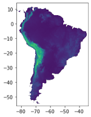

# Use of GRASS in HPC 

In grass the level of input and output (I/O) is quite high therefore is convenient to create LOCATION directly on the folders that are sit on the nodes. 

In this session we are going to see how to start a new grass project using a well standarized dataset: a DEM.

For this example we are goint to use: *r.slope.aspect* to calculate the slope *r.out.gdal* to export the GRASS raster to tif.

## Create a LOCATION and MAPSET in /tmp

Using the flag *--tmp-location* we can create a LOCATION on the flight that will automatically removed when GRASS will be closed. 

	sbatch  /project/geocourse/Software/scripts/hpc03a_grass_tmp.sh

**hpc03a_grass_tmp.sh**

	#!/bin/bash
	#SBATCH -p normal
	#SBATCH -J hpc03a_grass_tmp.sh
	#SBATCH -N 1 -c 2 -n 1
	#SBATCH -t 1:00:00 
	#SBATCH -o /home/geocourse-teacher01/stdout/hpc03a_grass_tmp.sh.%J.out
	#SBATCH -e /home/geocourse-teacher01/stderr/hpc03a_grass_tmp.sh.%J.err
	#SBATCH --mem-per-cpu=8000
	
	#### sbatch  /project/geocourse/Software/scripts/hpc03a_grass_tmp.sh
	
	module load GRASS/8.2.0-foss-2021b
	
	export IN=/project/geocourse/Data/dem 
	export OUT=/home/$USER/dem
	
	mkdir -p $OUT 
	rm -f $OUT/slope.tif 
	  
	
	cp  $IN/SA_elevation_mn_GMTED2010_mn_msk.tif  /tmp 
	
	grass  --text --tmp-location /tmp/SA_elevation_mn_GMTED2010_mn_msk.tif --exec <<'EOF'
	r.external -e input=/tmp/SA_elevation_mn_GMTED2010_mn_msk.tif  output=SA_elevation --o --q
	g.list raster -p
	r.info  map=SA_elevation
	r.slope.aspect elevation=SA_elevation slope=slope nprocs=2 memory=7000
	r.info  map=slope
	# export the "grass slope" to a geotif.
	r.out.gdal --o -c -m -f createopt="COMPRESS=DEFLATE,ZLEVEL=9" type=Int16 format=GTiff nodata=-9999  input=slope  output=$OUT/slope.tif
	EOF
	
	
	rm -f /tmp/SA_elevation_mn_GMTED2010_mn_msk.tif

**GRASS rasters support three data types:**

* 32bit signed integer (CELL) wich can be converted in GDAL using Byte/Int16/UInt16/UInt32/Int32
* single-precision floating-point (FCELL) wich can be converted in GDAL using Float32
* double-precision floating-point (DCELL) wich can be converted in GDAL using Float64

## Create a LOCATION and MAPSET in /dev/shm

/dev/shm is a directory in Unix-like operating systems that stands for "shared memory." It is part of the virtual filesystem and provides an efficient way to access data without the need to read from or write to the physical disk.
Therefore, when planning system resources and memory allocation, it is important to include the memory consumption of /dev/shm in the total RAM requirements. This ensures that the system has sufficient memory to handle all intended operations efficiently.

	sbatch  /project/geocourse/Software/scripts/hpc03b_grass_dev.sh

**hpc03b_grass_dev.sh**

	#!/bin/bash
	#SBATCH -p normal
	#SBATCH -J hpc03b_grass_dev.sh
	#SBATCH -N 1 -c 1 -n 1
	#SBATCH -t 1:00:00 
	#SBATCH -o /home/geocourse-teacher01/stdout/hpc03b_grass_dev.sh.%J.out
	#SBATCH -e /home/geocourse-teacher01/stderr/hpc03b_grass_dev.sh.%J.err
	#SBATCH --mem-per-cpu=8000
	
	#### sbatch  /project/geocourse/Software/scripts/hpc03b_grass_dev.sh
	
	module load GRASS/8.2.0-foss-2021b
	
	export IN=/project/geocourse/Data/dem 
	export OUT=/home/$USER/dem
	export RAM=/dev/shm
	
	mkdir -p $OUT 
	rm -f $OUT/slope.tif 
	  
	
	cp  $IN/SA_elevation_mn_GMTED2010_mn_msk.tif  $RAM 
	
	mkdir $RAM/grassdb$$
	
	
	grass -f --text   -c $RAM/SA_elevation_mn_GMTED2010_mn_msk.tif $RAM/grassdb$$/south_america$$ --exec <<'EOF'
	r.external -e input=$RAM/SA_elevation_mn_GMTED2010_mn_msk.tif  output=SA_elevation --o --q
	g.list raster -p
	r.info  map=SA_elevation
	r.slope.aspect elevation=SA_elevation slope=slope  nprocs=2 memory=7000 
	r.info  map=slope
	# export the "grass slope" to a geotif.
	r.out.gdal --o -c -m -f createopt="COMPRESS=DEFLATE,ZLEVEL=9" type=Int16 format=GTiff nodata=-9999  input=slope  output=$OUT/slope.tif
	EOF
	
	
	rm -fr   $RAM/grassdb$$/  $RAM/SA_elevation_mn_GMTED2010_mn_msk.tif 

## Acknowledgments
This material has been developed as part of the NSF-funded POSE project TI-2303651: Growing GRASS OSE for Worldwide Access to Multidisciplinary Geospatial Analytics.