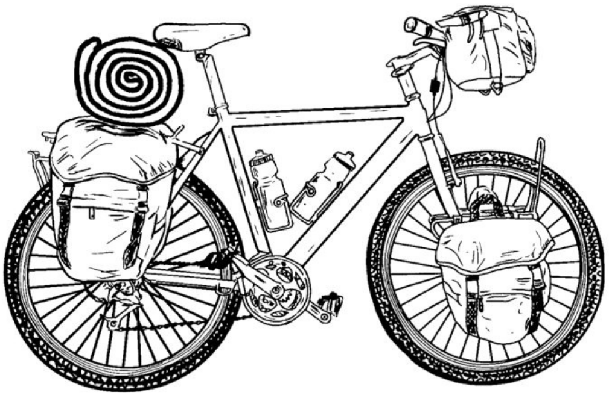

# Accomodation in Gioia del Colle (BA)

Are you bike touring? 
Are you biking towards Matera -> Alberobello and you looking for an affordable, and bike friendly accommodation in Gioa del Colle? Perfect!! you are reading the right post!

I’m an enthusiast cyclist based in Gioia del Colle, offering accommodation to fellow bike travelers. When you stay at my place, you'll feel like part of the family, sharing travel stories, drinks, and meals together. 

Just text and ask for availability!!  Peppe +39 35 one 59490 one one

## GPX Bike routes Matera-Gioa-Alberobello

* [Matera Gioia touring gpx route](http://spatial-ecology.net/docs/source/OUTDOOR/Matera_Gioia_touring.gpx)

* [Gioia Alberobello touring gpx route](http://spatial-ecology.net/docs/source/OUTDOOR/Gioia_Alberobello_touring.gpx)
* [Gioia Alberobello gravel gpx route](http://spatial-ecology.net/docs/source/OUTDOOR/Gioia_Alberobello_gravel.gpx.zip) 

## What to do on the Matera-Gioa-Alberobello routes

### Fattoria la Florida
[Fattoria la Florida](https://goo.gl/maps/DLtEBz9cn18zYtPL7) have very good and fresh mozzarella di Bufala. Mozzarella di Bufala is quite rare so do not loose this opportunity.

### Masseria quercetta
In the same area there is the [Masseria quercetta](https://maps.app.goo.gl/5YHUcAjjW3Kdr6rZ9) they have a very good cheese/mozzarella(cow) production and they have a selling point. So it is a must for a stop!! 

### What to eat
In Puglia you can survive with Focaccia and Mozzarella :-). The focaccia you can find in all bakeries (so call forno, pasticceria, panificio) rather the Mozzarella in the cheese shops (so call caseficio). For example in Gioia go to [Panetteria - Pasticceria Vittorio](https://maps.app.goo.gl/mU9MsCQHbUZ2kde28) and get the focaccia then walk few hundred meters to [Arcano](https://maps.app.goo.gl/rEXRkF8UZ4GvKJbw9)  get mozzarella keep walking to up to [here](https://maps.app.goo.gl/t1SmSvA81FDKZrD18) seat and enjoy :-).

Some local grocery/supermarket also have cooked food (e.g. lasagna), so with few euro you can get a real lunch. Also some bakeries make pizza and they are cheaper then pizzeria.

For drinking water there many fountains in the towns a bit less in the rural area (just ask to farmers).

### Use rural roads!!

Always AVOID the road that connect the the town directly, such as:
Giaoi-Noci, Alberobello-Locorotondo, etc. rather always use rural-road. They more beautiful and without cars.