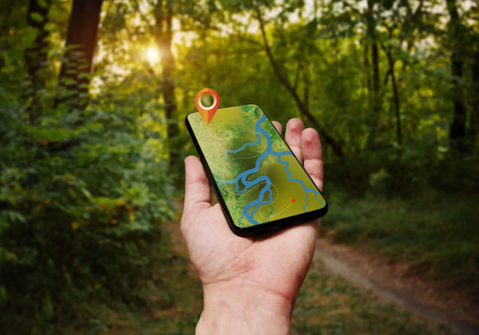

# Do not get lost in the wilderness
**Using Mobile App for 
Outdoor Orienteering and Tracking**  
Giuseppe Amatulli  
Research Scientist in GeoComputation and Spatial Science  

    
  

---------------------

**Instrument features**

 - Easy to use  
 - Accuracy  
 - Off-line maps  
 - Way-point and Tracking capability  
 - Capability to use free maps  
 - Interoperability with other platform 

---------------------

**Organize your next adventure**

 - Prepare your routs/maps/satellite-images at home.
 - Load maps and routs in your mobile.
 - Share the routs/maps/satellite-images with your team.
 - At least 3 persons need be able to navigate and bring all the device needed. Why three? 
 - Full charge the battery.
 - Bring an external battery (powerbank) for emergency.
 - During navigation put the phone in airplane mode and in battery saving mode.
 - Close all the other apps.

---------------------

**Apps/web-platforms with Navigation and GPS capability**

- Navigation
  - Here App https://here.navigation.com
- Orienteering and Tracking
  - Android → Locus App  http://www.locusmap.eu/
  - I-phone → MotionX GPS https://itunes.apple.com/us/app/motionx-gps/id299949744?mt=8
- Routing and Mapping
  - Ride with GPS: https://ridewithgps.com/
  - CalTopo: https://ridewithgps.com/

---------------------

**Here App : https://wego.here.com**

- Easy to install and use
- Off-line vectors maps free to download from the here map
- Web-platform and app user login – synchronized 
- Save locations and points of interest 
- Navigation system (from – to), in off/on-line mode
- Voice Navigation, but only on car-mode (not for walking and biking)

---------------------

**Ride with gps: https://ridewithgps.com/**

- Web-GIS mapping interface
- Vector maps and satellite images visualization
- Biking and walking trails 
- Good for planing and pre-tracking
- Routing (from – to)
- Adjusting routing
- Import/export gpx → import in Locus for navigation. 

---------------------

**CALTOPO : https://caltopo.com**

- Web-GIS mapping interface
- Vector maps and satellite images visualization. 
- Off-line data storage only under annual subscription
- Vector editing/labeling
- Import/export gpx
- Good for planing and pre-traking.

