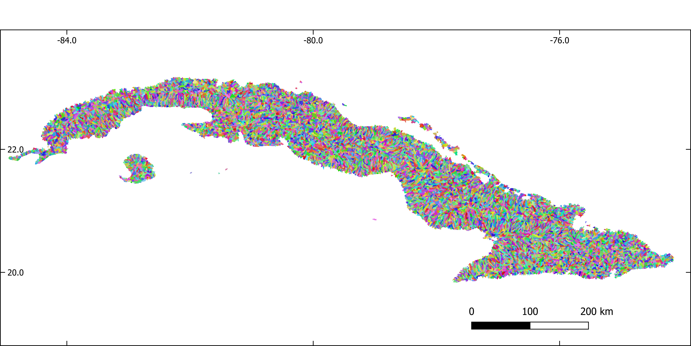
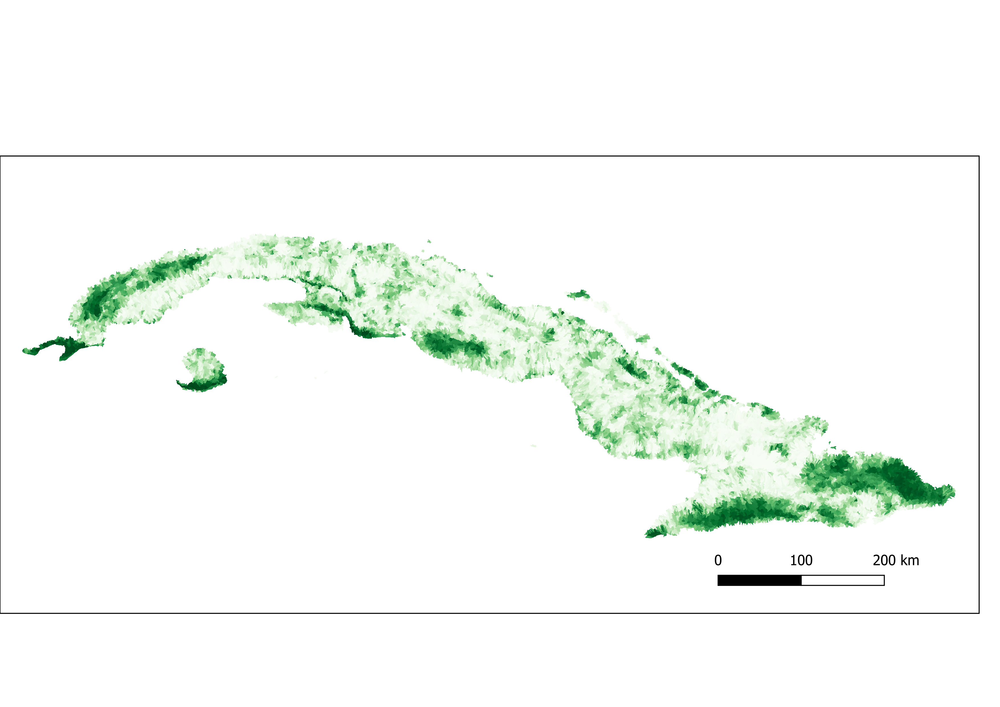
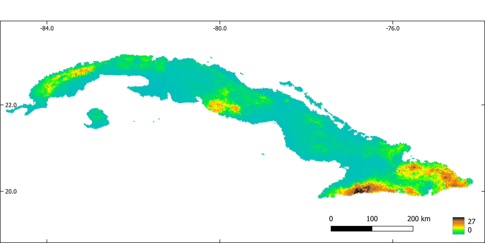
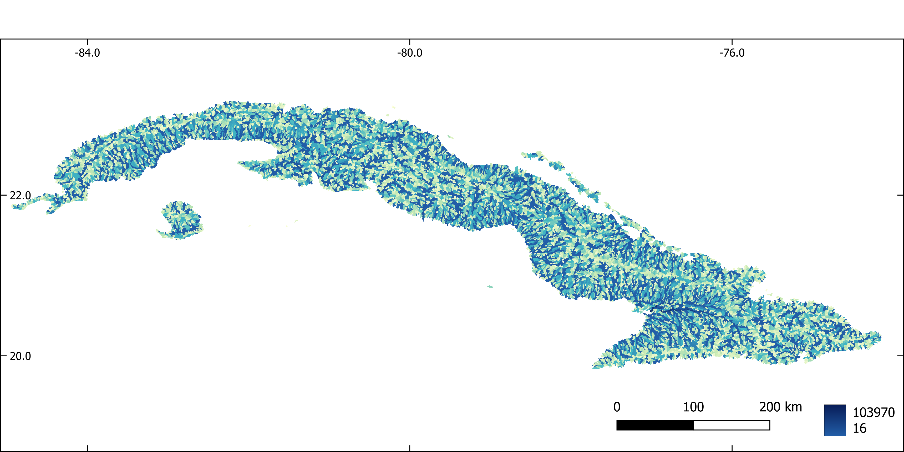
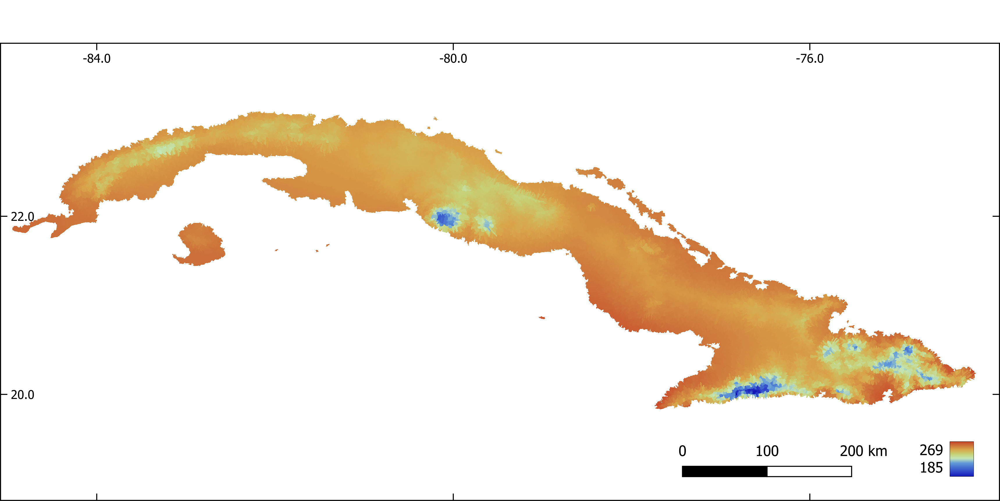
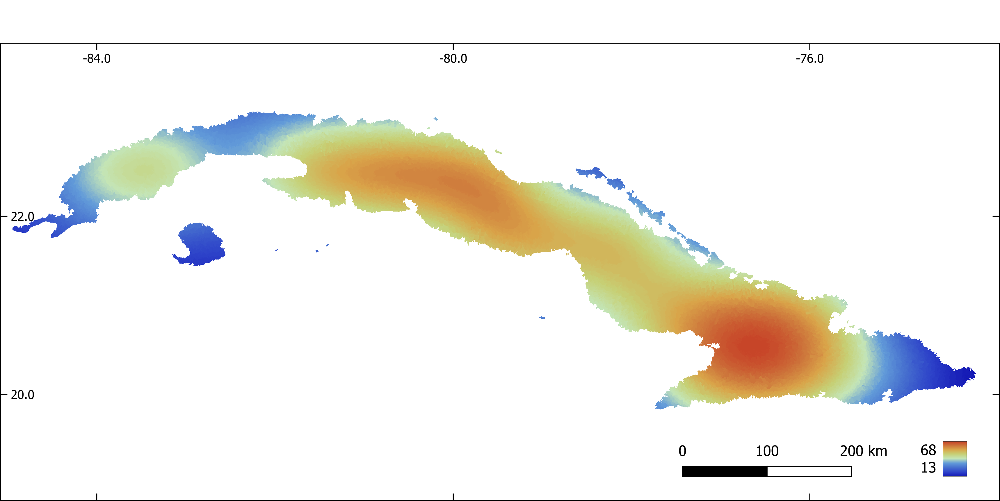
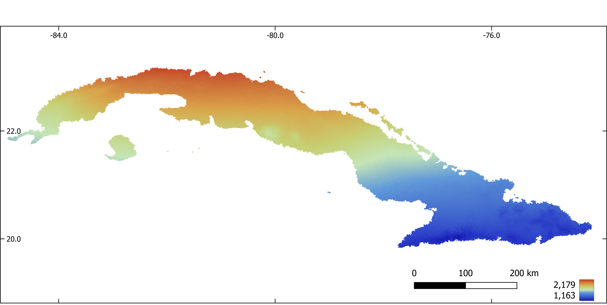
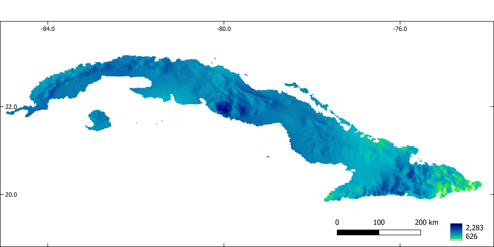
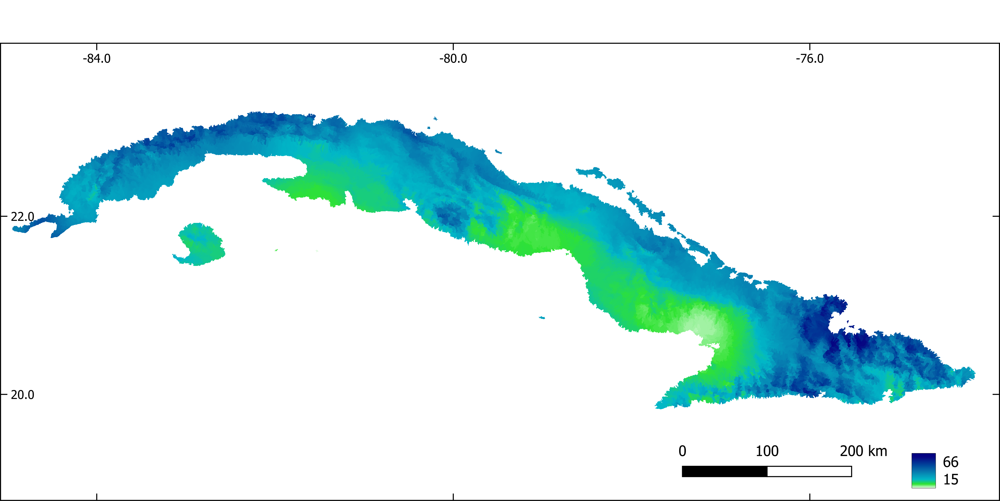
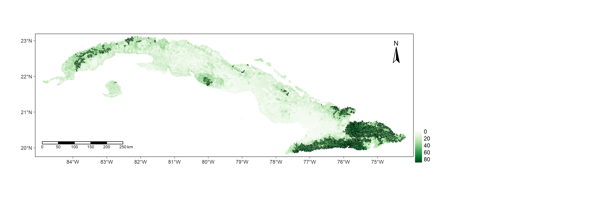

# Yusdiel Torres-Cambas: Distribution of freshwater biodiversity across Cuba
[Presentation](http://spatial-ecology.net/docs/source/STUDENTSPROJECTS/Proj_2022_Matera/Distributionof_Fresh_water_Biodiversity_AcrossCuba_Yusdiel_Torres.pdf)  
[Video recording](https://youtu.be/txgG2FRvln4)

## Introduction
Freshwater ecosystems are amongst the most biodiverse and the most important providers of ecosystem services to humans globally. Simultaneously, these ecosystems are also amongst the most threatened in the world. Threats include habitat loss and fragmentation, overharvesting, flow alteration, contamination and introduction of invasive species; all of which could be exacerbated by the influence of climate change in the future. 
Species distribution is a basic information required to develop conservation strategies for freshwater ecosystems. Unfortunately, we lack this information for many of the tropical freshwater species. Species distribution models are a useful tool to fill this knowledge gap. In the present project, the potential distribution of species of freshwater insects, crustaceans, mollusk, amphibians and fishes was modeled. 
The first part of the project is dedicated to prepare the model inputs. These include download, crop and reproject the layers of predictor variables, aggregate this variables by sub-basins and generate pseudoabsences for the models. The second part includes the modelling procedure.

## 1. Predictor variables

All the layers were cropped to the extent of Cuba and reprojected (Cuba Norte projection, EPSG: 3795). 

### 1.1. Download and mosaic tiles of a digital elevation model

```{bash  eval=FALSE}
#Download and mosaic DEM tiles 
#!/bin/bash

INPUT=/media/sf_Nextcloud/matera/raster_layers/wgs84
OUTPUT=/media/sf_Nextcloud/matera/raster_layers/wgs84
#INPUTV=/media/sf_Nextcloud/matera/vector_layers

#Download and unpack DEM tiles for Cuba
wget --user=hydrography --password=rivernetwork -P $OUTPUT http://hydro.iis.u-tokyo.ac.jp/~yamadai/MERIT_Hydro/distribute/v1.0/elv_n00w090.tar
tar -xvf $INPUT/elv_n00w090.tar -C $OUTPUT

#Mosaic tiles
gdalbuildvrt -overwrite $OUTPUT/merit_hydro_cuba_wgs8.vrt $INPUT/elv_n00w090/n15w075_elv.tif $INPUT/elv_n00w090/n20w075_elv.tif $INPUT/elv_n00w090/n15w080_elv.tif $INPUT/elv_n00w090/n20w085_elv.tif $INPUT/elv_n00w090/n20w080_elv.tif
gdal_translate -co COMPRESS=DEFLATE -co ZLEVEL=9 $OUTPUT/merit_hydro_cuba_wgs8.vrt $OUTPUT/dem_wgs8.tif

```

### 1.2. Download bioclimatic variables
```{bash  eval=FALSE}
### Download a list of raster layers from CHELSA website
#that represent bioclimatic variables for present climate
#!/bin/bash

#links_bio.txt: URLs of files to be downloaded

INPUT=/media/sf_Nextcloud/matera/scripts
OUTPUT=/media/sf_Nextcloud/matera/raster_layers/wgs84

wget -i $INPUT/links_bio.txt -P $OUTPUT
```


### 1.3. Download and mosaic tiles of tree cover
```{bash  eval=FALSE}

#Download  and mosaic Global 2010 Tree Cover (30 m)
#!/bin/bash

INPUT=/media/sf_Nextcloud/matera/raster_layers/wgs84
OUTPUT=/media/sf_Nextcloud/matera/raster_layers/wgs84
#INPUTV=/media/sf_Nextcloud/matera/vector_layers

#Download tree cover tiles for Cuba
wget -P $OUTPUT https://glad.umd.edu/Potapov/TCC_2010/treecover2010_20N_080W.tif
wget -P $OUTPUT https://glad.umd.edu/Potapov/TCC_2010/treecover2010_30N_080W.tif
wget -P $OUTPUT https://glad.umd.edu/Potapov/TCC_2010/treecover2010_30N_090W.tif

#Mosaic tiles
gdalbuildvrt -overwrite $OUTPUT/tree_wgs84.vrt $INPUT/treecover2010_20N_080W.tif $INPUT/treecover2010_30N_080W.tif $INPUT/treecover2010_30N_090W.tif
gdal_translate -co COMPRESS=DEFLATE -co ZLEVEL=9 $INPUT/tree_wgs84.vrt $OUTPUT/tree_wgs84.tif
```


### 1.4. Calculate slope
```{bash  eval=FALSE}
#Calculate slope
#!/bin/bash
INPUT=/media/sf_Nextcloud/matera/raster_layers/wgs84
OUTPUT=/media/sf_Nextcloud/matera/raster_layers/wgs84

#Slope
gdaldem slope -s 111120 -alg ZevenbergenThorne -co COMPRESS=LZW -co ZLEVEL=9 $INPUT/dem_wgs8.tif $OUTPUT/slope_wgs84.tif
```


### 1.5. Crop and reproject 
```{bash  eval=FALSE}
#Crop and reproject (Cuba Norte EPSG:3795)
#!/bin/bash

VECTORPATH=/media/sf_Nextcloud/matera/vector_layers
INPUTPATH=/media/sf_Nextcloud/matera/raster_layers/wgs84
OUTPUTPATH=/media/sf_Nextcloud/matera/raster_layers/cubanorte

#Download a vector file of Cuba. This vector file is used to crop all raster
wget -P $VECTORPATH https://data.humdata.org/dataset/32b4ba2e-2ee5-4b2b-a7e4-9e4d323ffe73/resource/42e19431-86a8-451c-a903-d60ec5ec16ad/download/cub_adma_2019_shp.zip
unzip -o $VECTORPATH/cub_adma_2019_shp.zip  -d  $VECTORPATH

#Crop and reproject DEM
#Crop
gdalwarp   -cutline $VECTORPATH/cub_admbnda_adm0_2019.shp -cl cub_admbnda_adm0_2019 -crop_to_cutline $INPUTPATH/dem_wgs8.tif  -dstnodata -9999 $INPUTPATH/dem_wgs8_crop.tif
# Reproject
gdalwarp -t_srs EPSG:3795 -r bilinear $INPUTPATH/dem_wgs8_crop.tif $OUTPUTPATH/dem.tif

#Crop and reproject bioclimatic layers
for file in $INPUT/CHELSA*.tif; do
   filename=$(basename $file .tif | cut -f 3 -d '_')
   echo $file
   echo $filename
   gdalwarp -cutline $VECTORPATH/cub_admbnda_adm0_2019.shp -cl cub_admbnda_adm0_2019 -crop_to_cutline $file  -co COMPRESS=LZW -co ZLEVEL=9 -dstnodata -9999 $INPUT/bio$filename.tif -overwrite
   gdalwarp  -t_srs EPSG:3795 -r bilinear $INPUT/bio$filename.tif  -co COMPRESS=LZW -co ZLEVEL=9 -dstnodata -9999 $OUTPUT/bio$filename.tif -overwrite
done

#Crop and reproject percent tree cover
#Crop
gdalwarp   -cutline $VECTORPATH/cub_admbnda_adm0_2019.shp -cl cub_admbnda_adm0_2019 -crop_to_cutline $INPUTPATH/tree_wgs84.tif  -dstnodata $INPUTPATH/tree_wgs84_crop.tif
# Reproject
gdalwarp -t_srs EPSG:3795 -r bilinear $INPUTPATH/tree_wgs84_crop.tif $OUTPUTPATH/tree.tif

#Crop and reproject slope
#Crop
gdalwarp   -cutline $VECTORPATH/cub_admbnda_adm0_2019.shp -cl cub_admbnda_adm0_2019 -crop_to_cutline $INPUTPATH/slope_wgs84.tif  -dstnodata -9999 $INPUTPATH/slope_wgs84_crop.tif
# Reproject
gdalwarp -t_srs EPSG:3795 -r bilinear $INPUTPATH/slope_wgs84_crop.tif $OUTPUTPATH/slope.tif
```

## 2. Stream network and sub-basins
The digital elevation model was used to extract a stream network and sub-basins associated with each stream reach
in GRASS-GIS. All predictors were aggregated (mean) by sub-basin.

### 2.1. Make a GRASS GIS database
```{bash  eval=FALSE}
#Make a GRASS GIS database

#Path to the database
export GRASS=/media/sf_Nextcloud/matera/grassdatabase
echo $GRASS
mkdir $GRASS

#Path to a DEM. The DEM is used to set the resolution and CRS of the GRASS-GIS
#location  
export DEMPATH=/media/sf_Nextcloud/matera/raster_layers/cubanorte/dem_3795.tif
echo $DEMPATH

### Create the GRASS GIS database and enter GRASS:
grass78  -text -c $DEMPATH  $GRASS/cubanorte
```

### 2.2. Extract flow direction, flow accumulation, stream network, basins and sub-basins
```{bash  eval=FALSE}
#Extract flow direction, flow accumulation, stream network, basins and sub-
#basins

#Path to the database
export GRASS=/media/sf_Nextcloud/matera/grassdatabase
echo $GRASS
mkdir $GRASS

#Path to a DEM
export INPUT=/media/sf_Nextcloud/matera/raster_layers/cubanorte/dem_3795.tif
echo $INPUT

#Output path
export OUTPUT=/media/sf_Nextcloud/matera/raster_layers/cubanorte
export OUTPUTV=/media/sf_Nextcloud/matera/vector_layers/cubanorte
# Open a GRASS GIS session
grass78  -text $GRASS/cubanorte/PERMANENT

### Import an elevation model into GRASS:
r.in.gdal $INPUT   output=elevation
#Visualize DEM
d.mon wx0
d.rast elevation

# flow direction, flow accumulation, stream
r.watershed -b -a  elevation=elevation  drainage=dirs   stream=stream  accumulation=accums  threshold=500 convergence=10  --o
# basins
g.extension r.stream.basins
r.stream.basins  direction=dirs  stream_rast=stream  basins=basins_last  -l  --o
# sub-basins
r.stream.basins  direction=dirs  stream_rast=stream  basins=sub_basins  --o
r.grow  input=sub_basins output=sub_basins_g --overwrite
# stream network with stream order
g.extension r.stream.order
r.stream.order  stream_rast=stream   elevation=elevation  direction=dirs  accumulation=accums  strahler=stream_strahler stream_vect=streams_v  --o

# Save results

r.out.gdal  input=basins_last   output=$OUTPUT/basins.tif      type=Int32  nodata=-9999  --o  -c  -m  createopt="COMPRESS=LZW,ZLEVEL=9"
r.out.gdal  input=sub_basins_g    output=$OUTPUT/sub_basins.tif   type=Int32  nodata=-9999  --o  -c  -m -f createopt="COMPRESS=LZW,ZLEVEL=9"

v.out.ogr  input=streams_v  output=$OUTPUTV/streams_v.gpkg   format=GPKG  type=line  --overwrite
r.out.gdal  input=accums   output=$OUTPUT/accums.tif      type=Int32  nodata=-9999  --o  -c  -m -f  createopt="COMPRESS=LZW,ZLEVEL=9"
r.out.gdal  input=dirs   output=$OUTPUT/dirs.tif      type=Int32  nodata=-9999  --o  -c  -m  -f createopt="COMPRESS=LZW,ZLEVEL=9
```


*Figure 1. Stream network extracted with GRASS-GIS*


*Figure 2. Sub-basins extracted with GRASS-GIS*

### 2.3. Aggregate predictors by sub-basin
```{bash  eval=FALSE}
#Aggregate predictors by sub-basin

#Path to the database
export GRASS=/media/sf_Nextcloud/matera/grassdatabase
echo $GRASS

#Input path
export INPUT=/media/sf_Nextcloud/matera/raster_layers/cubanorte

#Output path
export OUTPUT=/media/sf_Nextcloud/matera/raster_layers/cubanorte_aggregate

# Open a GRASS GIS session
grass78  -text $GRASS/cubanorte/PERMANENT

#Import sub-basins
r.in.gdal /media/sf_Nextcloud/matera/raster_layers/cubanorte/sub_basins.tif output=subb --overwrite

for file in $INPUT/*.tif; do

   filename=$(basename $file .tif)
   echo $file
   echo $filename
   r.in.gdal $file output=predictor --overwrite
   r.grow  input=predictor radius=5 output=predictor --overwrite
   r.stats.zonal method=average cover=predictor base=subb output=predictor_aggr --overwrite
   r.out.gdal  input=predictor_aggr output=$OUTPUT/$filename.tif type=Float32  nodata=-9999  --o  -c  -m -f  createopt="COMPRESS=LZW,ZLEVEL=9"
done
```



*Figure 3. Percent of tree cover aggregated by sub-basin.*


*Figure 4. Slope aggregated by sub-basin.*


*Figure 5. Flow accumulation aggregated by sub-basin.*


*Figure 6. Annual mean temperature (x 10) aggregated by sub-basin.*


*Figure 7. Mean diurnal range (x 10) aggregated by sub-basin.*


*Figure 8. Temperature seasonality aggregated by sub-basin.*



*Figure 9. Annual precipitation (mm).*


*Figure 10. Precipitation of the driest month (mm).*
```
## 3. Biodiversity data
Occurrence records were obtained from the scientific literature, unpublished thesis, Cuban scientific collections and online databases (GBIF, https://www.gbif.org, iNaturalist, https://www.inaturalist.org/).
Pseudo-absences were selected at random from potential unsuitable sub-basins for the presence of each species, previously identified through a one-class support vector machine analysis (i.e. two-step pseudo-absence selection method, Senay et al., 2013). The number of selected pseudo-absences was set to keep a constant prevalence (i.e. proportion presences / pseudoabsences) of 0.1 through all species (Barbet-Massin et al., 2012).

### 3.1. Creates a map with prediction points. One point per stream reach. Extract predictor values at each point
```{r  eval=FALSE}
R
#Creates a map with prediction points. One point per stream reach. Extract predictor values at each point 

library(dplyr)
library(sf)
library(raster)
library(maptools)

# Import presences
  pres <- st_read("./vector_layers/cubanorte/oc.gpkg") 
  
# Import streams
  streams <- st_read("./vector_layers/cubanorte/streams_v.gpkg") %>%
    filter(!(length==0))

# Transform stream to an sp object
  streams <- as_Spatial(streams)

# Get coordinates of the middle point of each stream segment
  center_points <- getSpatialLinesMidPoints(streams)%>%
    as.data.frame(center_points@coords) %>%
      st_as_sf(coords = c("coords.x1","coords.x2"))%>%
        st_set_crs(3795)

  center_points <- as_Spatial(center_points)

# Snap points to the nearest line
  center_points <- snapPointsToLines(center_points, streams)

# Get ID of each stream segment
  stream_id <- streams$stream

# Creates an sf object with stream IDs and middle point of each stream
  prediction_sites <- as(center_points, "sf")%>%
    dplyr::select(geometry)
  
  prediction_sites$stream_id <- stream_id

# Extract predictor values at prediction points
  list_pred <- list.files("./raster_layers/cubanorte_aggregate", full.names = T)
  
  predict_stack <- raster::stack(list_pred)
  
  predict_val <- extract(predict_stack, prediction_sites)
  
# Standardize variables
  predict_val <- predict_val %>%
    scale(center = T, scale = T)
  
  prediction_sites <- cbind(prediction_sites, predict_val) %>%
    st_set_crs(3795)

# Save results
  st_write(prediction_sites, "./sdm/input/prediction_sites.gpkg",
         driver = "GPKG", append = F)
```


### 3.2. Make maps with presence and pseudoabsences 

```{r  eval=FALSE}
#Creates a map with presence and pseudoabsences 

R

library(dplyr)
library(sf)
library(raster)
library(e1071)

# Keep only one observation point per sub-basin and extract predictor values at 
# each observation point
  pres <- st_read("./vector_layers/cubanorte/oc.gpkg")
  sub_bas <- raster("./raster_layers/cubanorte/sub_basins.tif")
 
  pres_ids <- extract(sub_bas, pres)%>%
    unique()
  
  predict_points <- st_read("./sdm/input/prediction_sites.gpkg")
  
  pres_pred <- predict_points %>%
    filter(stream_id %in% pres_ids)
  
# Inputs of the OCSVM model 
  occur_vars <- pres_pred %>%
    dplyr::select(-stream_id) %>%
      st_drop_geometry()
    
  bkgr_vars <- predict_points %>%
    dplyr::select(-stream_id) %>%
      st_drop_geometry()
  
# Model fitting
  svm_model <- svm(occur_vars, y=NULL, type='one-classification', nu=0.5)
    
# Make predictions with OCSVM
  env_prof_r <- predict(svm_model, bkgr_vars)
    
# Transform predictions from TRUE/FALSE to 1/0
  env_prof_r <- ifelse(env_prof_r=="FALSE",0,1)
    
# Add sub-basins ids
  env_prof_r <- data.frame(predict_points$stream_id, "pres_abs" = env_prof_r)
    
# Extract sub-basins IDs at sub-basins where the species is not recorded and
# the environmental profiling predicted an absence
  abs_ids <- predict_points %>%
    filter(!(stream_id %in% env_prof_r$stream_id) & 
      !(stream_id %in% pres_pred$stream_id))
  
# Generates a random sample of sub-basin IDs where the species is 
# potentially absent (no records or absence predicted by OCSVM).
# The number of random points is 10 times the number of occurrences
  pseudo_streams_ids <- sample(x = abs_ids$stream_id, size = 10*nrow(pres_pred))
    
# Make an sf object with random points from previous step
  pseudoabs_map <- predict_points %>%
    filter(stream_id %in% pseudo_streams_ids)

# Add a column with absences to the sf object from previous step
  pseudoabs_map$pres_abs <- 0
  
# Add a column with presences to the sf object with occurrence points
  pres_pred$pres_abs <- 1
    
# Bind presences and absences in an sf object
  obser_sites <- rbind(pres_pred, pseudoabs_map) %>%
    st_set_crs(3795)
    
# Save results
  st_write(obser_sites, "./sdm/input/obs.gpkg", append = F)
```


### 3.3. Make inputs required to create an SSN object, a kind of R object necessary to fit a Spatial Linear Models for Stream Networks (Hoef et al. 2014, Peterson et al. 2020). 

References:

1. Hoef, J.M. Ver, Peterson, E.E., Clifford, D., Shah, R., 2014. SSN: An R package
for spatial statistical modeling on stream networks. J. Stat. Softw. 56, 1–45.

2. Peterson, E., Scha, R.B., Id, M.K., Szo, E., 2020. Preparing GIS data for 
analysis of stream monitoring data: The R package 
openSTARS 1–10. https://doi.org/10.1371/journal.pone.0239237


The first part of the script initiate a GRASS-GIS session and import rasters with flow direction and flow accumulation and vector maps with a stream network and prediction sites into GRASS-GIS.
```{bash  eval=FALSE}
#!/bin/bash

#Input and output path

export INPUTDIR=/media/sf_Nextcloud/matera/
export OUTPUTDIR=/media/sf_Nextcloud/matera/sdm/input
echo $INPUTDIR
echo $OUTPUTDIR


# Make a GRASS location with a projected CRS for Cuba (EPSG: 3795) and load GRASS GIS.

grass78  -text -c $INPUTDIR/raster_layers/cubanorte/dem_3795.tif $INPUTDIR/grass_openstars

#Open an existing GRASS location
#grass78  -text $INPUTDIR/grass_openstars/PERMANENT

# Check current location projection
g.proj -wf

# Import maps of flow direction, flow accumulation, stream network,
# sampling sites and prediction sites into GRASS
#Map's name for flow direction, flow accumulation, stream network and
#sampling sites must be "dirs", "accums", "streams_v" and "sites_o" respectivelly

r.in.gdal $INPUTDIR/raster_layers/cubanorte/dirs.tif output=dirs --overwrite
r.in.gdal $INPUTDIR/raster_layers/cubanorte/accums.tif output=accums --overwrite
v.in.ogr $INPUTDIR/vector_layers/cubanorte/streams_v.gpkg output=streams_v --overwrite
v.in.ogr $INPUTDIR/sdm/input/prediction_sites.gpkg output=pred_sites_o --overwrite


#Rename columns in the attribute table of streams_v. This is required because
# openSTARS exports the results as Esri shapefiles, that requires column names length
# of 10 charactres or less

v.db.renamecolumn map=streams_v column=next_stream,next_str
v.db.renamecolumn map=streams_v column=scheidegger,scheid
v.db.renamecolumn map=streams_v column=source_elev,s_elev
v.db.renamecolumn map=streams_v column=outlet_elev,o_elev

#Check the attribute table
db.columns table=streams_v

```

The second part of the script calls R from within the GRASS-GIS session of the previous step, **(1)** check and correct the stream network and **(2)** prepare edges, **(3)** observation sites and **(4)** prediction sites.   
**(1)check and correct the stream network**: Stream network may have stream confluences of more than three segments, i.e. where more than two line segments flow into a node. These parts must be corrected before further processing.   
**(2)prepare edges**: Information (e.g. reach contributing area, upstream catchment areas, attributes related with the topology of the stream network) needed for the SSN object are derived for the streams and stored in a new vector map edges.  
**(3) prepare observation sites and (4) prediction sites**: snap points to the stream network, and add some attributes (e.g. distance to the outlet, reach identifier, network identifier)   


```{r  eval=FALSE}
R
library(openSTARS)
library(sp)
library(rgdal)
library(dplyr)
library(rgrass7)
use_sp()

# Correct the network where more than two line segments flow into a node
correct_compl_confluences()

#Prepare edges. Information needed for the SSN object are derived for the
#streams and stored in a new vector map "edges" based on streams_v
calc_edges()

#Read files with observation points 
  path_obs_files <- "/media/sf_Nextcloud/matera/sdm/input/obs_sites"
  obs_files <- list.files(path=path_obs_files, 
                          pattern = ".gpkg",
                          full.names = T)%>%
    lapply(readOGR)
#Get the names of files
  files_names    <- gsub(".gpkg","",
                         list.files(path_obs_files,full.names = FALSE),
                         fixed = TRUE)
#Import maps with observation sites of each species into GRASS
  for (i in 1:length(files_names)) {
    writeVECT(obs_files[[i]], vname = "sites_o", v.in.ogr_flags = "overwrite")
    calc_sites(predictions = "pred_sites_o")
    
#Write all data to an SSN folder
    ssn_dir <- file.path("./media/sf_Nextcloud/matera/sdm/input/outputOpenSTARS", files_names[i])
    export_ssn(ssn_dir, predictions = "pred_sites", delete_directory = TRUE)
  }
  
```


## 5. Species distribution modelling 

### 5.1. Model calibration and evaluation

```{r  eval=FALSE}

#Predict species distribution with a spatial linear model for stream network

library(SSN)
library(dplyr)


list_ssn_dirs <- list.dirs(path = "C:/Users/torres/Desktop/temporal", recursive = F)

load("./SDM/CorMdls.RData")


####### Functions

#Model selection Spatial Stream Network
#Non-spatial models. Fits all possible models and select the one with 
#lowest AUC
SSNparam <- function(SSNobj, CorMdls)
{
  
  # SSNparam <- function(SSNobj, CorMdls)
  #   {
  library(foreach)
  library(doParallel)
  library(MuMIn)
  library(purrr)
  # Selecting a non-spatial model
  DataNsp <- getSSNdata.frame(SSNobj, Name = "Obs")%>%
    dplyr::select(accums_av:slope_av, pres_abs)
  
  ModelNsp <- try(glm(formula = pres_abs ~ ., 
                      data = DataNsp,
                      family = binomial))
  options(na.action = "na.fail")
  ListModelNsp <- dredge(ModelNsp)
  BestModelNsp <- eval(attributes(ListModelNsp)$model.calls[[1]])
  
  #Get Residuals
  SSNobj@obspoints@SSNPoints[[1]]@point.data$RES <- resid(BestModelNsp)
  #Spatial models
  #Setup of a parallel backend
  print("Selecting a spatial autocorrelation model...")
  n.cores <- parallel::detectCores() - 1
  my.cluster <- parallel::makeCluster(
    n.cores,
    type = "PSOCK"
  )
  doParallel::registerDoParallel(cl = my.cluster)
  ssn_cor_test <- foreach (m = 1:length(CorMdls), .packages = "SSN", .errorhandling="remove") %dopar%  {
    #   print(paste(eval(CorMdls[[m]])))
    glmssn(RES ~ 1, SSNobj, CorModels= eval(CorMdls[[m]]),
           addfunccol = "computed.afv")
  }
  parallel::stopCluster(cl = my.cluster)
  # #Models AIC
  cor_modl_AIC <- InfoCritCompare(keep(ssn_cor_test, is.list))
  #Results
  formula <- BestModelNsp$formula
  model <- eval(CorMdls[[which.min(cor_modl_AIC$AIC)]])
  return(list("formula" = formula, "model" = model, "modelsAIC" = cor_modl_AIC))
  #return(list("formula" = formula))
  
}


#Function to calculates metrics of model performance
# obsPresAbs: a vector with presence / absence, test dataset
# predProb: predicted probabilities on test dataset with a model calibrated with
# train dataset
# The function returns a list with two dataframe, one with thresholds used to transform 
# predicted probabilities to presence / absence and calculate threshold-based
# performance metrics and other with performance metrics

eval_mod <- function(idsPresabsProb)
{
  #devtools::install_github("meeliskull/prg/R_package/prg", force = T)
  require(prg)
  require(PresenceAbsence)
  require(modEvA)
  require(dplyr)
  require(tibble)
  
  #Calculates AUC of PRG
  AUC_PRG <- prg::calc_auprg(prg::create_prg_curve(labels = idsPresabsProb[,2],
                                                   pos_scores = idsPresabsProb[,3]))
  
  
  #Calculates AUC of ROC
  AUC_ROC <- AUC(obs = idsPresabsProb[,2], 
                 pred = idsPresabsProb[,3], 
                 plot = F,
                 simplif = T) 
  
  # Calculates threshold based methods to asses model performance
  # Calculate thresholds 
  thresh <- idsPresabsProb %>%
    optimal.thresholds(opt.methods = c("Sens=Spec"))
  
  #Calculate threshold based metrics. Use the threshold that minimize the 
  #difference between sensibility and specificity
  
  perform <- threshMeasures(obs = idsPresabsProb[,2], 
                            pred = idsPresabsProb[,3], 
                            simplif = T, thresh = thresh[,2], standardize = T,
                            measures = c("Sensitivity", "Specificity", "Omission", "Commission", "TSS"))%>%
    as.data.frame()%>%
    rownames_to_column(var = "Measures")%>%
    add_row(Measures = c("AUC_ROC", "AUC_PRG"), Value = c(AUC_ROC, AUC_PRG))   #Add 
  #non-threshold based measures to a data frame with all metrics
  #Make a list with thresholds and performance metrics 
  func_output <- list("threshold" = thresh, "performance" = perform)
  #Return the list
  return(func_output)
}

#Get the names of files. Will be used to save results
files_names <- list.files(path = "C:/Users/torres/Desktop/temporal" ,full.names = FALSE)
                  


#Loop through all species

for (sp in 1:length(list_ssn_dirs)) {
  time_sp <- system.time({
    tryCatch({
      
    #1 Imports SSN object
      print(paste("Start",files_names[sp] ,sep = " "))
    print("Importing SSN object...")
    ssn_dir <- list_ssn_dirs[sp]
    ssn_sp_i <- importSSN(ssn_dir, predpts = "pred_sites")
  
    #2 Generating an additive function value (necessary for Tail-up models)
    print("Generating an additive function value...")
    ssn_sp_i <- additive.function(ssn_sp_i, "H2OArea","computed.afv")
    
    #3 Calculates distance matrix
    print("Calculating distance matrix...")
    createDistMat(ssn_sp_i, predpts = "pred_sites", o.write = T)
    
    
    ## Model parameter calibration
    glmssnParam <- SSNparam(ssn_sp_i, CorMdls)
    
    # Output path
    output_path <- paste0("./SDM/output/indepModels/",files_names[sp])
    ifelse(!dir.exists(output_path), dir.create(output_path), FALSE)
    output_path3 <- paste0("./SDM/output/ClimateScenarios/",files_names[sp])
    ifelse(!dir.exists(output_path3), dir.create(output_path3), FALSE)
    #Matrix to save results
    thres <- matrix(nrow = 1, ncol = 10)
    perform <- matrix(nrow = 2, ncol = 10)
    predict_sites <- getSSNdata.frame(ssn_sp_i, Name = "pred_sites")
    PredProb <- matrix(nrow = nrow(predict_sites), ncol = 11)
    PredProb[,11] <- predict_sites$stream
    # Import data frames with sub-catchment ids of calibration and evaluation
    # data sets
    CalDf <- read.csv(paste0("./SDM/input/occurr/",files_names[sp],"/calib.csv"))
    EvalDf <- read.csv(paste0("./SDM/input/occurr/",files_names[sp],"/eval.csv"))
    
    #Model training and testing through a 10 split sampling strategy
    for (r in 1:10) {
    tryCatch({
    #Data frame with observation points 
    ssn_test_dataDF <- getSSNdata.frame(ssn_sp_i)
    
    #Ids of observations selected for evaluation 
    EvaIds <- EvalDf[,r]
    
    #Insert NAs in the column of the response variable (pres_abs) in the observations
    #selected for evaluation
    ssn_test_dataDF[ssn_test_dataDF$stream %in% EvaIds,"pres_abs"] <- NA
    
    #Put the data frame with NAs in the SSN object. 
    ssn_calib_data <- putSSNdata.frame(ssn_test_dataDF, ssn_sp_i)
    #With this, the regression omits observations with NAs and the model is fitted
    # only on the calibration data set 
    options(na.action = "na.omit")
    
    #Fit the model with the calibration data set and parameters
    CalibSsn <- try(glmssn(formula =  glmssnParam$formula,
                                    family = "binomial",
                                    ssn_calib_data,
                                    CorModels = glmssnParam$model,
                                    addfunccol = "computed.afv",
                                    control = list(trunc.pseudo=100)))
    #Predict points used for evaluation with the model trained with the 
    #calibration data set 
    PredEval <- predict.glmssn(CalibSsn, "_MissingObs_")
    #Extract predictions and transform from logit to probabilities 
    SSNProb <- function(p)
    {
      #"p": predictions from predict.glmssn
      logit <- getPreds(p, pred.type = "pred")
      prob <- 1/(1+exp(-logit[,2]))
      return(prob)
    }
    PredProbEval <- SSNProb(PredEval) 
    #Extract ids and observed presence-absences of points used for evaluation
    obsPresAbs <- getSSNdata.frame(ssn_sp_i) %>%
      filter(stream %in% EvaIds) %>%
      select(stream,pres_abs)
    
    #Evaluation metrics
    idsPresabsProb <- data.frame(obsPresAbs,PredProbEval)
    TSS <- eval_mod(idsPresabsProb)$performance[5,2]
    AUC <- eval_mod(idsPresabsProb)$performance[6,2]
    th <- eval_mod(idsPresabsProb)$threshold[1,2]
    thres[,r] <- th
    perform[,r] <- c(TSS, AUC)
    if (AUC > 0.7 & TSS > 0.7){
    #Predict on complete data set
    PredAll <- predict.glmssn(CalibSsn, "pred_sites")
    PredProb[,r] <- SSNProb(PredAll)
    
    #Binary transformation 
    presabs <- ifelse(PredProb[,r] >= th,1,0)
    #Save  AUC, TSS, thresholds and predictions of models with AUC and TSS > 0.7
    
      write.csv(EvaIds, row.names = F, paste0(output_path,"/eva_ssn_",r,".csv"))
      write.csv(AUC, row.names = F, paste0(output_path,"/auc_ssn_",r,".csv"))
      write.csv(TSS, row.names = F, paste0(output_path,"/tss_ssn_",r,".csv"))
      write.csv(th, row.names = F, paste0(output_path,"/th_ssn_",r,".csv"))
      write.csv(PredProb[,r], row.names = F, paste0(output_path,"/pred_ssn_",r,".csv"))
      write.csv(presabs, row.names = F, paste0(output_path,"/presabs_ssn_",r,".csv"))
    }
  
    } , error=function(e){}) 
    } 

  }, error=function(e){})
    
  }) 

 
}
                        

```

### 5.2. Model ensamble 

```{r  eval=FALSE}
#Ensemble model

library(dplyr)
library(sf)
library(raster)
setwd("C:/Users/torres/Nextcloud/FBAC")

# Function to create an ensemble prediction based on different methods
# "ids": unique identifier for each observation in "prob"
# "prob": data frame with predicted probabilities from different models.
# Each column in the data frame corresponds to a model
# "occurr": data frame. Ids on the first column, occurrences (presence / absence)
# in the second.
# "evalids": data frame with occurrence ids used for evaluation. Each column 
# correspond to an independent model.
# "perform":  AUC to use as weight in weighted mean probability ensemble model. 
# Each column correspond to a single model.


ensem_mod <- function(ids,
                      prob,
                      presabs,
                      occurr,
                      evalids
                      )
  {

  
## Mean ensemble model
  #Mean
  MeanEns <- apply(prob, 1, mean, na.rm=T)
  #Coefficient of variation of the mean probabilities 
  cv <- function (x) (sqrt(var(x, na.rm = T) / length(x)))/ mean(x, na.rm = T) 
  CvMeanEns <- apply(prob, 1, cv)

## Weighted mean probability ensemble model 
  
  ProbAUC <- matrix(nrow = nrow(prob), ncol = ncol(prob))
  for (i in 1:ncol(prob)) {
    ProbAUC[,i] <- prob[,i] * perform[,i]
  }
  num <- apply(ProbAUC, 1, sum)
  div <- sum(perform[1,])
  WMeanEns <- num / div
  
## Committee average ensemble model
   ComAvgEns <- apply(presabs, 1, mean, na.rm=T)
### Evaluation 
  colnames(occurr)[1]<-"ids"
  EvalMeanEns <- matrix(ncol = ncol(evalids), nrow = 7)
  ThreshMeanEns <- vector(length = ncol(evalids))
  #EvalWMeanEns <- matrix(ncol = ncol(evalids), nrow = 7)
  #ThreshWMeanEns <- vector(length = ncol(evalids))
  EvalComAvgEns <- matrix(ncol = ncol(evalids), nrow = 7)
  ThreshComAvgEns <- vector(length = ncol(evalids))
  for (i in 1:ncol(evalids)) {
    #Set of occurrences for evaluation
    EvalSet <- occurr %>%
      filter(ids %in% evalids[,i])
    #Set of probabilities for evaluation from MeanEnsem and WMeanEns
    MeanEns2 <- data.frame(ids, MeanEns)%>%
      filter(ids %in% evalids[,i])
    #WMeanEns2 <- data.frame(ids, WMeanEns)%>%
      #filter(ids %in% evalids[,i])
    ComAvgEns2 <- data.frame(ids, ComAvgEns)%>%
      filter(ids %in% evalids[,i])
    #Bind occurrences and probabilities
    eval_input_mean <- EvalSet %>%
      inner_join(MeanEns2, by = c("ids" = "ids"))
    #eval_input_wmean <- EvalSet %>%
      #inner_join(WMeanEns2, by = c("ids" = "ids"))
    eval_input_cavg <- EvalSet %>%
      inner_join(ComAvgEns2, by = c("ids" = "ids"))
    #Performance metrics
    EvalMeanEns[,i] <- eval_mod(eval_input_mean)$performance[,2]
    #EvalWMeanEns[,i] <- eval_mod(eval_input_wmean)$performance[,2]
    EvalComAvgEns[,i] <- eval_mod(eval_input_cavg)$performance[,2]
    #Threshold
    ThreshMeanEns[i] <- eval_mod(eval_input_mean)$threshold[1,2]
    #ThreshWMeanEns[i] <- eval_mod(eval_input_wmean)$threshold[1,2]
    ThreshComAvgEns[i] <- eval_mod(eval_input_cavg)$threshold[1,2]
  }
  
  #Performance metrics. Mean in the last column
  Metrics <- c("Sensitivity", "Specificity", "Omission", "Commission", "TSS", "AUC_ROC", "AUC_PRG")
  mean_metrics_m <- apply(EvalMeanEns,1,mean, na.rm=T) 
  #mean_metrics_wm <- apply(EvalWMeanEns,1,mean, na.rm=T)
  mean_metrics_ca <- apply(EvalComAvgEns,1,mean, na.rm=T)
  EvalMeanEns <- data.frame(Metrics,EvalMeanEns, mean_metrics_m)
  #EvalWMeanEns <- data.frame(Metrics,EvalWMeanEns, mean_metrics_wm)
  EvalComAvgEns <- data.frame(Metrics, EvalComAvgEns, mean_metrics_ca)
## Binary mean ensemble model
  tm <- mean(ThreshMeanEns, na.rm=T)
  BinMeanEns <- ifelse(MeanEns >= tm,1,0)
## Binary weighted mean probability ensemble model
  #twm <- mean(ThreshWMeanEns, na.rm=T)
  #BinWMeanEns <- ifelse(WMeanEns >= twm,1,0)
## Binary committee average ensemble model
  tca <- mean(ThreshComAvgEns, na.rm=T)
  BinComAvgEns <- ifelse(ComAvgEns >= tca,1,0)

## Bind results
  EnsPred <- data.frame(ids, MeanEns, CvMeanEns, BinMeanEns,  ComAvgEns, BinComAvgEns)
  
## Function output
 output <- list(EnsPred, EvalMeanEns, EvalComAvgEns, 
                ThreshMeanEns, ThreshComAvgEns,
                tm, tca)
 return(output) 
}

#Get the names of files. Will be used to save results
files_names <- list.files(path = "./FBAC/data/SDM/output/indepModels",full.names = FALSE)
#Set the path to save the results
pathOutput <- "./FBAC/data/SDM/output/ensemble/"
#Input path
pathInput <- "./FBAC/data/SDM/output/indepModels/"

for (sp in 1:length(files_names)) {
  
      #Ids for prediction sites
      ids <- read.csv(paste0("./FBAC/data/SDM/input/pred_sites/pred_sites.csv"))$stream
      #Predicted probabilities from independent model algorithms
      filesProb <- list.files(path = paste0(pathInput,files_names[sp]), 
                              pattern = ".*pred.*\\.csv$",
                              full.names = T)
      prob <- lapply(filesProb, read.csv)%>%
        data.frame()
      #Presence absences predicted from independent model algorithms
      filesPresAbs <- list.files(path = paste0(pathInput,files_names[sp]), 
                              pattern = ".*presabs.*\\.csv$",
                              full.names = T)
      presabs <- lapply(filesPresAbs, read.csv)%>%
        data.frame()
      #Data set with occurrence records
      occurr <- read.csv(paste0("./FBAC/data/SDM/input/occurr/",files_names[sp],"/","occurr.csv"))
      #Data frame with ids of occurrences used for evaluation
      FilesEvalIds <- list.files(path = paste0(pathInput,files_names[sp]), 
                                 pattern = ".*eva.*\\.csv$",
                                 full.names = T)
      evalids <- lapply(FilesEvalIds, read.csv)%>%
        data.frame()
      #Performance (AUC) from independent model algorithms
      filesPerform <- list.files(path = paste0(pathInput,files_names[sp]), 
                                 pattern = ".*auc.*\\.csv$",
                                 full.names = T)
      perform <- lapply(filesPerform, read.csv)%>%
        data.frame()
      #Ensemble model
      occurr2 <- occurr %>%
        dplyr::select(stream, pres_abs)
      ens <- ensem_mod (ids, prob, presabs, occurr2, evalids, perform)
      
      #Export results
      tax <- occurr %>%
        dplyr::select(species, fam, ord, clas)
      EnsProb <- ens[[1]] 
      EnsProb$species <- tax[1,1]
      EnsProb$familiy <- tax[1,2]
      EnsProb$order <- tax[1,3]
      EnsProb$class <- tax[1,4]
      MeanEnsEval <- ens[[2]]
      WMeanEnsEval <- ens[[3]]
      ComAvgEnsEval <- ens[[4]]
      MeanEnsThresh <- ens[[5]]
      WMeanEnsThresh <- ens[[6]]
      ComAvgEnsThresh <- ens[[7]]
      print(paste0("Export results for ", files_names[sp]))
      
      outputpath2 <- paste0("./FBAC/data/SDM/output/ensemble/",files_names[sp])
      
      ifelse(!dir.exists(outputpath2), dir.create(outputpath2), FALSE)
      
      #write.csv(MeanEnsThresh, row.names = F, paste0(outputpath2, "/mean_ens_thres.csv"))
      # write.csv(WMeanEnsThresh, row.names = F, paste0(outputpath2,"/wmean_ens_thres.csv"))
      # write.csv(ComAvgEnsThresh, row.names = F, paste0(outputpath2,"/ca_ens_thres.csv"))
      # 
      # write.csv(MeanEnsEval, row.names = F, paste0(outputpath2, "/mean_ens_perform.csv"))
      # write.csv(WMeanEnsEval, row.names = F, paste0(outputpath2, "/wmean_ens_perform.csv"))
      # write.csv(ComAvgEnsEval, row.names = F, paste0(outputpath2, "/ca_ens_perform.csv"))
       
      #write.csv(EnsProb, row.names = F, paste0(outputpath2, "/pred.csv"))
      #Map with predictions
      #Vector
      #rivers <- st_read("./FBAC/data/SDM/input/streams_v.gpkg")%>%
      #   inner_join(EnsProb, by = c("stream" = "ids"))
      # 
      # st_write(rivers, paste0(outputpath2,"/dist_rivers.gpkg"),
      #          driver = "GPKG", append = F, quiet= T)
       sub_basins <- st_read("./FBAC/data/SDM/input/sub_basins_vectorized.gpkg")%>%
         inner_join(EnsProb, by = c("Sub_basinID" = "ids"))
      st_write(sub_basins, paste0(outputpath2,"/",files_names[sp],".gpkg"),
               driver = "GPKG", append = F, quiet= T)
    
}
```


*Figure 11. Richness of freshwater species across Cuba predicted with a Spatial Linear Stream Network model. Top 10 species richness sub-basins are outlined.*