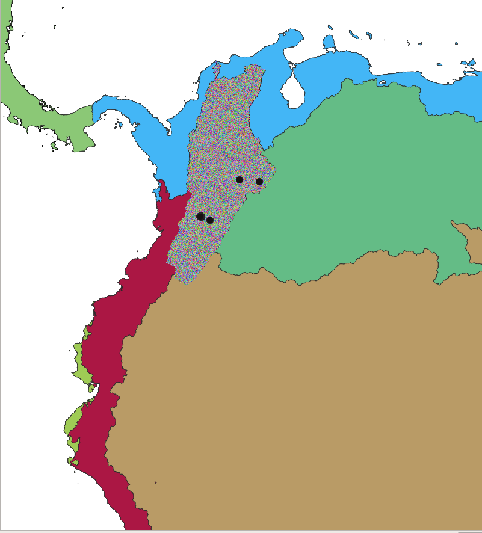
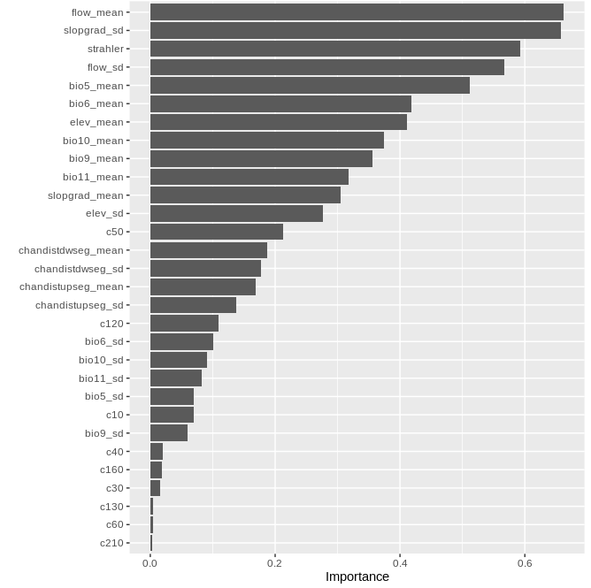

# Afroditi Grigoropoulou: Species Distribution Model with Random Forest

[Video recording](https://youtu.be/pNfXTdLFxBU)


### Taxon: genus Prebaetodes (Mayfly), occurring in a drainage basin in Colombia
### Goal: Predict which subcatchments provide suitable habitats for this genus
### Classify the subcatchments of the basin as 1 or 0, based on whether their habitat is suitable or not


## Random forest classification
### 1. Extract predictors for each subcatchment of this drainage basin
### 2. Extract the predictors for the subcatchment where the genus occurs, plus for 10,000 random subcatchments that will serve as pseudoabsence data 
### 3. Run SDM with random forest

  
(https://ucmp.berkeley.edu/arthropoda/uniramia/ephemeroptera/mayfly.jpg)


## 1. Extract predictors for each subcatchment of this drainage basin

Set paths of output and input directory 
```sh
export WDIR=xx
export CUDIR=xx
mkdir $WDIR/subc
```

Visualize species dataset
```sh
 head -5 $WDIR/taxa/Prebaetodes_points.csv
# order_ID dataset_ID   occurrence_ID   genus       family       longitude       latitude country year    subcatchment_ID basin_ID  CU     elevation
# E       051     000647545       Prebaetodes     Baetidae        -73.847944      6.0235  COL     2016    426156707       514490  33      1833.1
# E       051     000668399       Prebaetodes     Baetidae        -72.9787        5.94842 COL     2018    426173837       514490  33      3193.5
# E       051     000668413       Prebaetodes     Baetidae        -72.97908       5.94863 COL     2018    426173837       514490  33      3193.5
# E       051     001118376       Prebaetodes     Baetidae        -75.48049       4.45153 COL     2013    426478538       514490  33      2389.9
```

Define Computational Unit (CU)
```sh
export CU=$(awk -F'\t' 'FNR>1 {print $12}' $WDIR/taxa/Prebaetodes_points.csv  | sort | uniq)
echo CU $CU 
# CU 33
```
## Computational unit
  

Define basin
```sh
export BASIN=$(awk -F'\t' 'FNR>1 {print $11}' $WDIR/taxa/*.csv  | sort | uniq)
echo BASIN $BASIN
# BASIN 514490
```

## Basin
  


```sh
echo CU $CU BASIN $BASIN
# CU 33 BASIN 514490
```


## Subcatchments
  


Inspect bioclim statistics file
```sh
head -5 $CUDIR/CU_${CU}/out/stats_${CU}_bio5.txt
# subcID min max range mean sd
# 425395915 3018 3018 0 3018 0
# 425395916 3018 3018 0 3018 0
# 425395917 3018 3018 0 3018 0
# 425395918 3017 3019 2 3017.5393258427 0.520504935526613
```

Each row corresponds to a subcatchment. We need to extract only the subcatchments belonging to the basin 514490


Inspect file with subcatchment and basin IDs
```sh
 head -2 $CUDIR/CU_${CU}/out/stats_${CU}_BasinsIDs.txt
# subcID        X                   Y               MacrobasinID
# 425395915  -74.8245833333333 11.0579166666667      514490
# 425395916  -74.82125          11.0570833333333     514490

 tail 2 $CUDIR/CU_${CU}/out/stats_${CU}_BasinsIDs.txt
# 428235083 -75.4554166666667 -14.99375             504121
# 428235084 -75.4479166666667 -14.9929166666667     485074
```

A computational unit includes many basins. We need to extract the subcatchments of only 1 basin.

First extract all the subcatchment IDs of the given basin, based on the basin ID 
```sh
grep -w $BASIN  $CUDIR/CU_${CU}/out/stats_${CU}_BasinsIDs.txt | awk '{print $1}'  \
    > $WDIR/subc/CU_${CU}_basin_${BASIN}_subc.txt
```

See output file of subcatchment ids
```sh
head -5 $WDIR/subc/CU_${CU}_basin_${BASIN}_subc.txt
# 425395915
# 425395916
# 425395917
# 425395918
# 425395919
```


Identify number of subcatchments in the basin 514490
```sh
wc -l $WDIR/subc/CU_${CU}_basin_${BASIN}_subc.txt
# 1278276 
```

Define the path of the file including the subcatchment IDs as a variable. 
We are going to use this file to extract the predictors for all the subcathcments of the Magdalena basin

```sh
export SUBCFILE=$WDIR/subc/CU_${CU}_basin_${BASIN}_subc.txt
```


## Extract BIOCLIM data

See files
```sh
ls $CUDIR/CU_${CU}/out/stats*bio*.txt   | xargs -n 1 basename | head
# stats_33_bio10.txt
# stats_33_bio11.txt
# stats_33_bio12.txt
# stats_33_bio13.txt
# stats_33_bio14.txt
# stats_33_bio15.txt
# stats_33_bio16.txt
# stats_33_bio17.txt
# stats_33_bio18.txt
# stats_33_bio19.txt

```

Inspect bioclim statistics file
```sh
head -5 $CUDIR/CU_${CU}/out/stats_${CU}_bio5.txt
# subcID min max range mean sd
# 425395915 3018 3018 0 3018 0
# 425395916 3018 3018 0 3018 0
# 425395917 3018 3018 0 3018 0
# 425395918 3017 3019 2 3017.5393258427 0.520504935526613
```

Create output directory 
```sh
mkdir $WDIR/bioclim
```

grep -W matches exact pattern, -f searches based on patterns given by a file
```sh
for ibio in {5,6,9,10,11} ; do
    grep -wFf  $SUBCFILE   $CUDIR/CU_${CU}/out/stats_${CU}_bio${ibio}.txt  \
    > $WDIR/bioclim/stats_CU_${CU}_basin_${BASIN}_bio${ibio}.txt
    ## insert header
    sed -i "1 i$(head -1 $CUDIR/CU_${CU}/out/stats_${CU}_bio${ibio}.txt)" $WDIR/bioclim/stats_CU_${CU}_basin_${BASIN}_bio${ibio}.txt

done
```

check output file
```sh
head -5 $WDIR/bioclim/stats_CU_${CU}_basin_${BASIN}_bio5.txt
# subcID bio5_min bio5_max bio5_range bio5_mean bio5_sd
# 425395915 3018 3018 0 3018 0
# 425395916 3018 3018 0 3018 0
# 425395917 3018 3018 0 3018 0
# 425395918 3017 3019 2 3017.5393258427 0.520504935526613
```

Same procedure but with xargs
```sh
for ibio in 5 6 9 10 11 ; do
    echo  $ibio 
done   > $WDIR/biovars_xargs.txt

cat $WDIR/biovars_xargs.txt
# 5
# 6
# 9
# 10
# 11
```

```sh
cat $WDIR/biovars_xargs.txt | xargs -n 1 -P 5  bash -c $'
ibio=$1

    echo "subcID" bio${ibio}_min bio${ibio}_max bio${ibio}_range bio${ibio}_mean bio${ibio}_sd >  $WDIR/bioclim/stats_CU_${CU}_basin_${BASIN}_bio${ibio}.txt  

    grep -wFf $SUBCFILE $CUDIR/CU_${CU}/out/stats_${CU}_bio${ibio}.txt >> $WDIR/bioclim/stats_CU_${CU}_basin_${BASIN}_bio${ibio}.txt

' _

wc -l $WDIR/bioclim/* 
#   1278277 /home/ag2688/project/GC_2022//bioclim/stats_CU_33_basin_514490_bio10.txt
#   1278277 /home/ag2688/project/GC_2022//bioclim/stats_CU_33_basin_514490_bio11.txt
#   1278277 /home/ag2688/project/GC_2022//bioclim/stats_CU_33_basin_514490_bio5.txt
#   1278277 /home/ag2688/project/GC_2022//bioclim/stats_CU_33_basin_514490_bio6.txt
#   1278277 /home/ag2688/project/GC_2022//bioclim/stats_CU_33_basin_514490_bio9.txt
```


## Extract land cover mean proportion per subcatchment
Inspect file
```sh
head -5  $CUDIR/CU_${CU}/out/mean_LCprop_${CU}.txt
# subcID c100 c10 c110 c120 c130 c140 c150 c160 c170 c180 c190 c200 c20 c210 c220 c30 c40 c50 c60 c70 c80 c90
# 425395915 0 0 0 0 0 0 0 0 0.256098 0 0 0 0 0.365854 0 0 0.0121951 0.365854 0 0 0 0
# 425395916 0 0 0 0 0 0 0 0 0.509524 0 0 0 0 0.128571 0 0 0.0904762 0.271429 0 0 0 0
# 425395917 0 0 0 0 0 0 0 0 0.333333 0 0 0.0641026 0 0.602564 0 0 0 0 0 0 0 0
# 425395918 0 0 0 0 0 0 0 0 0.91469 0 0 0 0 0.011236 0 0 0.0740741 0 0 0 0 0
```

create output directory
```sh
mkdir $WDIR/LC
```

Create output file by first inserting the header
```sh
echo $(head -1 $CUDIR/CU_${CU}/out/mean_LCprop_${CU}.txt) > $WDIR/LC/stats_CU_${CU}_basin_${BASIN}_mean_LCprop.txt
```
```sh
Extract the land cover values per subcatchment
```sh
grep -wFf  $SUBCFILE  $CUDIR/CU_${CU}/out/mean_LCprop_${CU}.txt  \
    >> $WDIR/LC/stats_CU_${CU}_basin_${BASIN}_mean_LCprop.txt
```


## Extract mean and sd of elevation, flow accumulation and slope gradient per subcatchment

Inspect tables
```sh
head -5  $CUDIR/CU_${CU}/out/stats_${CU}_streamorder.txt
# subcID next_stream prev_str01 prev_str02 prev_str03 prev_str04 strahler horton shreve hack topo_dim scheidegger drwal_old length stright sinosoid cum_length flow_accum out_dist source_elev outlet_elev elev_drop out_drop gradient
# 425395915 425395926 0 0 0 0 1 1 1 2 6 2 1 1514.850301 1233.716941 1.227875 1514.850301 59446.808594 4630.377188 3.5 0.1 3.4 0 0.002244
# 425395916 425395933 0 0 0 0 1 1 1 2 7 2 1 1532.600832 1303.739763 1.175542 1532.600832 34791.675781 4739.185951 3.3 0.2 3.2 0.1 0.002088
# 425395917 425395921 0 0 0 0 1 1 1 2 2 2 1 1607.382511 1445.505848 1.111986 1607.382511 57713.539062 2827.177338 2 0 2 0 0.001244
# 425395918 425395964 0 0 0 0 1 1 1 3 19 2 1 2050.53521 1751.405198 1.170794 2050.53521 0.983474 8825.73779 7.2 0.5 6.7 0 0.003267
```

for loop 
```sh
for VAR in elev slopgrad flow chandistdwseg chandistupseg streamorder; do 

    # delete output file if it already exists
    [ -s $WDIR/$VAR/stats_CU_${CU}_basin_${BASIN}_${VAR}.txt ] && rm $WDIR/$VAR/stats_CU_${CU}_basin_${BASIN}_${VAR}.txt
    # create directory for the output
    [ ! -d $WDIR/$VAR ] && mkdir $WDIR/$VAR

    if [ $VAR != "streamorder" ] ; then 

        # create output file by first inserting the header
        echo $(cat $CUDIR/CU_${CU}/out/stats_${CU}_${VAR}.txt | head -1 | awk '{print $1, $5, $6}')  \
            > $WDIR/$VAR/stats_CU_${CU}_basin_${BASIN}_${VAR}.txt 

        # extract the values per subcatchment
        grep -wFf  $SUBCFILE  <(awk '{print $1, $5, $6}' $CUDIR/CU_${CU}/out/stats_${CU}_${VAR}.txt)  \
            >> $WDIR/$VAR/stats_CU_${CU}_basin_${BASIN}_${VAR}.txt


    if [ $VAR == "streamorder" ] ; then 

        # create output file by first inserting the header
        echo "subcID strahler" > $WDIR/$VAR/stats_CU_${CU}_basin_${BASIN}_${VAR}.txt 

        # extract the strahler column for each subcatchment
        grep -wFf  $SUBCFILE \
        <(awk -v col1=subcID -v col2=strahler 'NR==1{for(i=1;i<=NF;i++){if($i==col1)c1=i; if ($i==col2)c2=i;}} {print $c1 " " $c2}' \
        $CUDIR/CU_${CU}/out/stats_${CU}_${VAR}.txt ) >> $WDIR/$VAR/stats_CU_${CU}_basin_${BASIN}_${VAR}.txt
       
    fi

done

```

Same procedure but with xargs
```sh
for VAR in elev slopgrad flow chandistdwseg chandistupseg streamorder ; do
    echo  $VAR 
done   > $WDIR/vars_xargs.txt

cat $WDIR/vars_xargs.txt
# elev
# slopgrad
# flow
# chandistdwseg
# chandistupseg
# streamorder
```

```sh
cat $WDIR/vars_xargs.txt | xargs -n 1 -P 6  bash -c $'
VAR=$1

    [ -s $WDIR/$VAR/stats_CU_${CU}_basin_${BASIN}_${VAR}.txt ] && rm $WDIR/$VAR/stats_CU_${CU}_basin_${BASIN}_${VAR}.txt

    if [ $VAR != "streamorder" ] ; then 

        [ ! -d $WDIR/$VAR ] && mkdir $WDIR/$VAR

        echo "subcID ${VAR}_mean ${VAR}_sd" > $WDIR/$VAR/stats_CU_${CU}_basin_${BASIN}_${VAR}.txt 

        grep -wFf  $SUBCFILE  <(awk \'{print $1, $5, $6}\' $CUDIR/CU_${CU}/out/stats_${CU}_${VAR}.txt)  >> $WDIR/$VAR/stats_CU_${CU}_basin_${BASIN}_${VAR}.txt
    fi


    if [ $VAR == "streamorder" ] ; then 
        [ ! -d $WDIR/$VAR ] && mkdir $WDIR/$VAR

        echo "subcID strahler" > $WDIR/$VAR/stats_CU_${CU}_basin_${BASIN}_${VAR}.txt 

        grep -wFf  $SUBCFILE <(awk -v col1=subcID -v col2=strahler \'NR==1{for(i=1;i<=NF;i++){if($i==col1)c1=i; if ($i==col2)c2=i;}} {print $c1 " " $c2}\' $CUDIR/CU_${CU}/out/stats_${CU}_${VAR}.txt ) >> $WDIR/$VAR/stats_CU_${CU}_basin_${BASIN}_${VAR}.txt
       
    fi
    
    echo $CU $BASIN $VAR complete


' _

```


## Join all predictors in R
```sh
R
path <- "xx"
setwd(path)
library(dplyr)
library(data.table)
library(tidyverse)

# all directories in the data folder
dirnames <- list.dirs(path, full.names = F, recursive = F) 
dirnames
#  [1] "bioclim"       "chandistdwseg" "chandistupseg" "elev"         
#  [5] "flow"          "LC"            "slopgrad"      "streamorder"  
#  [9] "subc"          "taxa"  

# Loop iterating through all directories and importing files to be merged
d <- NULL
files_all <- list()
i=0
for(d in dirnames){
    i=i+1
    filenames <- list.files(d,full.names = T, all.files = T, pattern="stats")
    if(!identical(filenames,character(0))) {
        # Import file
        files <- lapply(filenames,  fread, header = T, stringsAsFactors = F, quote = "", keepLeadingZeros = T)
        # join based on subcID
        filesj <- files %>% reduce(left_join, by = "subcID")

        files_all[[i]] <- filesj
    }
}

files_allj <- files_all %>% reduce(left_join, by = "subcID")

# export table with all the predictors for all the subcatchments of the basin
fwrite(files_allj, "stats_CU_33_basin_514490_all.txt", sep=" ", row.names=F, quote=F)

q()
```

Visualize selected columns in the final file
```sh
awk '{print $1, $2, $3, $25, $30, $NF}'  stats_CU_33_basin_514490_all.txt  | head -5
# subcID bio10_min bio10_max bio9_mean chandistupseg_sd strahler
# 425395915 3007 3007 2994 424.215512470263 1
# 425395916 3006 3007 2994 436.726188032742 1
# 425395917 3007 3007 2994 451.771830664826 1
# 425395918 3006 3007 2994 577.236937482746 1
```


## 2. Extract the predictors for the subcatchments where the genus occurs, plus for 10,000 random subcatchments that will serve as pseudoabsence data 


Get the IDs of the subcatchments where the genus occurs, in a file
```sh
awk -F'\t' 'NR>1 {print $10}' $WDIR/taxa/Prebaetodes_points.csv | sort | uniq > $WDIR/taxa/Prebaetodes_subc.txt

head -5 $WDIR/taxa/Prebaetodes_subc.txt
# 426156707
# 426173837
# 426475409
# 426475754
# 426475915
```
```sh
## Get the subcIDs for 10,000 random rows for the pseudoabsences
cat $SUBCFILE | shuf -n 10000 > taxa/pseudo_subc.txt
```

Extract the predictors for the subcatchments of the file***
```sh
for TAXON in Prebaetodes ; do 

    ## add header
    head -1  $WDIR/stats_CU_${CU}_basin_${BASIN}_all.txt \
        > $WDIR/taxa/stats_CU_${CU}_basin_${BASIN}_${TAXON}.txt

    awk  'NR==FNR{searchstr[$1]; next} $1 in searchstr' $WDIR/taxa/${TAXON}_subc.txt  $WDIR/stats_CU_${CU}_basin_${BASIN}_all.txt \
        >> $WDIR/taxa/stats_CU_${CU}_basin_${BASIN}_${TAXON}.txt
    
done
```

Extract the predictors for the subcatchments of the pseudoabsence file


```sh
head -1  $WDIR/stats_CU_${CU}_basin_${BASIN}_all.txt \
    > $WDIR/taxa/stats_CU_${CU}_basin_${BASIN}_pseudo.txt    # Add header
awk  'NR==FNR{searchstr[$1]; next} $1 in searchstr' $WDIR/taxa/pseudo_subc.txt $WDIR/stats_CU_${CU}_basin_${BASIN}_all.txt \
    >> $WDIR/taxa/stats_CU_${CU}_basin_${BASIN}_pseudo.txt
```


## For the prediction, we need the subcatchment raster to be cropped to the extent of the basin 
Load GRASS78
```sh
source /home/jg2657/bin/grass78m
```

Set paths to hydrography data folder and the subcatchment data of the CU
```sh
export DATA=/gpfs/gibbs/pi/hydro/hydro/dataproces/MERIT_HYDRO
export SUBCATCHMENT=$DATA/CompUnit_basin_lbasin_clump_reclas/basin_lbasin_clump_${CU}.tif 

```

Extract basin of interest
```sh
grass78  -f -text --tmp-location  -c $DATA/lbasin_compUnit_tiles/bid${CU}.tif  <<EOF
r.external  input=$DATA/lbasin_compUnit_tiles/bid${CU}.tif  output=CU   --overwrite

r.external  input=$SUBCATCHMENT   output=subc   --overwrite

# mask out basins that don't have the desired basinID
r.mapcalc " CU_$BASIN = if (CU == $BASIN , $BASIN , null() ) "
g.region -a zoom=CU_$BASIN --o #### With the -a flag all four boundaries are adjusted to be even multiples of the resolution, aligning the region to the resolution supplied by the user. 
                                #### The default is to align the region resolution to match the region boundaries.

# repeat for the subcatchments
r.mapcalc " SUBC_$BASIN = if (CU_$BASIN == $BASIN , subc , null() ) "

# export
r.out.gdal --o -f -c -m createopt="COMPRESS=DEFLATE,ZLEVEL=9,INTERLEAVE=BAND,TILED=YES"  nodata=0   type=UInt32    format=GTiff input=SUBC_$BASIN output=$WDIR/subcatchment_${BASIN}.tif 


EOF
```

## 3. Run SDM with random forest
```sh
R
path <- "xx"

setwd(path)
pacman::p_load(data.table,ranger,parallel,doParallel,vip,raster,stringr,dplyr)


# Import presence subcatchments with their predictors
pres <- fread("stats_CU_33_basin_514490_Prebaetodes.txt", header=T, keepLeadingZeros=T, stringsAsFactors = F, sep=" ") 
head(pres)

# Import pseudoabsence subcatchments with their predictors
pseudo <- fread("stats_CU_33_basin_514490_pseudo.txt", header=T)
head(pseudo)

# Add a column that indicates presence or absence of the genus (0|1)
pres$occurrence <- rep(1, nrow(pres))
pseudo$occurrence <- rep(0, nrow(pseudo))

# join presences-absences
rf_data <- rbind.data.frame(pres, pseudo)

# Exclude some predictor columns
rf_data <- rf_data %>% select(!contains(c("min", "max", "range")))

## Split data into train and test
set.seed(37)


# Rescale
# Define rescaling functions
slope_scale <- function(x, na.rm = F) (x*0.000001)
clim_scale <- function(x, na.rm = F) (x * 0.1)
offset <- function(x, na.rm = F) (x - 273.15)

# Apply rescaling functions
rf_data_rescale <- rf_data  %>%
    mutate(across(contains("slopgrad_mean"), slope_scale)) %>%
    mutate(across(matches("bio[0-9]+_mean"), clim_scale))  %>%
    mutate(across(starts_with("bio[0-9]+_mean"), offset))


rf_data <- rf_data_rescale

## Convert occurrence column to factor to run the random forest
rf_data$occurrence <- as.factor(rf_data$occurrence)


## Split data into train and test
set.seed(37)
# train.idx <- sample(nrow(rf_data), 2/3 * nrow(rf_data))
# data_train <- rf_data[train.idx, ]
# data_test <- rf_data[-train.idx, ]


# In random forests, there is no need for a separate test set to validate result.  
# It is estimated internally, during the run, as follows:
# As the forest is built on training data , each tree is tested on the 1/3rd of the samples (36.8%) not used in building that tree 
# (similar to validation data set). 
# This is the out of bag error estimate - an internal error estimate of a random forest as it is being constructed.


# For parallel processing
cl<-makePSOCKcluster(6)
registerDoParallel(cl)


## Down-sampling method for presence-only data
# calculate sub-samples
presNum <- nrow(rf_data[rf_data$occurrence==1,])


# Ranger with down-sampling
spsize <- c("0" = presNum/nrow(rf_data), "1" = presNum/nrow(rf_data)) 
rg <- ranger(rf_data$occurrence ~ ., 
                 data = rf_data[,2:ncol(rf_data)],
                 num.trees = 1000,
                 mtry=6,
                 replace = T,
                 sample.fraction = spsize,
                 oob.error = T,
                 keep.inbag = TRUE,
                 num.threads = 6,
                 importance ='impurity', 
                 probability=T) 
rg
rg$confusion.matrix
# Type:                             Probability estimation 
# Number of trees:                  1000 
# Sample size:                      10011 
# Number of independent variables:  43 
# Mtry:                             6 
# Target node size:                 10 
# Variable importance mode:         impurity 
# Splitrule:                        gini 
# OOB prediction error (Brier s.):  0.09524617 


(mtry: Number of variables to possibly split at in each node)


rg$confusion.matrix
#         predicted
# true      0    1
#    0    6025  642
#    1      2    5


v1 <- vip(rg_all,num_features=30, horizontal=T)
v1

```
  


## Predict with fitted model

```sh
subc_data <- fread("../stats_CU_33_basin_514490_all.txt", header=T)
# Exclude some columns 
subc_data <- subc_data %>% select(!contains(c("min", "max", "range")))

pred <- predict(rg, data=subc_data[,!1])
prediction <- data.frame(subc_data[,1], pred_occur=as.numeric(as.character(pred$predictions)))
head(prediction)
#     subcID    pred_occur
# 1 425395915          0
# 2 425395916          0
# 3 425395917          0
# 4 425395918          0
# 5 425395919          0
# 6 425395920          0


## Reclassify subcatchment raster in GRASS 
## create file with reclassification rules
setDT(prediction)
prediction$reclass <- str_c(prediction$subcID," = ", round(prediction$pred_occur,2)*100)
prediction <- prediction[,'reclass']
prediction <- rbind.data.frame(as.data.frame(prediction), "* = 0")
head(prediction)

fwrite(prediction, "reclass_rules_pred_prob.txt", sep="\t", row.names=F, quote=F, col.names=F)    

q()
```

## Reclassify subcatchment raster based on predicted values

```sh
export MBFILE=$WDIR/subcatchment_512290.tif


grass78 -f  --tmp-location  -c $MBFILE   <<<EOF

    export filename=$(basename $MBFILE .tif  )
    r.in.gdal --o input=$MBFILE  output=subc    --overwrite

    # Reclassify
    r.reclass input=subc output=pred rules=$WDIR/taxa/reclass_rules_pred_prob.txt --overwrite

    # export maps
    r.out.gdal --o -f -m -c createopt="COMPRESS=DEFLATE,ZLEVEL=9" type=Int32  format=GTiff nodata=-9999 input=pred output=$WDIR/taxa/pred_prob.tif

EOF


```

## Predicted habitat suitability

  
