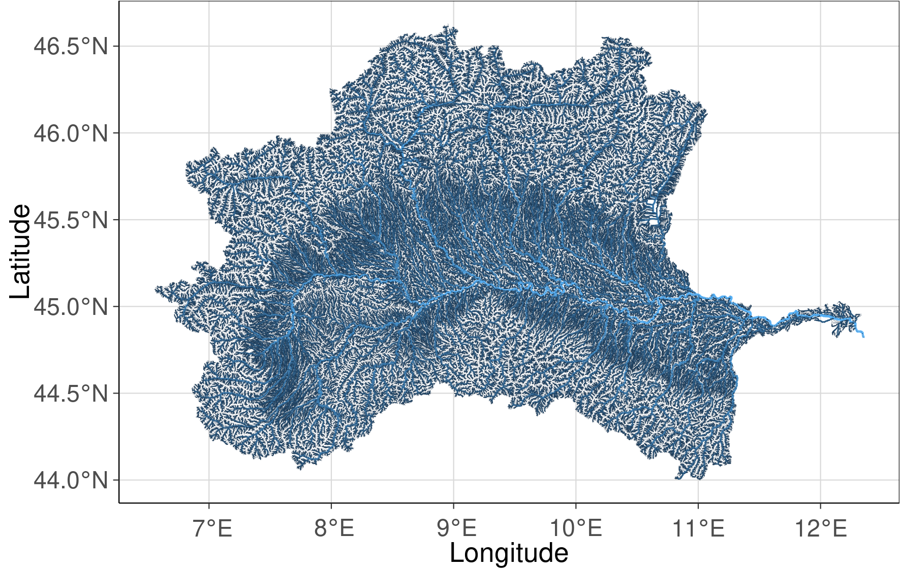
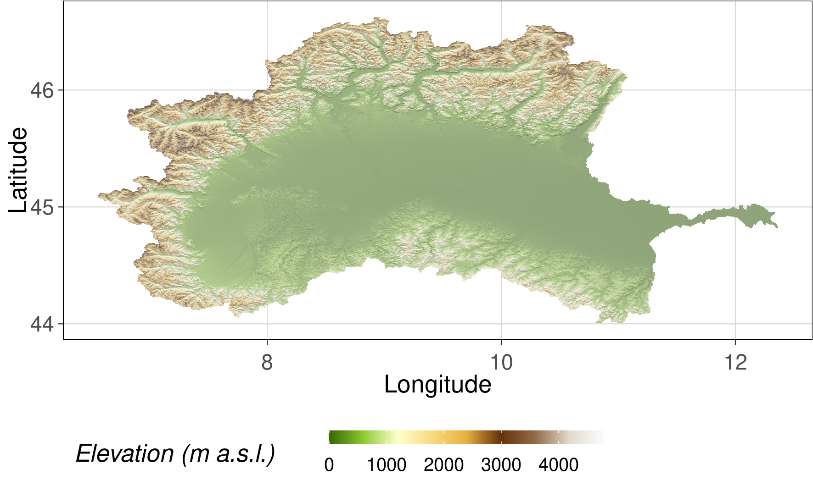
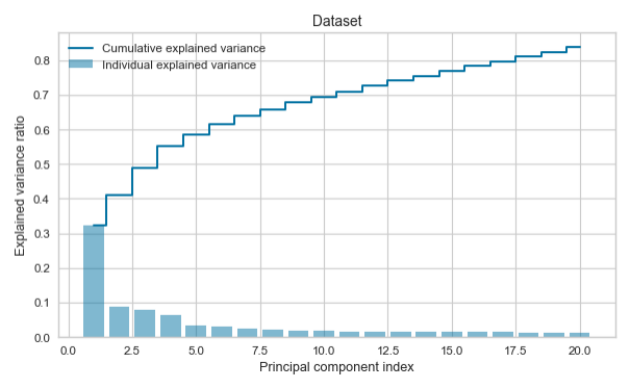
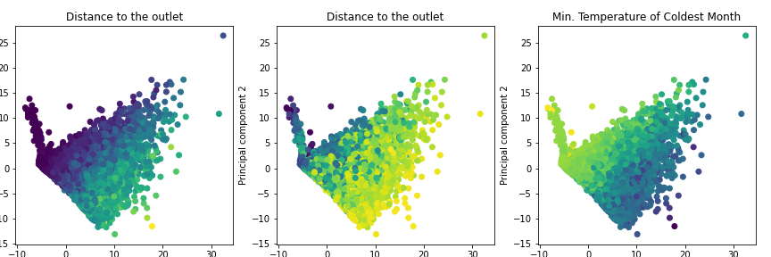
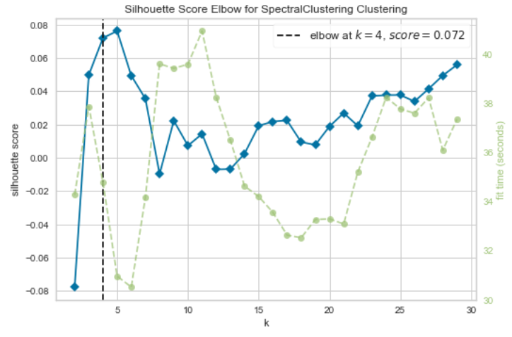
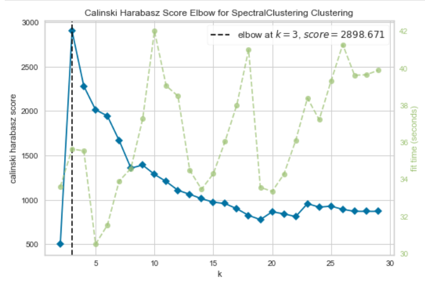

# Maria Üblacker: Spectral clustering of freshwater habitats

### Project description

In the framework of this project spectral clustering was performed to identify groups of environmental unique freshwater habitats for the Po river basin located in the North of Italy. Freshwater habitats were defined by stream reaches and their associated sub-catchments based on the Hydrography90m dataset. Sub-catchments were characterized by 71 variables describing the geomorphology, the climate and the land cover. 

For this project the following datasets were used:

- Hydrography90m (Amatulli et al., 2022)
- CHELSA Bioclim (Karger et al., 2017)
- ESA CCI Land cover  (ESA, 2017)

Spectral clustering is a clustering method based on graph theory and needs a similarity matrix as input. Generating a similarity matrix of a large dataset can be challenging as it requires a high capacity of RAM. Therefore, a random subset was taken from the dataset. To verify that the variance of the sampled sub-catchments represents the variance of all sub-catchments within the Po river basin a Principal Component Analysis was conducted. The cluster analysis was then performed on the subset and clusters for the whole dataset were predicted using k-nearest neighbors. 

### Setup R Markdown Python Engine
```{r message=FALSE, warning=FALSE}
# The R package 'reticulate' builds the interface 'Python' modules, classes, and functions. 
library(reticulate)

# Defines the python virtual environment R should use
use_python(".Rpy_env/bin/python")

```
 

### R and Python packages

```{r message=FALSE, warning=FALSE}
# Load R packages
library(tidyverse) # For data manipulation
library(data.table) # For reading csv files
library(rgdal)  # Provides bindings to the 'Geospatial' Data Abstraction Library
library(sf)  # Support for simple features
library(raster) # Functions for raster and vector data
library(ggplot2) # For creating plots
library(ggnewscale) # For using multiple scales in ggplot2
library(RSQLite) # For reading gpkg
```

```{python message=FALSE, warning=FALSE}
# Load python packages
import pandas as pd # For reading csv files

import matplotlib.pyplot as plt # For creating plots
import seaborn as sns # For creating plots

import numpy as np 
from sklearn.preprocessing import StandardScaler # For scaling the data
from sklearn.decomposition import PCA # For running a PCA
from sklearn.cluster import SpectralClustering # For running spectral clustering
from sklearn.neighbors import KNeighborsClassifier # For predicting the cluster


from yellowbrick.cluster import KElbowVisualizer # For calculating the Silhouette and the Calinski Harabasz Score
```

### Study region

The stream network of the Po river basin has 382 157 stream reaches and the aggregated mean elevation of the sub-catchments ranges from 0 to 4458 m a.s.l.


**Hydrography90m stream network of the Po river basin** 


```{r eval=FALSE}
# Load data 

sf_basin <- st_read(dsn = "data/hydrography/order_vect_59_clip.gpkg") 
# To ensure the right protection
# st_crs(sf_basin) <- "+proj=longlat +datum=WGS84" 

# Creating the map  

stream_plot <- ggplot() + 
  geom_sf(data = sf_basin, aes(col= strahler, lwd = strahler)) + 
  scale_size(range=c(0.05, 0.5), guide = "none") +
  scale_fill_manual(values = "dodgerblue") +
  defined_theme() +
  theme(legend.position = "none")+
  xlab("Longitude") +
  ylab("Latitude")

stream_plot

```



**MERIT DEM of Po river basin** 

```{r eval=FALSE}
# Load the raster file of the digital elevation map (DEM)
dem_file <- "data/elv_59_1173421.tif"
dem <- raster(dem_file)
dem_df <- as.data.frame(dem, xy = TRUE) %>% 
  filter(!is.na(elv_59_1173421)) 

slope <- terrain(dem, opt = "slope") # Calculate the slop from the DEM
aspect <- terrain(dem, opt = "aspect") # Calculate the aspect from slope
hill_shade <- hillShade(slope, aspect) # Calculate the hill shade
hillshade_df <- as.data.frame(hill_shade, xy = TRUE) %>% 
  filter(!is.nan(layer)) %>% 
  filter(!is.na(layer))

elev <- ggplot() +
  geom_raster(data = hillshade_df, aes(x = x, y = y, fill = layer), na.rm = TRUE) +
  scale_fill_gradientn(colours = grey((1:100)/100), guide = 'none') +
  new_scale_fill() +
  geom_raster(data = dem_df, aes(x = x, y = y, fill = elv_59_1173421), alpha = 0.4) +
  scale_fill_gradientn(colours = c('#366901', '#8fca32', '#ffffcc', '#f9da80', '#e8b140', '#66330b', '#916c47', '#e3dad0', '#fcfcfc')) +
  scale_size(range=c(0.05, 0.5), guide = "none") +
  coord_equal() +
  guides(fill = guide_colourbar(barwidth = 10)) +
  labs(fill = 'Elevation (m a.s.l.)') +
  defined_theme() +
  xlab("Longitude") +
  ylab("Latitude") 

```



### Example code for filtering data from text files by sub-catchment ID

```{bash eval=FALSE}
# Define computational unit and basin ID
export CUNIT=59
export BID=1173421

# Define directories
export DIR=/data/envtbl
export OUT=/data/out

# Get sub-catchment IDs filtering by basin ID
printf "%s\n" subcID $(cat $DIR/stats_${CUNIT}_BasinsIDs.txt | awk  -v var="$BID"  '$4==var {print $1}') > $OUT/subcIDs.txt

files=("DIR"/*)

# Go through all files within the folder and select sub-catchment IDs defined in the look-up table
for FILE in $DIR/*
do

NAME="$(basename -- $FILE)"
awk 'NR==FNR{a[$0];next} $1 in a' $OUT/subcIDs.txt $DIR/${NAME} > $MYDIR/${NAME}

done

```


### Load the data
```{python}
# Load data of environmental variables
basin = pd.read_csv("data/envtbl/basin_59_1173421.csv", sep=",",  index_col=False)

# Remove land use classes with 0% in all sub-catchments
basin = basin.loc[:, (basin != 0).any(axis=0)]

```


```{python}
# Exclude columns with IDs from the data frame
env_var = basin.loc[:, 'topo_elev_mean':'land_c90_y2018']

# Calculate summary statistic
summary = env_var.describe()

# Save the summary 
summary.to_csv('data/summary.csv')
```

```{r}
# Get pandas summary table from python
# Select some of the variables for printing
env_summary <- py$summary %>% 
  dplyr::select("topo_elev_mean", "topo_flow_mean", "stream_out_dist", "stream_gradient",
         "flow_spi_mean", "clim_bio1_mean",  "clim_bio6_mean", "clim_bio13_mean",
         "land_c10_y2018" , "land_c70_y2018" ) 
env_summary[-1,]
```

```{python results=FALSE, collapse=TRUE}
# Create a random subset by picking 20 000 rows 
env_var_sub = env_var.sample(20000)

# Scale the data
# Dataset
sc = StandardScaler()
sc.fit(env_var)
env_var_std = sc.transform(env_var)

# Subset
sc_sub = StandardScaler()
sc_sub.fit(env_var_sub)
env_var_std_sub = sc.transform(env_var_sub)
```


### Principal Component analysis (PCA)

PCA was used to evaluate how many principal components describe 80% of the dataset and to evaluate if the variance of the subset is similar to the variance of the whole dataset.

```{python eval=FALSE}
# Whole dataset
pca = PCA(n_components=20)
pca.fit(env_var_std)
var_pca = pca.explained_variance_ratio_
sum_pca = var_pca.sum()
train_pca = pca.fit_transform(env_var_std)

print("Dataset")
print(var_pca)
print(sum_pca)

# Subset
pca_sub = PCA(n_components=20)
pca_sub.fit(env_var_std_sub)
var_pca_sub = pca_sub.explained_variance_ratio_
sum_pca_sub = var_pca.sum()
train_pc_sub = pca_sub.fit_transform(env_var_std_sub)

print("Subset")
print(var_pca)
print(sum_pca_sub)
```

```{python echo=FALSE}
# Determine explained variance using explained_variance_ration_ attribute
exp_var_pca = pca.explained_variance_ratio_

# Cumulative sum of eigenvalues; This will be used to create step plot
# for visualizing the variance explained by each principal component.
cum_sum_eigenvalues = np.cumsum(var_pca)

# Create the visualization plot
plt.clf()
plt.bar(np.arange(0,len(var_pca))+1, exp_var_pca, alpha=0.5, align='center', label='Individual explained variance')
plt.step(np.arange(0,len(cum_sum_eigenvalues))+1, cum_sum_eigenvalues, where='mid',label='Cumulative explained variance')
plt.title('Dataset')
plt.ylabel('Explained variance ratio')
plt.xlabel('Principal component index')
plt.legend(loc='best')
plt.tight_layout()

plt.show()
```


```{python echo=FALSE}
# Explained variance for the subset
exp_var_pca_sub = pca_sub.explained_variance_ratio_
cum_sum_eigenvalues_sub = np.cumsum(var_pca_sub)

# Plot
plt.clf()
plt.bar(np.arange(0,len(var_pca_sub))+1, exp_var_pca_sub, alpha=0.5, align='center', label='Individual explained variance')
plt.step(np.arange(0,len(cum_sum_eigenvalues_sub))+1, cum_sum_eigenvalues, where='mid',label='Cumulative explained variance')
plt.title('Subset')
plt.ylabel('Explained variance ratio')
plt.xlabel('Principal component index')
plt.legend(loc='best')
plt.tight_layout()


plt.show()
```


```{python eval=FALSE}
n_comp = 2
pca = PCA(n_components = n_comp, svd_solver='full')
components = pca.fit_transform(env_var_std)

labels = {str(i): f"PC {i+1}" for i in range(2)}
labels['color'] = 'Mean elevation'

fig = plt.figure(figsize=(30, 4))
fig.subplots_adjust(left=0.08, right=1, bottom=0.1, top=0.9)

ax = fig.add_subplot(1, 3, 1)
plt.scatter(
    x=components[:,0],
    y=components[:,1], 
    c=env_var.topo_elev_mean
)
plt.title('Mean Elevation')
plt.xlabel('Principal component 1')
plt.ylabel('Principal component 2')


ax = fig.add_subplot(1, 3, 2)
plt.scatter(
    x=components[:,0],
    y=components[:,1], 
    c=env_var.stream_out_dist

)
plt.title('Distance to the outlet')
plt.xlabel('Principal component 1')
plt.ylabel('Principal component 2')


ax = fig.add_subplot(1, 3, 3)
plt.scatter(
    x=components[:,0],
    y=components[:,1], 
    c=env_var.clim_bio6_mean

)
plt.title('Min Temperature of Coldest Month')
plt.xlabel('Principal component 1')
plt.ylabel('Principal component 2')
plt.savefig("data/comp_dataset.png")
plt.show()


n_comp = 2
pca_sub = PCA(n_components = n_comp, svd_solver='full')

components_sub = pca_sub.fit_transform(env_var_std_sub)

labels = {str(i): f"PC {i+1}" for i in range(n_comp)}
labels['color'] = 'Mean elevation'

fig = plt.figure(figsize=(30, 4))
fig.subplots_adjust(left=0.08, right=1, bottom=0.1, top=0.9)

ax = fig.add_subplot(1, 3, 1)
plt.scatter(
    x=components_sub[:,0],
    y=components_sub[:,1], 
    c=env_var_sub.topo_elev_mean

)
plt.title('Distance to the outlet')
plt.xlabel('Principal component 1')
plt.ylabel('Principal component 2')

ax = fig.add_subplot(1, 3, 2)
plt.scatter(
    x=components_sub[:,0],
    y=components_sub[:,1], 
    c=env_var_sub.stream_out_dist

)
plt.title('Distance to the outlet')
plt.xlabel('Principal component 1')
plt.ylabel('Principal component 2')

ax = fig.add_subplot(1, 3, 3)
plt.scatter(
    x=components_sub[:,0],
    y=components_sub[:,1], 
    c=env_var_sub.clim_bio6_mean

)

plt.title('Min. Temperature of Coldest Month')
plt.xlabel('Principal component 1')
plt.ylabel('Principal component 2')
plt.savefig("data/comp_subset.png")
plt.show()

```

To compare the distribution of the whole dataset with the subset PC 1 and PC 2 were plotted. The color of each plot is indicating either the mean elevation, the distance to the outlet, or the min. temperature of the coldest month.


**Whole dataset**


**Subset**




### Evaluation of the best number of clusters

```{python eval=F, echo=T}
# Silhouette Score for Spectral Clustering
model = SpectralClustering(affinity='nearest_neighbors', assign_labels = 'discretize')

# k is the range of number of clusters
visualizer = KElbowVisualizer(model, k=(2,30),metric='silhouette', timings= True)
visualizer.fit(env_var_std_sub)        # Fit the data to the visualizer
visualizer.show()        # Finalize and render the figure

```




```{python eval=F, echo=T}
# Calinski Harabasz Score
# k is range of number of clusters.
visualizer_ch = KElbowVisualizer(model, k=(2,30), metric='calinski_harabasz', timings= True)
visualizer_ch.fit(env_var_std_sub)        # Fit data to visualizer
visualizer_ch.show()        # Finalize and render figure

```



### Spectral clustering 
```{python eval=F, echo=T}
# Spectral clustering for 3 and 4 clusters
spec_clustering = SpectralClustering(n_clusters = 3, 
assign_labels = 'discretize', affinity = 'nearest_neighbors')
sub_labels = spec_clustering.fit_predict(env_var_std_sub)
```

### Predict clusters for the whole dataset
```{python eval=F, echo=T}
# Use k-nearest neighbors to predict clusters for the whole dataset
neigh = KNeighborsClassifier(n_neighbors=3)
neigh.fit(env_var_std_sub, sub_labels)

whole_data_labels = neigh.predict(env_var_std)
```

### Exporting sub-catchment IDs and k for reclassification
```{python eval=F, echo=T}
subcID = basin.loc[:, 'subcID']
clusters = pd.DataFrame(whole_data_labels, columns=['clusters'])
reclass = pd.concat([subcID, clusters], axis=1, ignore_index=True)
print(reclass)
reclass.to_csv('reclass.csv')
```


### Example code for reclassifying a raster file
```{bash eval=FALSE}
export CUNIT=59
export BID=1173421

export BASIN=/data/basin_${CUNIT}_${BID}
export DRAST=/data/spatial_data/CompUnit/CU_${CUNIT}

# Reclassification of a rater file using GRASS GIS
grass78  -f -text --tmp-location  -c $DRAST/elv_${CUNIT}_msk.tif  <<'EOF'

r.in.gdal --o input=$DRAST/lbasin_${CUNIT}_msk.tif output=lbasin
r.in.gdal --o input=$DRAST/basin_lbasin_${CUNIT}.tif output=subc


# Get only the basin ID (BID)
r.mapcalc "basin_msk = if(lbasin==${BID}, lbasin, null() ) "  --o
# Set mask
r.mask raster=basin_msk


r.to.vect input=lbasin output=lbasin_${BID} type=area column=basinID --o

r.reclass input=subc output=reclass_subc rules=$BASIN/reclass.txt --o 

v.out.ogr  input=lbasin_${BID}  output=$DRAST/lbasin_${CUNIT}_${BID}.shp   format=ESRI_Shapefile  --overwrite

r.out.gdal  input=reclass_subc   output=$BASIN/reclass_subc_${CUNIT}_${BID}.tif   type=Int16  nodata=-9999  --o  -c  -m createopt="compress=LZW,zlevel=9"

' _

EOF

# Crop the file to the extent of the Po river basin
pkcrop -i $BASIN/reclass_subc_${CUNIT}_${BID}.tif -o  $BASIN/reclass_subc_${CUNIT}_${BID}_cropped.tif -e $DRAST/lbasin_${CUNIT}_${BID}.shp 

# Set no data value
gdal_edit -a_nodata -9999 $BASIN/reclass_subc_${CUNIT}_${BID}_cropped.tif 

```

### Spatial cluster plots

To visualize the spatial extend of each cluster the reclassification table was joined with the gpkg attribute table of the stream network.
The plots show the solution with 3 and 4 clusters. Colors are indicating which stream reach belongs to which cluster.


```{r message=FALSE, warning=FALSE}
# Load data 

sf_basin <- st_read(dsn = "data/hydrography/order_vect_59_clip.gpkg") 
# To ensure the right protection
# st_crs(sf_basin) <- "+proj=longlat +datum=WGS84" 

cluster <- fread("data/reclass.csv")

cluster <- cluster %>% 
  rename(stream = subcID) %>% 
  mutate(k = ifelse(k==0, 3, k))


study_region <- inner_join(sf_basin, cluster, by ="stream") %>% 
  mutate(k = factor(k))


# Creating the map  

cluster_plot <- ggplot() + 
  geom_sf(data = study_region, aes(col = k , lwd = strahler)) + 
  scale_size(range=c(0.05, 0.5), guide = "none") +
  scale_color_manual(values = RColorBrewer::brewer.pal(9, "Set1")[c(3,2,5)]) + #,4,5
  defined_theme() +
  labs(col = "Cluster")+
  xlab("Longitude") +
  ylab("Latitude") 

cluster_plot

```


```{r echo=FALSE, message=FALSE, warning=FALSE}
cluster<- fread("data/reclass4.csv")

cluster <- cluster %>% 
  rename(stream = subcID) %>% 
  mutate(k = ifelse(k==0, 4, k))


study_region <- inner_join(sf_basin, cluster, by ="stream") %>% 
  mutate(k = factor(k))


# Creating the map  

cluster2_plot <- ggplot() + 
  geom_sf(data = study_region, aes(col = k , lwd = strahler)) + 
  scale_size(range=c(0.05, 0.5), guide = "none") +
  scale_color_manual(values = RColorBrewer::brewer.pal(9, "Set1")[c(3,2,5, 4)]) + #,4,5
  defined_theme() +
  labs(col = "Cluster")+
  xlab("Longitude") +
  ylab("Latitude") 

cluster2_plot

```


### Conclusion

- The use of a subset decreases the run time of the analysis substantially and allows the use of a cluster method which needs a similarity matrix as input
- The identified clusters are very large. A reason could be that the subset was to small and that rare habitats were therefore not included
- The best number of cluster which was calculated with the Silhouette and the Calinski Harabasz Score can vary by running the analysis multiple times


### Reference

Amatulli, G., Garcia Marquez, J., Sethi, T., Kiesel, J., Grigoropoulou, A., Üblacker, M., Shen, L., and Domisch, S (in review, 2022).. Hydrography90m: A new high-resolution global hydrographic dataset, Earth Syst. Sci. Data Discuss. [preprint], https://doi.org/10.5194/essd-2022-9

Karger, D.N., Conrad, O., Böhner, J., Kawohl, T., Kreft, H., Soria-Auza, R.W., Zimmermann, N.E., Linder, P., Kessler, M. (2017). Climatologies at high resolution for the Earth land surface areas. Scientific Data. 4 170122. https://doi.org/10.1038/sdata.2017.122

Karger D.N., Conrad, O., Böhner, J., Kawohl, T., Kreft, H., Soria-Auza, R.W., Zimmermann, N.E,, Linder, H.P., Kessler, M.. Data from: Climatologies at high resolution for the earth’s land surface areas. Dryad Digital Repository.http://dx.doi.org/doi:10.5061/dryad.kd1d4

ESA. Land Cover CCI Product User Guide Version 2. Tech. Rep. (2017). Available at: maps.elie.ucl.ac.be/CCI/viewer/download/ESACCI-LC-Ph2-PUGv2_2.0.pdf

