# Gidske L. Andersen: Topographic and hydrological influence on vegetation in an arid environment

## Background
Arid lands are highly variable environments due to their water dependency and the high spatio-temporal variability of precipitation. But water is not only available to plants as run-off precipation, it is also availble as soil moisture (shallow and deep) and groundwater. These water resources are redistributed in and by the landscape. Vegetation has adapted to the variability of water resources in different ways and are found at places where water conditions are optimal, either in short term perspective (ephemeral species; where runoff is important) or in a long-term perspective (shrubs and trees; where soil moisture is stable). In this case study I will look into which topographical and hydrological parameters that influence vegetation patterns and to what degree they can model these patterns. Landsat data is used to extract vegetation indices (vegetation pattern) and SRTM is used for derivation of hydrological and topographical predictors. 

The pictures below show the area for the case study in the Red Sea Hills of Sudan (an overview and a close-up to show how vegetation can grow in the wadis).


```python
import matplotlib.pyplot as plt
import matplotlib.image as mpimg
from matplotlib import rcParams

%matplotlib inline

# figure size in inches optional
rcParams['figure.figsize'] = 11 ,8

# read images
img_A = mpimg.imread("area.jpg")
img_B = mpimg.imread("area_detail.jpg")

# display images
fig, ax = plt.subplots(1,2)
ax[0].imshow(img_A)
ax[1].imshow(img_B)

```


    <matplotlib.image.AxesImage at 0x7f371a7f10a0>


    

    


**flow chart of processing**


```python
from IPython.display import Image
Image("figure_flowchart.png", width = 300)
```


    
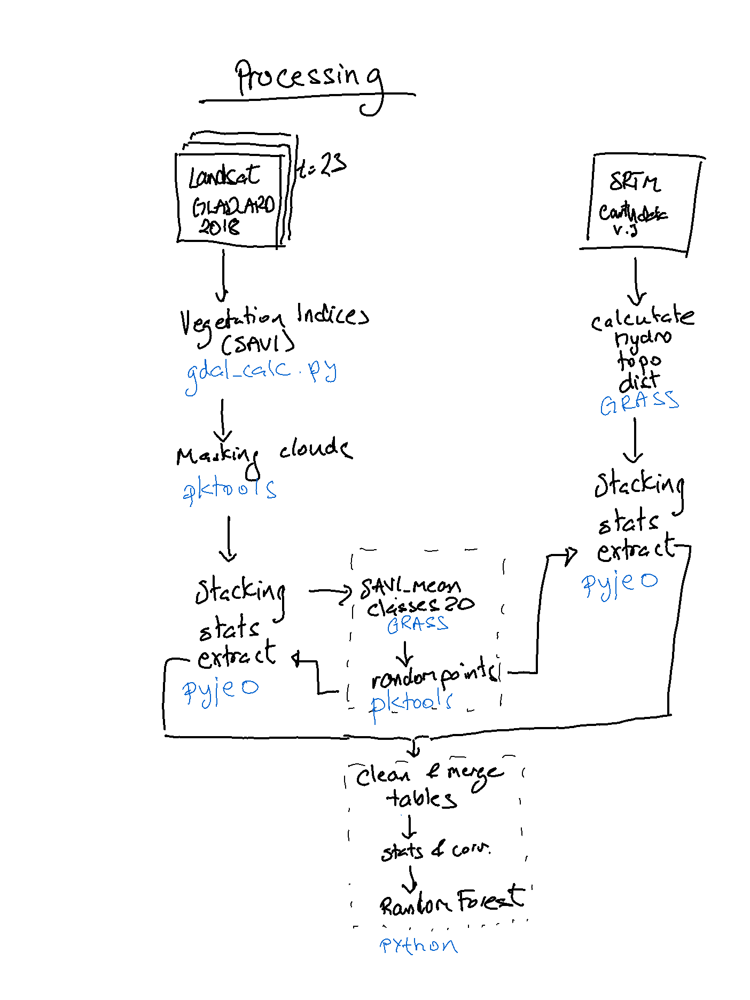
    


## 1 GLAD ARD Landsat images

The Landsat Analysis Ready Data (GLAD ARD) developed by the Global Land Analysis and Discovery (GLAD) provides spatially and temporally consistent inputs for land cover mapping and change detection. The GLAD ARD represent a 16-day time-series of tiled Landsat normalized surface reflectance from 1997 to present (source 
https://glad.umd.edu/book/overview). 

The GLAD ARD data can be download from https://glad.umd.edu/dataset/landsat_v1.1/ previous autentifcation.

In my project I'm using imagery from Red Sea Hills, Sudan, portion of TILE 037E_18N. Due to working on the virtual machine I only selected one year of data, i.e. **2018**. 

The temporal series for each tile is labeled following this numerical nomenclature
- first column is year
- remaining columns are name of 16day time series imagery


```python
! head -43 geodata/glad_ard/16d_intervals.csv  | tail -6
```

    2017 852 853 854 855 856 857 858 859 860 861 862 863 864 865 866 867 868 869 870 871 872 873 874         
    2018 875 876 877 878 879 880 881 882 883 884 885 886 887 888 889 890 891 892 893 894 895 896 897         
    2019 898 899 900 901 902 903 904 905 906 907 908 909 910 911 912 913 914 915 916 917 918 919 920         
    2020 921 922 923 924 925 926 927 928 929 930 931 932 933 934 935 936 937 938 939 940 941 942 943         
    2021 944 945 946 947 948 949 950 951 952 953 954 955 956 957 958 959 960 961 962 963 964 965 966         
    2022 967 968 969 970 971 972 973 974 975 976 977 978 979 980 981 982 983 984 985 986 987 988 989         


### Data download 

Data for 2018 was downloaded with this code, where user:password should be replace

```bash
%%bash
for INTER in $(grep -e ^2018 geodata/glad_ard//16d_intervals.csv | awk '{ $1=""; print $0}') ; do  
    curl --connect-timeout 600 -u user:passwd -X GET https://glad.umd.edu/dataset/landsat_v1.1/18N/037E_18N/$INTER.tif -o project/glad_ard/$INTER.tif
    gdal_translate -co COMPRESS=DEFLATE -co ZLEVEL=9  -projwin 37 18.86666 37.4 18.63333 project/glad_ard/$INTER.tif project/glad_ard/${INTER}_crop.tif      
done
```

The images has 8 bands, where band 3 and 4 can be used to calculate vegetation indices. Band 8, BQA, is used for masking pixels with low quality (https://glad.umd.edu/ard/landsat-ard-methodology). In addition to clouds, there can also be low quality pixels seen as stripes (caused by sensor problems; see figure below).

Due the arid characteristics of the area, the Soil Adjusted Vegetation Index (SAVI) is used:

(NIR - Red)/(NIR + RED) + 0.5)) * 1.5


```python
%%capture
#converting to png for display
!gdal_translate -b 1 -b 2 -b 3 project/glad_ard/875_crop.tif project/glad_ard/875_crop.png
```


```python
from rasterio.plot import show
src = rasterio.open("project/glad_ard/875_crop_m.tif")
show(src, cmap='pink')
```


    
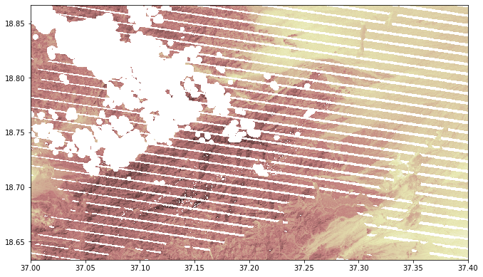
    


    <matplotlib.axes._subplots.AxesSubplot at 0x7f3719b14eb0>


### Calculate vegetation index


```bash
%%bash
for file in project/glad_ard/*_crop.tif; do 
  filename=$(basename $file .tif )
  #echo $file
  #VI
  gdal_calc.py  --type=Float32 --overwrite -A $file --A_band=3 -B $file --B_band=4 \
  --co COMPRESS=DEFLATE --co ZLEVEL=9 --calc="(B.astype(float))/(A.astype(float))" --outfile=project/glad_ard/${filename}_VI.tif \
  --quiet

  #NDVI
  gdal_calc.py  --type=Float32 --overwrite -A $file --A_band=3 -B $file --B_band=4 \
  --co COMPRESS=DEFLATE --co ZLEVEL=9 --calc="(B.astype(float)- A.astype(float))/(B.astype(float) + A.astype(float))" \
  --outfile=project/glad_ard/${filename}_NDVI.tif \
  --quiet
    
  #SAVI
  gdal_calc.py  --type=Float32 --overwrite -A $file --A_band=3 -B $file --B_band=4 \
  --co COMPRESS=DEFLATE --co ZLEVEL=9 --calc="((B.astype(float)- A.astype(float))/(B.astype(float) + A.astype(float) + 0.5)) * 1.5" \
  --outfile=project/glad_ard/${filename}_SAVI.tif \
  --quiet

done
```

### Masking and statistics  
Only BQA pixels 1 and 2 are kept in the masking. Since counting starts from 0, BQA band is #7. Nodata value is set to  Uint16 max (65535) since using 0 will cause error when estimating SAVI. All images were masked in the same way after calculating SAVI (since input nulldata could not be set in this version of gdalcalc.py).


```python
%%capture
%%bash
for file in project/glad_ard/*_crop.tif; do 
  filename=$(basename $file .tif )
  echo $file
  echo $filename  
  pkgetmask --overwrite -i $file -o project/glad_ard/${filename}_mask.tif -min 1 -max 2 -b 7
  pksetmask -i project/glad_ard/${filename}_SAVI.tif -m project/glad_ard/${filename}_mask.tif -msknodata 0 -nodata -99 \
  -o project/glad_ard/${filename}_SAVI_m.tif\
  --quiet
done
```

**Checking nodata and statistics for the VIs**


```bash
%%bash
gdalinfo project/glad_ard/875_crop_SAVI_m.tif |grep -E 'NoData' 
```

      NoData Value=-99


```bash
%%bash
for file in project/glad_ard/*crop_SAVI_m.tif; do
pkinfo -i $file -stats|awk '{print $0}'
done
```

    -min -0.211417 -max 0.611614 --mean 0.12386 --stdDev 0.0465675 
    -min 0.0631748 -max 0.210848 --mean 0.134271 --stdDev 0.0229662 
    -min -0.188215 -max 0.772617 --mean 0.126266 --stdDev 0.0579652 
    -min -0.31516 -max 0.715421 --mean 0.126566 --stdDev 0.0513284 
    -min -0.216388 -max 0.600698 --mean 0.124193 --stdDev 0.0397357 
    -min -0.274006 -max 0.610294 --mean 0.124246 --stdDev 0.0368988 
    -min -0.227176 -max 0.60059 --mean 0.124319 --stdDev 0.0350922 
    -min -0.0308992 -max 0.572593 --mean 0.123665 --stdDev 0.0308838 
    -min -0.197234 -max 0.620289 --mean 0.128406 --stdDev 0.0353955 
    -min -0.0114275 -max 0.636907 --mean 0.125323 --stdDev 0.0319995 
    -min 0.063293 -max 0.226574 --mean 0.11956 --stdDev 0.0187572 
    -min 0.07592 -max 0.250311 --mean 0.122435 --stdDev 0.019505 
    -min -0.00347078 -max 0.500646 --mean 0.127181 --stdDev 0.0314407 
    -min 0.0270167 -max 0.394247 --mean 0.128143 --stdDev 0.0302831 
    -min -0.0294599 -max 0.542999 --mean 0.125114 --stdDev 0.0315137 
    -min 0.0247256 -max 0.229192 --mean 0.109571 --stdDev 0.0199349 
    -min -0.234899 -max 0.79372 --mean 0.125687 --stdDev 0.0335479 
    -min -0.526694 -max 0.911127 --mean 0.126048 --stdDev 0.0363183 
    -min -0.105182 -max 0.686265 --mean 0.132825 --stdDev 0.030873 
    -min -0.307845 -max 0.969288 --mean 0.132675 --stdDev 0.0423124 
    -min -0.169741 -max 0.699102 --mean 0.135448 --stdDev 0.0472854 
    -min -0.41313 -max 0.955517 --mean 0.168209 --stdDev 0.0908494 
    -min -0.0180593 -max 0.620982 --mean 0.134354 --stdDev 0.0493728 
    -min -0.186645 -max 0.349589 --mean 0.1139 --stdDev 0.037978 


**Extracting histograms for SAVI**


```python
%%capture
%%bash
for file in project/glad_ard/*_SAVI_m.tif; do
filename=$(basename $file .tif )
echo $filename
pkstat -i $file -hist -nbin 20 -nodata -99 > project/glad_ard/${filename}_h.txt 
done

```


```python
!more project/glad_ard/897_crop_SAVI_m_h.txt
```

    -0.002083286643 7
    0.02986876667 154
    0.06182081997 6017
    0.09377287328 44899
    0.1257249266 33275
    0.1576769799 15828
    0.1896290332 7138
    0.2215810865 3958
    0.2535331398 1774
    0.2854851931 1003
    0.3174372464 313
    0.3493892998 218
    0.3813413531 134
    0.4132934064 86
    0.4452454597 45
    0.477197513 31
    0.5091495663 20
    0.5411016196 9
    0.5730536729 5
    0.6050057262 2


## Generate stacks and extract statistics in Pyjeo

I wanted to try out Pyjeo after Dr. Pieter Kempeneers presentation (http://spatial-ecology.net/docs/build/html/PKTOOLS/pyjeo_introduction.html). I used it to calculate yearly mean, median, 90 percentil and standard deviation. Probably there are cleaner ways to do this with some more pyjeo-practice. One of workarounds I ended up using was creating a test* jim, and copied crs++ info from that to an "empty" jim that was "filled" with all my timesteps/planes. Later I used these layers when extracting information for random points. 


```python
from pathlib import Path
import numpy as np
import pandas as pd
%matplotlib inline
import matplotlib.pyplot as plt
import pyjeo as pj
import os
```


```python
fn = Path('project/glad_ard/875_crop_SAVI_m.tif')
test = pj.Jim(fn)
```


```python
#del jim #delete if old jim exists
jim = pj.Jim(ncol = 1600, nrow = 933, otype='float32', nodata=-99) #create jim object with one 1 empty plane
jim.properties.copyGeoTransform(test) #get all crs from test
print(jim.properties.nrOfCol())
print(jim.properties.getBBox())
print(jim.stats.getStats())
print(jim.properties.nrOfPlane()) #show number of planes
```

    1600
    [37.0, 18.86675, 37.4, 18.633499999999998]
    {'min': 0.0, 'max': 0.0, 'mean': 0.0}
    1


```python
# iterate over SAVI files in
# that directory

#check number of files/planes
!ls project/glad_ard/???_crop_SAVI_m.tif | wc -l
#sjekk denne sorteringen
files = sorted(Path('project/glad_ard').glob('???_crop_SAVI_m.tif'))

for file in files:
    jim.geometry.stackPlane(pj.Jim(file))

print(jim.properties.nrOfPlane()) #show number of planes
#remove first empty plane; probably better way to do this
jim=jim[[1,2,3,4,5,6,7,8,9,10,11,12,13,14,15,16,17,18,19,20,21,22,23]]
jim.properties.nrOfPlane() #should be 23
```

    23
    24


    23


```python
print(jim.stats.getStats())
```

    {'min': -99.0, 'max': 0.9692878723144531, 'mean': -25.83536720275879}


```python
#calculate mean
mean = pj.geometry.reducePlane(jim, rule = 'mean', nodata = -99.0) #applied mask to all planes (more than 2D); "reduce" som i GEE
mean.stats.getStats()
```


    {'min': -0.02188333310186863,
     'max': 0.5145996809005737,
     'mean': 0.12636782228946686}


```python
#calculate median
median = pj.geometry.reducePlane(jim, rule = 'median', nodata = -99)
median.stats.getStats()
```


    {'min': -0.006859873421490192,
     'max': 0.5675770044326782,
     'mean': 0.12463919818401337}


```python
#calculate stdev
# std.pixops.convert('GDT_Float32') #converts into float if needed
std = pj.Jim(mean) #works as a placeholder for the std to be calculated
jim.np()[jim.np()==-99] = np.nan #all 0 assign to nan
stdnp = np.nanstd(jim.np(), axis=0) #second data cube (1), starts at 0
std.np()[:] = stdnp
std.stats.getStats()
```


    {'min': 0.001729343319311738,
     'max': 0.2672453820705414,
     'mean': 0.017469022423028946}


```python
#calculate quantiles
per90 = pj.Jim(mean)
jim.np()[jim.np()==-99] = np.nan #all -99 assign to nan
per90np = np.nanpercentile(jim.np(), 90, axis=0) 
per90.np()[:] = per90np
per90.stats.getStats()
```


    {'min': 0.06932799518108368,
     'max': 0.9273030161857605,
     'mean': 0.14474131166934967}


```python
plt.gray()  # show the filtered result in grayscale
fig = plt.figure(figsize=(20,10))
ax1 = fig.add_subplot(141)
ax2 = fig.add_subplot(142)
ax3 = fig.add_subplot(143)
ax4 = fig.add_subplot(144)
ax1.imshow(mean.np())
ax2.imshow(std.np())
ax3.imshow(per90.np())
ax4.imshow(median.np())
plt.show()
```


    <Figure size 432x288 with 0 Axes>


    

    


```python
#save to files
mean.io.write('project/glad_ard/mean_pyjeo.tif', co = ['COMPRESS=DEFLATE', 'ZLEVEL=9']) #io from io-module
median.io.write('project/glad_ard/median_pyjeo.tif', co = ['COMPRESS=DEFLATE', 'ZLEVEL=9']) #io from io-module
std.io.write('project/glad_ard/std_pyjeo.tif', co = ['COMPRESS=DEFLATE', 'ZLEVEL=9']) #io from io-module
per90.io.write('project/glad_ard/per90_pyjeo.tif', co = ['COMPRESS=DEFLATE', 'ZLEVEL=9']) #io from io-module
```

## 2 Creating topographical and hydrological layers in GRASS

Requirements for GRASS to run
- make seperate folder under home/user/ to run GRASS
- install addons for special algorithms, i.e. r.stream.order. Addons had to be downloaded from github to be installed due to changes in URL not implemented in current version of GRASS (7.8.5). 

```
%%bash  
mkdir -p /home/user/my_SE_data/exercise  
cp -r /home/user/SE_data/exercise/grassdb /home/user/my_SE_data/exercise  
git clone https://github.com/OSGeo/grass-addons.git /home/user/grass_addons
#run GRASS to install extension  
cd /home/user/my_SE_data/exercise  
grass78 -text grassdb/europe/PERMANENT/ << EOF  
g.extension extension=r.stream.basins  url=/home/user/grass_addons/src/raster/r.stream.basins/  
g.extension extension=r.stream.distance  url=/home/user/grass_addons/src/raster/r.stream.distance/  
EOF 
```

### Download SRTM  

SRTM data (version 3, 30m resolution) was downloaded from NASA earthdata.  
See https://wiki.earthdata.nasa.gov/display/EL/How+To+Access+Data+With+cURL+And+Wget  
Replace "user" and "password"   
    
    
```
%%bash  
cd /home/user/  
touch .netrc  
echo "machine urs.earthdata.nasa.gov login <user> password <password>" > .netrc  
chmod 0600 .netrc  
#### create cookie #### 
cd ~  
touch .urs_cookies  
##### download more files in one go and move to folder  ####
curl -O -b ~/.urs_cookies -c ~/.urs_cookies -L -n "https://e4ftl01.cr.usgs.gov/MEASURES/SRTMGL1.003/2000.02.11/N18E0[36-37].SRTMGL1.hgt.zip"  
mv N18* project/srtm/  
cd project/srtm/  
unzip "*.zip"  
##### to speed up convert to tiff ####  
for file in project/srtm/*.hgt; do  
  filename=$(basename $file .hgt)  
  gdal_translate -co COMPRESS=DEFLATE -co ZLEVEL=9 -co PREDICTOR=2 $file project/srtm/$filename.tif  
done  
```

### Calculate variables

A number of topographic and hydrological explanatory variables are calculated in GRASS. Since some of the hydrological variables are depending on data for complete watersheds, region is readjusted to the smaller AOI (from landsat savi data) when the export is done (g.region). Distance from streams and stream junctions are also calculated. 


```python
%%capture
%%bash
# topidx don't work on lat lon data
cp project/srtm/N18E037.tif /home/user/my_SE_data/exercise/
cd /home/user/my_SE_data/exercise
mkdir grassout

# use the --tmp-location option to store a temporal location in the /tmp folder 
# -f forces removal of gislock; --text - textbased GUI --tmp-location - temporary location deleted
# -c geofile - location based on that file
# opens a GRASS text interface where input is ended by EOF
grass78  -f -text --tmp-location  -c  /home/user/my_SE_data/exercise/N18E037.tif  <<'EOF' 

#prints all env. settings
#debug 0 - silence
g.gisenv set="GRASS_VERBOSE=-1","DEBUG=0"

echo  "######## import the layers ########"
# not imported, just registered as a grass dataset 
r.external input=N18E037.tif output=elv --o --q # dem 
r.external input=landsat/SAVI.tif output=savi --o --q

echo  "######## calculate topographic layers ########"
r.slope.aspect elevation=elv slope=slope aspect=aspect pcurvature=pcurv tcurvature=tcurv dx=dx dy=dy dxx=dxx dyy=dyy dxy=dxy --o
#r.topidx input=elv output=topidx --o

echo "######## estimating watershed ########"
#threshold basinsize in number of pixels
r.watershed elevation=elv threshold=2000 \
  accumulation=w_accum \
  tci=w_tci \
  spi=w_spi \
  drainage=w_dr_dir \
  basin=w_basin \
  stream=w_stream_w2k \
  length_slope=w_lSl \
  slope_steepness=w_SlSt \
  --o

echo "######## estimating distance from stream ########"
# input should be from same function (r.watershed or r.stream..)

r.stream.distance stream_rast=w_stream_w2k \
  direction=w_dr_dir \
  elevation=elv \
  method=downstream \
  distance=w_str_w2k_dist

echo "######## extract stream vector ########"
# extract stream vector, including points for confluence
r.stream.extract elevation=elv \
  accumulation=w_accum \
  threshold=2000 \
  stream_vector=streamx_2kv \
  --o

echo "######## info stream vector ########"
#info about stream_v
db.describe -c table=streamx_2kv
v.to.rast input=streamx_2kv type=point where="type_code = 1" output=str_2kvj_r use=attr attribute_column="type_code" 


echo "######## estimating distance from junctions ########"
#-m for meter
r.grow.distance -m input=str_2kvj_r distance=str_2kvj_dist metric=geodesic


echo "######## exporting products ########"
#export multiple rasterfiles - exclude elv from the list
g.region raster=savi
for file in $(g.list type=raster ); do 
   r.out.gdal --o -f -c -m createopt="COMPRESS=DEFLATE,ZLEVEL=9" type=Float64 nodata=999999999 format=GTiff input=$file  output=grassout/${file}.tif 
done
EOF
```

## 3 Extract statistics for random points

Random points are created within classes of SAVI_mean to make sure the whole range of SAVI values are represented. The SAVI classes are based on the histogram with 20 bins. Classfication of SAVI is done in GRASS using a file with the recoding values. Awk is used to generate the recode.txt file, that should .
have the following format:

1:1:1.1:1.1 #from_start:from_end:to_start:to_end, where to_start=to_end for classes.

Random points are generated with pkextractimg.


```python
#del jim
fn = Path('project/glad_ard/mean_pyjeo.tif')
jim = pj.Jim(fn)
jim.stats.getStats()
```


    {'min': -0.02188333310186863,
     'max': 0.5159205794334412,
     'mean': 0.1263299584388733}


```python
!rm -r output.txt
stats = jim.stats.getStats('histogram', nbin=20, src_min=-0.1, src_max=0.55, nodata=-99)
with open("output.txt", "a") as f:
  for index, bin in enumerate(stats['bin']):
    print(bin, stats['histogram'][index], file=f)
```


```bash
%%bash

#make recode rules from txt-file

paste -d":" \
    <(awk '{print $1}' output.txt | head -n19) \
    <(awk 'NR>1{print $1}' output.txt) \
    <(printf "%s\n" {1..19}) \
    <(printf "%s\n" {1..19}) \
    > rules.txt
```


```python
!wc -l rules.txt
!more rules.txt
```

    19 rules.txt
    -0.08375:-0.05125:1:1
    -0.05125:-0.01875:2:2
    -0.01875:0.01375:3:3
    0.01375:0.04625:4:4
    0.04625:0.07875:5:5
    0.07875:0.11125:6:6
    0.11125:0.14375:7:7
    0.14375:0.17625:8:8
    0.17625:0.20875:9:9
    0.20875:0.24125:10:10
    0.24125:0.27375:11:11
    0.27375:0.30625:12:12
    0.30625:0.33875:13:13
    0.33875:0.37125:14:14
    0.37125:0.40375:15:15
    0.40375:0.43625:16:16
    0.43625:0.46875:17:17
    0.46875:0.50125:18:18
    0.50125:0.53375:19:19


**classify SAVI with GRASS**


```python
%%capture
%%bash

cp project/glad_ard/mean_pyjeo.tif /home/user/my_SE_data/exercise/
cd /home/user/my_SE_data/exercise

grass78  -f -text --tmp-location  -c  /home/user/my_SE_data/exercise/mean_pyjeo.tif  <<'EOF' 
g.gisenv set="GRASS_VERBOSE=-1","DEBUG=0"

echo "######## import the layers #############"
r.external input=mean_pyjeo.tif output=SAVI --o --q # dem 

echo "######## recode SAVI 30classes #############"
r.recode input=SAVI output=SAVI_c rules=rules.txt

r.out.gdal --o -f -c -m createopt="COMPRESS=DEFLATE,ZLEVEL=9" format=GTiff input=SAVI_c output=SAVI_c.tif

EOF
```

**create random points**


```python
!pkextractimg -i project/glad_ard/mean_pyjeo.tif \
    -s project/glad_ard/SAVI_c.tif \
    -o project/glad_ard/random.sqlite -t 5
```


```python
!ogrinfo project/glad_ard/random.sqlite
```

    	- 'VirtualXPath'	[XML Path Language - XPath]
    INFO: Open of `project/glad_ard/random.sqlite'
          using driver `SQLite' successful.
    1: training data (Point)


### Extract values for response and predictor variables

In this part values for predictors and response variables for all random points are extracted. I'm using pyjeo for this part. Since stacking requires the datasets to be same datatype as well as CRS, extraction is done separately for response and predictors. 

**Repsonse variable**


```python
del jim
jim = pj.Jim(ncol = 1600, nrow = 933, otype='float32', nodata=-99) #create empty jim object
jim.properties.copyGeoReference(test)
print(jim.properties.nrOfCol())
print(jim.properties.getBBox())
print(jim.stats.getStats())

files = sorted(Path('project/glad_ard').glob('*pyjeo.tif'))
print(files)

for file in files:
    jim.geometry.stackPlane(pj.Jim(file))

jim.properties.nrOfPlane() #show number of planes
jim=jim[[1,2,3,4]] #select last 4 planes

```

    1600
    [37.0, 18.86675, 37.4, 18.633499999999998]
    {'min': 0.0, 'max': 0.0, 'mean': 0.0}
    [PosixPath('project/glad_ard/mean_pyjeo.tif'), PosixPath('project/glad_ard/median_pyjeo.tif'), PosixPath('project/glad_ard/per90_pyjeo.tif'), PosixPath('project/glad_ard/std_pyjeo.tif')]


```python
#check CRS for layers
!ogrinfo -so project/glad_ard/random.sqlite 'training data' | grep -E 'EPSG'
!gdalinfo project/glad_ard/mean_pyjeo.tif | grep -E 'EPSG'
jim.properties.getProjection()
#test.properties.getProjection()
```

        ID["EPSG",4326]]


    'GEOGCS["WGS 84",DATUM["WGS_1984",SPHEROID["WGS 84",6378137,298.257223563,AUTHORITY["EPSG","7030"]],AUTHORITY["EPSG","6326"]],PRIMEM["Greenwich",0],UNIT["degree",0.0174532925199433,AUTHORITY["EPSG","9122"]],AXIS["Latitude",NORTH],AXIS["Longitude",EAST],AUTHORITY["EPSG","4326"]]'


```python
vfn = 'project/glad_ard/random.sqlite'
v = pj.JimVect(vfn)
output = 'project/glad_ard/temp.sqlite'
Path(output).unlink(missing_ok = True)
extracted1 = pj.geometry.extract(v, jim, output=output, srcnodata = -99)
savi = pd.DataFrame(extracted1.dict())
savi.to_csv('project/glad_ard/savi.csv')
```

**Predictor variables**


```python
fn = Path('/home/user/my_SE_data/exercise/grassout/elv.tif')
del jim #if old jim exists
jim = pj.Jim(fn)
planes = jim.properties.nrOfPlane()
col = jim.properties.nrOfCol() #show number of planes; i.e. timesteps
row = jim.properties.nrOfRow()
print('no of planes, columns and rows:',planes, col, row)
```

    no of planes, columns and rows: 1 1600 933


```python
print(jim.properties.getBBox())
print(jim.stats.getStats())
```

    [37.0, 18.86675, 37.4, 18.633499999999998]
    {'min': 6.0, 'max': 1530.0, 'mean': 576.3270136655949}


```python
%%capture
%%bash
#planes to be added
ls /home/user/my_SE_data/exercise/grassout/*.tif | wc -l 
#check that all rasters are same datatype
for file in /home/user/my_SE_data/exercise/grassout/*.tif; do
  echo $file
  gdalinfo $file -stats | grep -E 'Type' | awk '{print $4}'
done
```


```python
# iterate over tif files in
# that directory
files = sorted(Path('/home/user/my_SE_data/exercise/grassout').glob('*.tif'))
print(files)

for file in files:
    jim.geometry.stackPlane(pj.Jim(file))

planes = jim.properties.nrOfPlane()
col = jim.properties.nrOfCol() 
row = jim.properties.nrOfRow()
print('no of files, no of planes, columns and rows:',len(files), planes, col, row)
```

    [PosixPath('/home/user/my_SE_data/exercise/grassout/aspect.tif'), PosixPath('/home/user/my_SE_data/exercise/grassout/dx.tif'), PosixPath('/home/user/my_SE_data/exercise/grassout/dxx.tif'), PosixPath('/home/user/my_SE_data/exercise/grassout/dxy.tif'), PosixPath('/home/user/my_SE_data/exercise/grassout/dy.tif'), PosixPath('/home/user/my_SE_data/exercise/grassout/dyy.tif'), PosixPath('/home/user/my_SE_data/exercise/grassout/elv.tif'), PosixPath('/home/user/my_SE_data/exercise/grassout/pcurv.tif'), PosixPath('/home/user/my_SE_data/exercise/grassout/savi.tif'), PosixPath('/home/user/my_SE_data/exercise/grassout/slope.tif'), PosixPath('/home/user/my_SE_data/exercise/grassout/str_2kvj_dist.tif'), PosixPath('/home/user/my_SE_data/exercise/grassout/str_2kvj_r.tif'), PosixPath('/home/user/my_SE_data/exercise/grassout/tcurv.tif'), PosixPath('/home/user/my_SE_data/exercise/grassout/w_SlSt.tif'), PosixPath('/home/user/my_SE_data/exercise/grassout/w_accum.tif'), PosixPath('/home/user/my_SE_data/exercise/grassout/w_basin.tif'), PosixPath('/home/user/my_SE_data/exercise/grassout/w_dr_dir.tif'), PosixPath('/home/user/my_SE_data/exercise/grassout/w_lSl.tif'), PosixPath('/home/user/my_SE_data/exercise/grassout/w_spi.tif'), PosixPath('/home/user/my_SE_data/exercise/grassout/w_str_w2k_dist.tif'), PosixPath('/home/user/my_SE_data/exercise/grassout/w_stream_w2k.tif'), PosixPath('/home/user/my_SE_data/exercise/grassout/w_tci.tif')]
    no of files, no of planes, columns and rows: 22 23 1600 933


```python
!ogrinfo -so project/glad_ard/random.sqlite 'training data' | grep -E 'EPSG'
# confirm that CRS is the same
jim.properties.getProjection()
```

        ID["EPSG",4326]]


    'GEOGCS["WGS 84",DATUM["WGS_1984",SPHEROID["WGS 84",6378137,298.257223563,AUTHORITY["EPSG","7030"]],AUTHORITY["EPSG","6326"]],PRIMEM["Greenwich",0],UNIT["degree",0.0174532925199433,AUTHORITY["EPSG","9122"]],AXIS["Latitude",NORTH],AXIS["Longitude",EAST],AUTHORITY["EPSG","4326"]]'


```python
vfn = 'project/glad_ard/random.sqlite'
v = pj.JimVect(vfn)
output = 'project/glad_ard/temp1.sqlite'
Path(output).unlink(missing_ok = True)
extracted3 = pj.geometry.extract(v, jim, output=output, srcnodata = 999999999)
```


```python
topo = pd.DataFrame(extracted3.dict())
topo.to_csv('project/glad_ard/predictors.csv')
```


```python
topo.head()
```


<div>
<style scoped>
    .dataframe tbody tr th:only-of-type {
        vertical-align: middle;
    }

    .dataframe tbody tr th {
        vertical-align: top;
    }

    .dataframe thead th {
        text-align: right;
    }
</style>
<table border="1" class="dataframe">
  <thead>
    <tr style="text-align: right;">
      <th></th>
      <th>fid</th>
      <th>label</th>
      <th>b</th>
      <th>t0b0</th>
      <th>t1b0</th>
      <th>t2b0</th>
      <th>t3b0</th>
      <th>t4b0</th>
      <th>t5b0</th>
      <th>t6b0</th>
      <th>...</th>
      <th>t13b0</th>
      <th>t14b0</th>
      <th>t15b0</th>
      <th>t16b0</th>
      <th>t17b0</th>
      <th>t18b0</th>
      <th>t19b0</th>
      <th>t20b0</th>
      <th>t21b0</th>
      <th>t22b0</th>
    </tr>
  </thead>
  <tbody>
    <tr>
      <th>0</th>
      <td>0</td>
      <td>11</td>
      <td>0.097008</td>
      <td>760.0</td>
      <td>167.750107</td>
      <td>-0.243415</td>
      <td>-0.006419</td>
      <td>-0.000278</td>
      <td>0.052850</td>
      <td>-0.003702</td>
      <td>...</td>
      <td>-0.003823</td>
      <td>16.299999</td>
      <td>57.580921</td>
      <td>298.0</td>
      <td>3.0</td>
      <td>0.078407</td>
      <td>173.928513</td>
      <td>42.452179</td>
      <td>1.000000e+09</td>
      <td>8.741459</td>
    </tr>
    <tr>
      <th>1</th>
      <td>1</td>
      <td>10</td>
      <td>0.082413</td>
      <td>793.0</td>
      <td>186.597610</td>
      <td>-0.456937</td>
      <td>-0.003307</td>
      <td>-0.001944</td>
      <td>-0.052850</td>
      <td>-0.005112</td>
      <td>...</td>
      <td>-0.004220</td>
      <td>16.299999</td>
      <td>18.216928</td>
      <td>298.0</td>
      <td>5.0</td>
      <td>0.040093</td>
      <td>153.324326</td>
      <td>143.446518</td>
      <td>1.000000e+09</td>
      <td>7.134220</td>
    </tr>
    <tr>
      <th>2</th>
      <td>2</td>
      <td>10</td>
      <td>0.082921</td>
      <td>808.0</td>
      <td>187.867950</td>
      <td>-0.529534</td>
      <td>-0.002334</td>
      <td>0.000556</td>
      <td>-0.073177</td>
      <td>-0.004231</td>
      <td>...</td>
      <td>-0.003833</td>
      <td>16.299999</td>
      <td>13.026308</td>
      <td>298.0</td>
      <td>5.0</td>
      <td>0.054766</td>
      <td>115.282860</td>
      <td>199.080109</td>
      <td>1.000000e+09</td>
      <td>6.180274</td>
    </tr>
    <tr>
      <th>3</th>
      <td>3</td>
      <td>11</td>
      <td>0.106816</td>
      <td>877.0</td>
      <td>135.514297</td>
      <td>-0.269037</td>
      <td>-0.004474</td>
      <td>0.001944</td>
      <td>0.264250</td>
      <td>-0.000881</td>
      <td>...</td>
      <td>-0.000656</td>
      <td>0.030000</td>
      <td>5.122952</td>
      <td>298.0</td>
      <td>3.0</td>
      <td>0.030000</td>
      <td>23.608582</td>
      <td>824.232788</td>
      <td>1.000000e+09</td>
      <td>5.899572</td>
    </tr>
    <tr>
      <th>4</th>
      <td>4</td>
      <td>11</td>
      <td>0.114286</td>
      <td>898.0</td>
      <td>95.767517</td>
      <td>-0.042704</td>
      <td>-0.003501</td>
      <td>0.001667</td>
      <td>0.422801</td>
      <td>-0.003173</td>
      <td>...</td>
      <td>-0.002913</td>
      <td>16.299999</td>
      <td>2.950633</td>
      <td>298.0</td>
      <td>2.0</td>
      <td>0.037655</td>
      <td>23.699802</td>
      <td>1175.459473</td>
      <td>1.000000e+09</td>
      <td>5.373617</td>
    </tr>
  </tbody>
</table>
<p>5 rows × 26 columns</p>
</div>


## 4 Modelling vegetation


```python
import pandas as pd
import numpy as np
import rasterio
from rasterio import * #raster processing
from rasterio.plot import show
from pyspatialml import Raster
from sklearn.ensemble import RandomForestRegressor
from sklearn.model_selection import train_test_split,GridSearchCV
from sklearn.pipeline import Pipeline
from scipy.stats import pearsonr
import matplotlib.pyplot as plt
plt.rcParams["figure.figsize"] = (10,6.5)

import seaborn as sns
```

### Prepare table

**import table and rename predictor variables**


```python
#read data using panda
predictors = pd.read_csv("project/glad_ard/predictors.csv", sep=",",  index_col=False)
pd.set_option('display.max_columns',None)
predictors.columns

```


    Index(['Unnamed: 0', 'fid', 'label', 'b', 't0b0', 't1b0', 't2b0', 't3b0',
           't4b0', 't5b0', 't6b0', 't7b0', 't8b0', 't9b0', 't10b0', 't11b0',
           't12b0', 't13b0', 't14b0', 't15b0', 't16b0', 't17b0', 't18b0', 't19b0',
           't20b0', 't21b0', 't22b0'],
          dtype='object')


```python
!ls /home/user/my_SE_data/exercise/grassout/*.tif | xargs -n1 basename
```

    aspect.tif
    dx.tif
    dxx.tif
    dxy.tif
    dy.tif
    dyy.tif
    elv.tif
    pcurv.tif
    savi.tif
    slope.tif
    str_2kvj_dist.tif
    str_2kvj_r.tif
    tcurv.tif
    w_accum.tif
    w_basin.tif
    w_dr_dir.tif
    w_lSl.tif
    w_SlSt.tif
    w_spi.tif
    w_stream_w2k.tif
    w_str_w2k_dist.tif
    w_tci.tif


```python
print(files)
len(files)
```

    [PosixPath('/home/user/my_SE_data/exercise/grassout/aspect.tif'), PosixPath('/home/user/my_SE_data/exercise/grassout/dx.tif'), PosixPath('/home/user/my_SE_data/exercise/grassout/dxx.tif'), PosixPath('/home/user/my_SE_data/exercise/grassout/dxy.tif'), PosixPath('/home/user/my_SE_data/exercise/grassout/dy.tif'), PosixPath('/home/user/my_SE_data/exercise/grassout/dyy.tif'), PosixPath('/home/user/my_SE_data/exercise/grassout/elv.tif'), PosixPath('/home/user/my_SE_data/exercise/grassout/pcurv.tif'), PosixPath('/home/user/my_SE_data/exercise/grassout/savi.tif'), PosixPath('/home/user/my_SE_data/exercise/grassout/slope.tif'), PosixPath('/home/user/my_SE_data/exercise/grassout/str_2kvj_dist.tif'), PosixPath('/home/user/my_SE_data/exercise/grassout/str_2kvj_r.tif'), PosixPath('/home/user/my_SE_data/exercise/grassout/tcurv.tif'), PosixPath('/home/user/my_SE_data/exercise/grassout/w_SlSt.tif'), PosixPath('/home/user/my_SE_data/exercise/grassout/w_accum.tif'), PosixPath('/home/user/my_SE_data/exercise/grassout/w_basin.tif'), PosixPath('/home/user/my_SE_data/exercise/grassout/w_dr_dir.tif'), PosixPath('/home/user/my_SE_data/exercise/grassout/w_lSl.tif'), PosixPath('/home/user/my_SE_data/exercise/grassout/w_spi.tif'), PosixPath('/home/user/my_SE_data/exercise/grassout/w_str_w2k_dist.tif'), PosixPath('/home/user/my_SE_data/exercise/grassout/w_stream_w2k.tif'), PosixPath('/home/user/my_SE_data/exercise/grassout/w_tci.tif')]


    22


```python
#PS! sorting gave different results for jim object and in bash (capital letters?)
names_list = ['aspect', 'dx', 'dxx', 'dxy', 'dy', 'dyy', 'elv', 'pcurv', 'savi', 'slope', 
              'str_2kvj_dist', 'str_2kvj_r', 'tcurv', 'w_SlSt', 'w_accum',
              'w_basin', 'w_dr_dir', 'w_lSl', 'w_spi', 'w_str_w2k_dist', 'w_stream_w2k', 'w_tci']
len(names_list)
print(predictors.columns) 
len(predictors.columns)
```

    Index(['Unnamed: 0', 'fid', 'label', 'b', 't0b0', 't1b0', 't2b0', 't3b0',
           't4b0', 't5b0', 't6b0', 't7b0', 't8b0', 't9b0', 't10b0', 't11b0',
           't12b0', 't13b0', 't14b0', 't15b0', 't16b0', 't17b0', 't18b0', 't19b0',
           't20b0', 't21b0', 't22b0'],
          dtype='object')


    27


```python
predictors.columns = predictors.columns[:5].tolist() + names_list
print(predictors.columns)
```

    Index(['Unnamed: 0', 'fid', 'label', 'b', 't0b0', 'aspect', 'dx', 'dxx', 'dxy',
           'dy', 'dyy', 'elv', 'pcurv', 'savi', 'slope', 'str_2kvj_dist',
           'str_2kvj_r', 'tcurv', 'w_SlSt', 'w_accum', 'w_basin', 'w_dr_dir',
           'w_lSl', 'w_spi', 'w_str_w2k_dist', 'w_stream_w2k', 'w_tci'],
          dtype='object')


```python
len(predictors)
```


    74610


```python
predictors.head()
```


<div>
<style scoped>
    .dataframe tbody tr th:only-of-type {
        vertical-align: middle;
    }

    .dataframe tbody tr th {
        vertical-align: top;
    }

    .dataframe thead th {
        text-align: right;
    }
</style>
<table border="1" class="dataframe">
  <thead>
    <tr style="text-align: right;">
      <th></th>
      <th>Unnamed: 0</th>
      <th>fid</th>
      <th>label</th>
      <th>b</th>
      <th>t0b0</th>
      <th>aspect</th>
      <th>dx</th>
      <th>dxx</th>
      <th>dxy</th>
      <th>dy</th>
      <th>dyy</th>
      <th>elv</th>
      <th>pcurv</th>
      <th>savi</th>
      <th>slope</th>
      <th>str_2kvj_dist</th>
      <th>str_2kvj_r</th>
      <th>tcurv</th>
      <th>w_SlSt</th>
      <th>w_accum</th>
      <th>w_basin</th>
      <th>w_dr_dir</th>
      <th>w_lSl</th>
      <th>w_spi</th>
      <th>w_str_w2k_dist</th>
      <th>w_stream_w2k</th>
      <th>w_tci</th>
    </tr>
  </thead>
  <tbody>
    <tr>
      <th>0</th>
      <td>0</td>
      <td>0</td>
      <td>11</td>
      <td>0.097008</td>
      <td>760.0</td>
      <td>167.750107</td>
      <td>-0.243415</td>
      <td>-0.006419</td>
      <td>-0.000278</td>
      <td>0.052850</td>
      <td>-0.003702</td>
      <td>760.0</td>
      <td>-0.005648</td>
      <td>0.086638</td>
      <td>13.986955</td>
      <td>1611.938110</td>
      <td>1.000000e+09</td>
      <td>-0.003823</td>
      <td>16.299999</td>
      <td>57.580921</td>
      <td>298.0</td>
      <td>3.0</td>
      <td>0.078407</td>
      <td>173.928513</td>
      <td>42.452179</td>
      <td>1.000000e+09</td>
      <td>8.741459</td>
    </tr>
    <tr>
      <th>1</th>
      <td>1</td>
      <td>1</td>
      <td>10</td>
      <td>0.082413</td>
      <td>793.0</td>
      <td>186.597610</td>
      <td>-0.456937</td>
      <td>-0.003307</td>
      <td>-0.001944</td>
      <td>-0.052850</td>
      <td>-0.005112</td>
      <td>793.0</td>
      <td>-0.002830</td>
      <td>0.083820</td>
      <td>24.701620</td>
      <td>1603.144653</td>
      <td>1.000000e+09</td>
      <td>-0.004220</td>
      <td>16.299999</td>
      <td>18.216928</td>
      <td>298.0</td>
      <td>5.0</td>
      <td>0.040093</td>
      <td>153.324326</td>
      <td>143.446518</td>
      <td>1.000000e+09</td>
      <td>7.134220</td>
    </tr>
    <tr>
      <th>2</th>
      <td>2</td>
      <td>2</td>
      <td>10</td>
      <td>0.082921</td>
      <td>808.0</td>
      <td>187.867950</td>
      <td>-0.529534</td>
      <td>-0.002334</td>
      <td>0.000556</td>
      <td>-0.073177</td>
      <td>-0.004231</td>
      <td>808.0</td>
      <td>-0.001522</td>
      <td>0.083765</td>
      <td>28.127462</td>
      <td>1601.273193</td>
      <td>1.000000e+09</td>
      <td>-0.003833</td>
      <td>16.299999</td>
      <td>13.026308</td>
      <td>298.0</td>
      <td>5.0</td>
      <td>0.054766</td>
      <td>115.282860</td>
      <td>199.080109</td>
      <td>1.000000e+09</td>
      <td>6.180274</td>
    </tr>
    <tr>
      <th>3</th>
      <td>3</td>
      <td>3</td>
      <td>11</td>
      <td>0.106816</td>
      <td>877.0</td>
      <td>135.514297</td>
      <td>-0.269037</td>
      <td>-0.004474</td>
      <td>0.001944</td>
      <td>0.264250</td>
      <td>-0.000881</td>
      <td>877.0</td>
      <td>-0.003813</td>
      <td>0.130181</td>
      <td>20.661793</td>
      <td>1625.434448</td>
      <td>1.000000e+09</td>
      <td>-0.000656</td>
      <td>0.030000</td>
      <td>5.122952</td>
      <td>298.0</td>
      <td>3.0</td>
      <td>0.030000</td>
      <td>23.608582</td>
      <td>824.232788</td>
      <td>1.000000e+09</td>
      <td>5.899572</td>
    </tr>
    <tr>
      <th>4</th>
      <td>4</td>
      <td>4</td>
      <td>11</td>
      <td>0.114286</td>
      <td>898.0</td>
      <td>95.767517</td>
      <td>-0.042704</td>
      <td>-0.003501</td>
      <td>0.001667</td>
      <td>0.422801</td>
      <td>-0.003173</td>
      <td>898.0</td>
      <td>-0.002736</td>
      <td>0.139849</td>
      <td>23.023153</td>
      <td>1658.049072</td>
      <td>1.000000e+09</td>
      <td>-0.002913</td>
      <td>16.299999</td>
      <td>2.950633</td>
      <td>298.0</td>
      <td>2.0</td>
      <td>0.037655</td>
      <td>23.699802</td>
      <td>1175.459473</td>
      <td>1.000000e+09</td>
      <td>5.373617</td>
    </tr>
  </tbody>
</table>
</div>


**Cleaing up table and calculate some new variables**  
Columns that will not be used in the modelling is deleted from the table. Aspect is a circular variable and is linearised by calculating its sine and cosine. w_basin is a categorical value and to test whether it is treated correctly and meaningful its values are shuffled (basin_shuf).


```python
predictors = predictors.drop(['Unnamed: 0', 'b', 't0b0', 'w_stream_w2k', 'savi', 'str_2kvj_r'], axis=1)
predictors.columns
```


    Index(['fid', 'label', 'aspect', 'dx', 'dxx', 'dxy', 'dy', 'dyy', 'elv',
           'pcurv', 'slope', 'str_2kvj_dist', 'tcurv', 'w_SlSt', 'w_accum',
           'w_basin', 'w_dr_dir', 'w_lSl', 'w_spi', 'w_str_w2k_dist', 'w_tci'],
          dtype='object')


```python
#linearise aspect
import numpy as np
predictors['cos_asp']=np.cos(np.radians(predictors['aspect']))
predictors['sin_asp']=np.sin(np.radians(predictors['aspect']))
```


```python
#shuffle categorical basin-variable
predictors['basin_shuf'] = np.random.permutation(predictors['w_basin'].values)
predictors.head()
```


<div>
<style scoped>
    .dataframe tbody tr th:only-of-type {
        vertical-align: middle;
    }

    .dataframe tbody tr th {
        vertical-align: top;
    }

    .dataframe thead th {
        text-align: right;
    }
</style>
<table border="1" class="dataframe">
  <thead>
    <tr style="text-align: right;">
      <th></th>
      <th>fid</th>
      <th>label</th>
      <th>aspect</th>
      <th>dx</th>
      <th>dxx</th>
      <th>dxy</th>
      <th>dy</th>
      <th>dyy</th>
      <th>elv</th>
      <th>pcurv</th>
      <th>slope</th>
      <th>str_2kvj_dist</th>
      <th>tcurv</th>
      <th>w_SlSt</th>
      <th>w_accum</th>
      <th>w_basin</th>
      <th>w_dr_dir</th>
      <th>w_lSl</th>
      <th>w_spi</th>
      <th>w_str_w2k_dist</th>
      <th>w_tci</th>
      <th>cos_asp</th>
      <th>sin_asp</th>
      <th>basin_shuf</th>
    </tr>
  </thead>
  <tbody>
    <tr>
      <th>0</th>
      <td>0</td>
      <td>11</td>
      <td>167.750107</td>
      <td>-0.243415</td>
      <td>-0.006419</td>
      <td>-0.000278</td>
      <td>0.052850</td>
      <td>-0.003702</td>
      <td>760.0</td>
      <td>-0.005648</td>
      <td>13.986955</td>
      <td>1611.938110</td>
      <td>-0.003823</td>
      <td>16.299999</td>
      <td>57.580921</td>
      <td>298.0</td>
      <td>3.0</td>
      <td>0.078407</td>
      <td>173.928513</td>
      <td>42.452179</td>
      <td>8.741459</td>
      <td>-0.977232</td>
      <td>0.212176</td>
      <td>7490.0</td>
    </tr>
    <tr>
      <th>1</th>
      <td>1</td>
      <td>10</td>
      <td>186.597610</td>
      <td>-0.456937</td>
      <td>-0.003307</td>
      <td>-0.001944</td>
      <td>-0.052850</td>
      <td>-0.005112</td>
      <td>793.0</td>
      <td>-0.002830</td>
      <td>24.701620</td>
      <td>1603.144653</td>
      <td>-0.004220</td>
      <td>16.299999</td>
      <td>18.216928</td>
      <td>298.0</td>
      <td>5.0</td>
      <td>0.040093</td>
      <td>153.324326</td>
      <td>143.446518</td>
      <td>7.134220</td>
      <td>-0.993378</td>
      <td>-0.114896</td>
      <td>1646.0</td>
    </tr>
    <tr>
      <th>2</th>
      <td>2</td>
      <td>10</td>
      <td>187.867950</td>
      <td>-0.529534</td>
      <td>-0.002334</td>
      <td>0.000556</td>
      <td>-0.073177</td>
      <td>-0.004231</td>
      <td>808.0</td>
      <td>-0.001522</td>
      <td>28.127462</td>
      <td>1601.273193</td>
      <td>-0.003833</td>
      <td>16.299999</td>
      <td>13.026308</td>
      <td>298.0</td>
      <td>5.0</td>
      <td>0.054766</td>
      <td>115.282860</td>
      <td>199.080109</td>
      <td>6.180274</td>
      <td>-0.990586</td>
      <td>-0.136890</td>
      <td>6642.0</td>
    </tr>
    <tr>
      <th>3</th>
      <td>3</td>
      <td>11</td>
      <td>135.514297</td>
      <td>-0.269037</td>
      <td>-0.004474</td>
      <td>0.001944</td>
      <td>0.264250</td>
      <td>-0.000881</td>
      <td>877.0</td>
      <td>-0.003813</td>
      <td>20.661793</td>
      <td>1625.434448</td>
      <td>-0.000656</td>
      <td>0.030000</td>
      <td>5.122952</td>
      <td>298.0</td>
      <td>3.0</td>
      <td>0.030000</td>
      <td>23.608582</td>
      <td>824.232788</td>
      <td>5.899572</td>
      <td>-0.713425</td>
      <td>0.700731</td>
      <td>1154.0</td>
    </tr>
    <tr>
      <th>4</th>
      <td>4</td>
      <td>11</td>
      <td>95.767517</td>
      <td>-0.042704</td>
      <td>-0.003501</td>
      <td>0.001667</td>
      <td>0.422801</td>
      <td>-0.003173</td>
      <td>898.0</td>
      <td>-0.002736</td>
      <td>23.023153</td>
      <td>1658.049072</td>
      <td>-0.002913</td>
      <td>16.299999</td>
      <td>2.950633</td>
      <td>298.0</td>
      <td>2.0</td>
      <td>0.037655</td>
      <td>23.699802</td>
      <td>1175.459473</td>
      <td>5.373617</td>
      <td>-0.100492</td>
      <td>0.994938</td>
      <td>1172.0</td>
    </tr>
  </tbody>
</table>
</div>


**import response variable and join to predictors**


```python
#read response using panda
savi = pd.read_csv("project/glad_ard/savi.csv", sep=",",  index_col=False)
pd.set_option('display.max_columns',None)
print(savi.columns)

savi = savi.rename({'t0b0':'mean', 
                    't1b0':'median',
                    't2b0':'per90',
                    't3b0':'std'
                    } , axis='columns')

savi = savi.drop(['Unnamed: 0', 'b', 'label'], axis=1)
savi.head(10)
print(len(savi))
print(savi.columns)
```

    Index(['Unnamed: 0', 'fid', 'label', 'b', 't0b0', 't1b0', 't2b0', 't3b0'], dtype='object')
    74610
    Index(['fid', 'mean', 'median', 'per90', 'std'], dtype='object')


```python
predictors = predictors.merge(savi, left_on = 'fid', right_on='fid', how = 'inner')
```


```python
len(predictors)
```


    74610


```python
predictors.head()
```


<div>
<style scoped>
    .dataframe tbody tr th:only-of-type {
        vertical-align: middle;
    }

    .dataframe tbody tr th {
        vertical-align: top;
    }

    .dataframe thead th {
        text-align: right;
    }
</style>
<table border="1" class="dataframe">
  <thead>
    <tr style="text-align: right;">
      <th></th>
      <th>fid</th>
      <th>label</th>
      <th>aspect</th>
      <th>dx</th>
      <th>dxx</th>
      <th>dxy</th>
      <th>dy</th>
      <th>dyy</th>
      <th>elv</th>
      <th>pcurv</th>
      <th>slope</th>
      <th>str_2kvj_dist</th>
      <th>tcurv</th>
      <th>w_SlSt</th>
      <th>w_accum</th>
      <th>w_basin</th>
      <th>w_dr_dir</th>
      <th>w_lSl</th>
      <th>w_spi</th>
      <th>w_str_w2k_dist</th>
      <th>w_tci</th>
      <th>mean</th>
      <th>median</th>
      <th>per90</th>
      <th>std</th>
    </tr>
  </thead>
  <tbody>
    <tr>
      <th>0</th>
      <td>0</td>
      <td>11</td>
      <td>167.750107</td>
      <td>-0.243415</td>
      <td>-0.006419</td>
      <td>-0.000278</td>
      <td>0.052850</td>
      <td>-0.003702</td>
      <td>760.0</td>
      <td>-0.005648</td>
      <td>13.986955</td>
      <td>1611.938110</td>
      <td>-0.003823</td>
      <td>16.299999</td>
      <td>57.580921</td>
      <td>298.0</td>
      <td>3.0</td>
      <td>0.078407</td>
      <td>173.928513</td>
      <td>42.452179</td>
      <td>8.741459</td>
      <td>0.097008</td>
      <td>0.094664</td>
      <td>0.117911</td>
      <td>0.016844</td>
    </tr>
    <tr>
      <th>1</th>
      <td>1</td>
      <td>10</td>
      <td>186.597610</td>
      <td>-0.456937</td>
      <td>-0.003307</td>
      <td>-0.001944</td>
      <td>-0.052850</td>
      <td>-0.005112</td>
      <td>793.0</td>
      <td>-0.002830</td>
      <td>24.701620</td>
      <td>1603.144653</td>
      <td>-0.004220</td>
      <td>16.299999</td>
      <td>18.216928</td>
      <td>298.0</td>
      <td>5.0</td>
      <td>0.040093</td>
      <td>153.324326</td>
      <td>143.446518</td>
      <td>7.134220</td>
      <td>0.082413</td>
      <td>0.082888</td>
      <td>0.101135</td>
      <td>0.020149</td>
    </tr>
    <tr>
      <th>2</th>
      <td>2</td>
      <td>10</td>
      <td>187.867950</td>
      <td>-0.529534</td>
      <td>-0.002334</td>
      <td>0.000556</td>
      <td>-0.073177</td>
      <td>-0.004231</td>
      <td>808.0</td>
      <td>-0.001522</td>
      <td>28.127462</td>
      <td>1601.273193</td>
      <td>-0.003833</td>
      <td>16.299999</td>
      <td>13.026308</td>
      <td>298.0</td>
      <td>5.0</td>
      <td>0.054766</td>
      <td>115.282860</td>
      <td>199.080109</td>
      <td>6.180274</td>
      <td>0.082921</td>
      <td>0.078278</td>
      <td>0.113270</td>
      <td>0.023337</td>
    </tr>
    <tr>
      <th>3</th>
      <td>3</td>
      <td>11</td>
      <td>135.514297</td>
      <td>-0.269037</td>
      <td>-0.004474</td>
      <td>0.001944</td>
      <td>0.264250</td>
      <td>-0.000881</td>
      <td>877.0</td>
      <td>-0.003813</td>
      <td>20.661793</td>
      <td>1625.434448</td>
      <td>-0.000656</td>
      <td>0.030000</td>
      <td>5.122952</td>
      <td>298.0</td>
      <td>3.0</td>
      <td>0.030000</td>
      <td>23.608582</td>
      <td>824.232788</td>
      <td>5.899572</td>
      <td>0.106816</td>
      <td>0.104386</td>
      <td>0.123099</td>
      <td>0.014474</td>
    </tr>
    <tr>
      <th>4</th>
      <td>4</td>
      <td>11</td>
      <td>95.767517</td>
      <td>-0.042704</td>
      <td>-0.003501</td>
      <td>0.001667</td>
      <td>0.422801</td>
      <td>-0.003173</td>
      <td>898.0</td>
      <td>-0.002736</td>
      <td>23.023153</td>
      <td>1658.049072</td>
      <td>-0.002913</td>
      <td>16.299999</td>
      <td>2.950633</td>
      <td>298.0</td>
      <td>2.0</td>
      <td>0.037655</td>
      <td>23.699802</td>
      <td>1175.459473</td>
      <td>5.373617</td>
      <td>0.114286</td>
      <td>0.117651</td>
      <td>0.129462</td>
      <td>0.015016</td>
    </tr>
  </tbody>
</table>
</div>


```python
predictors.describe()
```


<div>
<style scoped>
    .dataframe tbody tr th:only-of-type {
        vertical-align: middle;
    }

    .dataframe tbody tr th {
        vertical-align: top;
    }

    .dataframe thead th {
        text-align: right;
    }
</style>
<table border="1" class="dataframe">
  <thead>
    <tr style="text-align: right;">
      <th></th>
      <th>fid</th>
      <th>label</th>
      <th>aspect</th>
      <th>dx</th>
      <th>dxx</th>
      <th>dxy</th>
      <th>dy</th>
      <th>dyy</th>
      <th>elv</th>
      <th>pcurv</th>
      <th>slope</th>
      <th>str_2kvj_dist</th>
      <th>tcurv</th>
      <th>w_SlSt</th>
      <th>w_accum</th>
      <th>w_basin</th>
      <th>w_dr_dir</th>
      <th>w_lSl</th>
      <th>w_spi</th>
      <th>w_str_w2k_dist</th>
      <th>w_tci</th>
      <th>cos_asp</th>
      <th>sin_asp</th>
      <th>basin_shuf</th>
      <th>mean</th>
      <th>median</th>
      <th>per90</th>
      <th>std</th>
    </tr>
  </thead>
  <tbody>
    <tr>
      <th>count</th>
      <td>74610.000000</td>
      <td>74610.000000</td>
      <td>7.461000e+04</td>
      <td>7.461000e+04</td>
      <td>7.461000e+04</td>
      <td>7.461000e+04</td>
      <td>7.461000e+04</td>
      <td>7.461000e+04</td>
      <td>74610.000000</td>
      <td>7.461000e+04</td>
      <td>7.461000e+04</td>
      <td>74610.000000</td>
      <td>7.461000e+04</td>
      <td>74610.000000</td>
      <td>74610.000000</td>
      <td>7.461000e+04</td>
      <td>74610.000000</td>
      <td>74610.000000</td>
      <td>7.461000e+04</td>
      <td>7.461000e+04</td>
      <td>7.461000e+04</td>
      <td>74610.000000</td>
      <td>74610.000000</td>
      <td>7.461000e+04</td>
      <td>74610.000000</td>
      <td>74610.000000</td>
      <td>74610.000000</td>
      <td>74610.000000</td>
    </tr>
    <tr>
      <th>mean</th>
      <td>37333.886986</td>
      <td>11.610481</td>
      <td>6.837265e+05</td>
      <td>6.835545e+05</td>
      <td>6.835545e+05</td>
      <td>6.835545e+05</td>
      <td>6.835545e+05</td>
      <td>6.835545e+05</td>
      <td>575.752379</td>
      <td>6.835545e+05</td>
      <td>6.835639e+05</td>
      <td>1244.034957</td>
      <td>6.835545e+05</td>
      <td>6.898900</td>
      <td>156.125340</td>
      <td>1.102226e+07</td>
      <td>4.388795</td>
      <td>0.041021</td>
      <td>6.843058e+05</td>
      <td>1.101833e+07</td>
      <td>6.835616e+05</td>
      <td>0.149895</td>
      <td>0.070254</td>
      <td>1.102226e+07</td>
      <td>0.126390</td>
      <td>0.124655</td>
      <td>0.144773</td>
      <td>0.017460</td>
    </tr>
    <tr>
      <th>std</th>
      <td>21553.426532</td>
      <td>0.961089</td>
      <td>2.613611e+07</td>
      <td>2.613611e+07</td>
      <td>2.613611e+07</td>
      <td>2.613611e+07</td>
      <td>2.613611e+07</td>
      <td>2.613611e+07</td>
      <td>419.481320</td>
      <td>2.613611e+07</td>
      <td>2.613611e+07</td>
      <td>831.669605</td>
      <td>2.613611e+07</td>
      <td>8.035924</td>
      <td>11065.900632</td>
      <td>1.043836e+08</td>
      <td>2.454120</td>
      <td>0.024518</td>
      <td>2.613610e+07</td>
      <td>1.043841e+08</td>
      <td>2.613611e+07</td>
      <td>0.700993</td>
      <td>0.693699</td>
      <td>1.043836e+08</td>
      <td>0.033416</td>
      <td>0.031926</td>
      <td>0.045378</td>
      <td>0.013877</td>
    </tr>
    <tr>
      <th>min</th>
      <td>0.000000</td>
      <td>9.000000</td>
      <td>0.000000e+00</td>
      <td>-1.344040e+00</td>
      <td>-1.182164e-01</td>
      <td>-2.553215e-02</td>
      <td>-1.341612e+00</td>
      <td>-5.341714e-02</td>
      <td>8.000000</td>
      <td>-3.485471e-02</td>
      <td>0.000000e+00</td>
      <td>0.000000</td>
      <td>-4.527013e-02</td>
      <td>0.030000</td>
      <td>-518632.187500</td>
      <td>2.980000e+02</td>
      <td>-4.000000</td>
      <td>0.025332</td>
      <td>1.446173e-01</td>
      <td>0.000000e+00</td>
      <td>1.318053e+00</td>
      <td>-1.000000</td>
      <td>-1.000000</td>
      <td>2.980000e+02</td>
      <td>0.018881</td>
      <td>0.029393</td>
      <td>0.071009</td>
      <td>0.002483</td>
    </tr>
    <tr>
      <th>25%</th>
      <td>18669.250000</td>
      <td>11.000000</td>
      <td>6.651141e+01</td>
      <td>-2.985837e-02</td>
      <td>-1.551966e-03</td>
      <td>-5.554170e-04</td>
      <td>-3.658877e-02</td>
      <td>-1.410363e-03</td>
      <td>171.000000</td>
      <td>-1.434810e-03</td>
      <td>1.847334e+00</td>
      <td>585.213623</td>
      <td>-1.201079e-03</td>
      <td>0.030000</td>
      <td>1.378385</td>
      <td>1.468000e+03</td>
      <td>2.000000</td>
      <td>0.030000</td>
      <td>2.121571e+00</td>
      <td>2.781997e+02</td>
      <td>5.179891e+00</td>
      <td>-0.532889</td>
      <td>-0.614763</td>
      <td>1.468000e+03</td>
      <td>0.106657</td>
      <td>0.105575</td>
      <td>0.119463</td>
      <td>0.009773</td>
    </tr>
    <tr>
      <th>50%</th>
      <td>37334.500000</td>
      <td>11.000000</td>
      <td>1.623830e+02</td>
      <td>1.279920e-02</td>
      <td>0.000000e+00</td>
      <td>0.000000e+00</td>
      <td>4.065462e-03</td>
      <td>0.000000e+00</td>
      <td>452.000000</td>
      <td>-1.332938e-04</td>
      <td>4.606714e+00</td>
      <td>1060.480957</td>
      <td>1.762322e-19</td>
      <td>0.030000</td>
      <td>2.929744</td>
      <td>7.130000e+03</td>
      <td>5.000000</td>
      <td>0.030000</td>
      <td>9.361089e+00</td>
      <td>8.213889e+02</td>
      <td>6.182429e+00</td>
      <td>0.310322</td>
      <td>0.123289</td>
      <td>7.130000e+03</td>
      <td>0.119984</td>
      <td>0.119425</td>
      <td>0.133374</td>
      <td>0.012945</td>
    </tr>
    <tr>
      <th>75%</th>
      <td>55997.750000</td>
      <td>12.000000</td>
      <td>2.785243e+02</td>
      <td>5.974620e-02</td>
      <td>1.359604e-03</td>
      <td>5.553937e-04</td>
      <td>4.878521e-02</td>
      <td>1.234086e-03</td>
      <td>1037.000000</td>
      <td>1.057664e-03</td>
      <td>1.578789e+01</td>
      <td>1755.921539</td>
      <td>1.408627e-03</td>
      <td>16.299999</td>
      <td>10.037903</td>
      <td>7.732000e+03</td>
      <td>7.000000</td>
      <td>0.040093</td>
      <td>3.752013e+01</td>
      <td>1.587121e+03</td>
      <td>8.189266e+00</td>
      <td>0.826665</td>
      <td>0.732041</td>
      <td>7.732000e+03</td>
      <td>0.139325</td>
      <td>0.138246</td>
      <td>0.155657</td>
      <td>0.019381</td>
    </tr>
    <tr>
      <th>max</th>
      <td>74664.000000</td>
      <td>19.000000</td>
      <td>1.000000e+09</td>
      <td>1.000000e+09</td>
      <td>1.000000e+09</td>
      <td>1.000000e+09</td>
      <td>1.000000e+09</td>
      <td>1.000000e+09</td>
      <td>1523.000000</td>
      <td>1.000000e+09</td>
      <td>1.000000e+09</td>
      <td>4256.849121</td>
      <td>1.000000e+09</td>
      <td>16.299999</td>
      <td>207631.109375</td>
      <td>1.000000e+09</td>
      <td>8.000000</td>
      <td>0.409775</td>
      <td>1.000000e+09</td>
      <td>1.000000e+09</td>
      <td>1.000000e+09</td>
      <td>1.000000</td>
      <td>1.000000</td>
      <td>1.000000e+09</td>
      <td>0.404548</td>
      <td>0.414857</td>
      <td>0.674392</td>
      <td>0.238861</td>
    </tr>
  </tbody>
</table>
</div>


**Check for and remove nan-values**


```python
#predictors.describe()
print(predictors.isnull().values.any())
predictors = predictors.dropna()
predictors.isnull().values.any()
```

    False


    False


**checking covariance for some variables**


```python
predictors_sample = predictors[["mean","std", "w_basin", "elv", "str_2kvj_dist"]].sample(5000)
sns.pairplot(predictors_sample ,  kind="reg", plot_kws=dict(scatter_kws=dict(s=2)))  
plt.show()
```


    
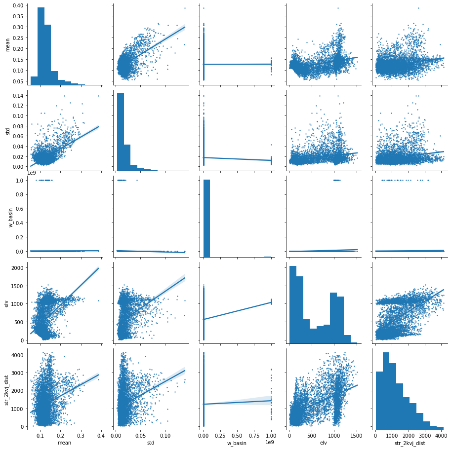
    


```python
bins = np.linspace(min(predictors['mean']),max(predictors['mean']),100)
plt.hist((predictors['mean']),bins,alpha=0.8);
```


    
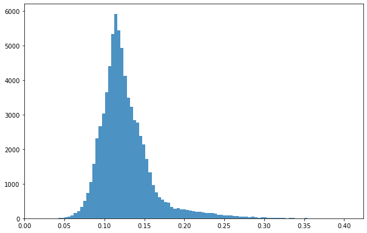
    


```python
predictors.columns #get names
```


    Index(['fid', 'label', 'aspect', 'dx', 'dxx', 'dxy', 'dy', 'dyy', 'elv',
           'pcurv', 'slope', 'str_2kvj_dist', 'tcurv', 'w_SlSt', 'w_accum',
           'w_basin', 'w_dr_dir', 'w_lSl', 'w_spi', 'w_str_w2k_dist', 'w_tci',
           'cos_asp', 'sin_asp', 'basin_shuf', 'mean', 'median', 'per90', 'std'],
          dtype='object')


```python
predictors.shape
```


    (74610, 28)


```python
X = predictors.iloc[:,[2, 3, 4, 5, 6, 7, 8, 9, 10, 11, 12, 14, 15, 17, 18, 19, 20, 21, 22, 23]].values #remove savi related and stream_j_dist
Y = predictors.iloc[:,24].values #response variable
feat = predictors.iloc[:,[2, 3, 4, 5, 6, 7, 8, 9, 10, 11, 12, 14, 15, 17, 18, 19, 20, 21, 22, 23]].columns.values
predictors.iloc[:,[24]].columns.values
```


    array(['mean'], dtype=object)


```python
print(feat)
```

    ['aspect' 'dx' 'dxx' 'dxy' 'dy' 'dyy' 'elv' 'pcurv' 'slope'
     'str_2kvj_dist' 'tcurv' 'w_accum' 'w_basin' 'w_lSl' 'w_spi'
     'w_str_w2k_dist' 'w_tci' 'cos_asp' 'sin_asp' 'basin_shuf']


```python
print(Y.shape)
print(X.shape)
```

    (74610,)
    (74610, 20)


```python
Y
```


    array([0.09700802, 0.08241346, 0.0829206 , ..., 0.13141605, 0.12182923,
           0.11685393])


**split data into test and training dataset**


```python
X_train, X_test, Y_train, Y_test = train_test_split(X, Y, test_size=0.5, random_state=24) #id. training and testing; split 50/50
y_train = np.ravel(Y_train)
y_test = np.ravel(Y_test)
```

### Random forest

Random forest is defined and then run with different settings to find the best model. 


```python
rf = RandomForestRegressor(random_state = 42)
rf.get_params()#default parameters - should be tuned! - not needed in R
```


    {'bootstrap': True,
     'ccp_alpha': 0.0,
     'criterion': 'mse',
     'max_depth': None,
     'max_features': 'auto',
     'max_leaf_nodes': None,
     'max_samples': None,
     'min_impurity_decrease': 0.0,
     'min_impurity_split': None,
     'min_samples_leaf': 1,
     'min_samples_split': 2,
     'min_weight_fraction_leaf': 0.0,
     'n_estimators': 100,
     'n_jobs': None,
     'oob_score': False,
     'random_state': 42,
     'verbose': 0,
     'warm_start': False}


```python
# first tried with this default setting rfReg = RandomForestRegressor(min_samples_leaf=50, oob_score=True)
# after running chunks below, these settings seems to better fit the data. 
rfReg = RandomForestRegressor(n_estimators=80, min_samples_leaf=20, max_depth=100, max_features=0.5, random_state=42 , oob_score = True)

rfReg.fit(X_train, y_train);
dic_pred = {}
dic_pred['train'] = rfReg.predict(X_train)
dic_pred['test'] = rfReg.predict(X_test)
pearsonr_all = [pearsonr(dic_pred['train'],y_train)[0],pearsonr(dic_pred['test'],y_test)[0]] #training vs pred R
pearsonr_all
```


    [0.9151073853228917, 0.8930071550321135]


```python
# checking the oob score
rfReg.oob_score_
```


    0.7825391349776363


```python
plt.rcParams["figure.figsize"] = (8,6)
plt.scatter(y_train,dic_pred['train'])
plt.xlabel('training SAVI mean (all rows)')
plt.ylabel('training prediction')
ident = [0, 0.5]
plt.plot(ident,ident,'r--')
```


    [<matplotlib.lines.Line2D at 0x7f374ad840d0>]


    

    


```python
impt = [rfReg.feature_importances_, np.std([tree.feature_importances_ for tree in rfReg.estimators_],axis=1)] 
ind = np.argsort(impt[0])
```


```python
ind
```


    array([13,  5,  3, 19,  7, 10,  2, 18,  0, 17, 11, 14, 16,  4,  8,  1, 15,
            9,  6, 12])


```python
#feature importance
plt.rcParams["figure.figsize"] = (6,12)
plt.barh(range(len(feat)),impt[0][ind],color="b", xerr=impt[1][ind], align="center")
plt.yticks(range(len(feat)),feat[ind]);
```


    
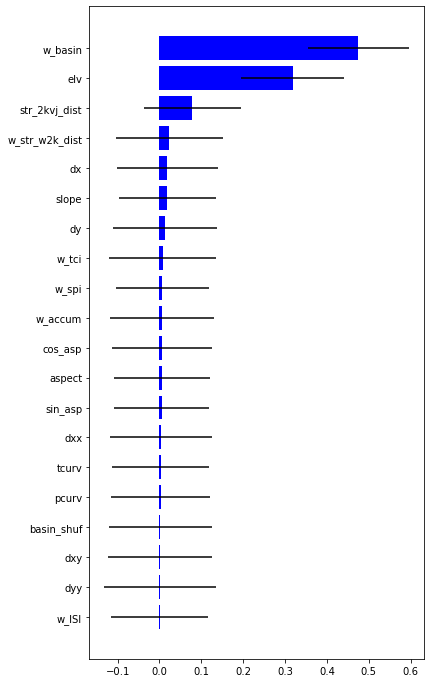
    


```python
src1 = rasterio.open("/home/user/my_SE_data/exercise/grassout/w_basin.tif")
src2 = rasterio.open("/home/user/my_SE_data/exercise/grassout/elv.tif")
src3 = rasterio.open("/home/user/my_SE_data/exercise/grassout/str_2kvj_dist.tif")
src4 = rasterio.open("/home/user/my_SE_data/exercise/landsat/mean_pyjeo.tif")
fig, (src1p,src2p,src3p, src4p) = plt.subplots(1,4, figsize=(21,7))
show(src1, ax=src1p, title='basins' , vmin=0, vmax=10000, cmap='gist_rainbow' )
show(src2, ax=src2p, title='elevation' , vmin=0, vmax=1500, cmap='gist_rainbow' )
show(src3, ax=src3p, title='str_2kvj_dist' , vmin=0, vmax=5000, cmap='gist_rainbow' )
show(src4, ax=src4p, title='mean SAVI' , vmin=0, vmax=1, cmap='gist_rainbow' )
```


    <matplotlib.axes._subplots.AxesSubplot at 0x7f374abeb910>


    

    


### Random Forest tuning


* "max_features": number of features to consider when looking for the best split. 
* "max_samples": number of samples to draw from X to train each base estimator.
* "n_estimators": identify the number of trees that must grow. It must be large enough so that the error is stabilized. Defoult 100.
* "max_depth": max number of levels in each decision tree.


```python
scores =[]
for k in range(40, 100):
    rfReg = RandomForestRegressor(n_estimators=k, min_samples_leaf=50, max_features=0.33,max_depth=150,max_samples=0.7,n_jobs=-1,random_state=42 , oob_score = True)
    rfReg.fit(X_train, y_train);
    dic_pred = {}
    dic_pred['train'] = rfReg.predict(X_train)
    dic_pred['test'] = rfReg.predict(X_test)
    scores.append([pearsonr(dic_pred['train'],y_train)[0],pearsonr(dic_pred['test'],y_test)[0]])

%matplotlib inline
plt.plot(range(40, 100), scores)
plt.xlabel('Value of n_estimators for Random Forest Classifier')
plt.ylabel('Prediction Accuracy')
```


    Text(0, 0.5, 'Prediction Accuracy')


    

    


```python
scores =[]
for k in [50, 100, 150]:
    rfReg = RandomForestRegressor(n_estimators=80, min_samples_leaf=50, max_features=0.33, max_depth=k, max_samples=0.7,n_jobs=-1,random_state=42 , oob_score = True)
    rfReg.fit(X_train, y_train);
    dic_pred = {}
    dic_pred['train'] = rfReg.predict(X_train)
    dic_pred['test'] = rfReg.predict(X_test)
    scores.append([pearsonr(dic_pred['train'],y_train)[0],pearsonr(dic_pred['test'],y_test)[0]])

%matplotlib inline
plt.plot([50, 100, 150], scores)
plt.xlabel('Value of n_estimators for Random Forest Classifier')
plt.ylabel('Prediction Accuracy')
```


    Text(0, 0.5, 'Prediction Accuracy')


    
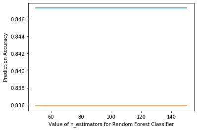
    


```python
scores =[]
for k in [10, 20, 40, 50, 75, 100, 125, 150]:
    rfReg = RandomForestRegressor(n_estimators=80, min_samples_leaf=k, max_features=0.33, max_depth=50, max_samples=0.7,n_jobs=-1,random_state=42 , oob_score = True)
    rfReg.fit(X_train, y_train);
    dic_pred = {}
    dic_pred['train'] = rfReg.predict(X_train)
    dic_pred['test'] = rfReg.predict(X_test)
    scores.append([pearsonr(dic_pred['train'],y_train)[0],pearsonr(dic_pred['test'],y_test)[0]])

%matplotlib inline
plt.plot([10, 20, 40, 50, 75, 100, 125, 150], scores)
plt.xlabel('Value of min_samples_leaf for Random Forest Classifier')
plt.ylabel('Prediction Accuracy')

#    rfReg = RandomForestRegressor(n_estimators=80, min_samples_leaf=80, max_features=0.33, max_depth=50, max_samples=0.7,n_jobs=-1,random_state=42 , oob_score = True)

```


    Text(0, 0.5, 'Prediction Accuracy')


    
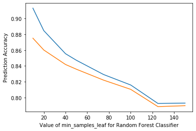
    


```python
scores =[]
for k in [0.1, 0.2, 0.3, 0.4, 0.5]:
    rfReg = RandomForestRegressor(n_estimators=80, min_samples_leaf=50, max_features=k, max_depth=50, max_samples=0.7,n_jobs=-1,random_state=42 , oob_score = True)
    rfReg.fit(X_train, y_train);
    dic_pred = {}
    dic_pred['train'] = rfReg.predict(X_train)
    dic_pred['test'] = rfReg.predict(X_test)
    scores.append([pearsonr(dic_pred['train'],y_train)[0],pearsonr(dic_pred['test'],y_test)[0]])

%matplotlib inline
plt.plot([0.1, 0.2, 0.3, 0.4, 0.5], scores)
plt.xlabel('Value of max_features for Random Forest Classifier')
plt.ylabel('Prediction Accuracy')

#    rfReg = RandomForestRegressor(n_estimators=80, min_samples_leaf=80, max_features=0.33, max_depth=50, max_samples=0.7,n_jobs=-1,random_state=42 , oob_score = True)

```


    Text(0, 0.5, 'Prediction Accuracy')


    
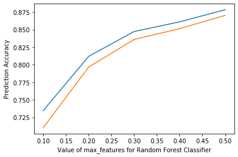
    


### Predict on the raster using pyspatialml

`pip install Pyspatialml`

**prediction with most important variables**


```python
X = predictors[['elv', 'w_basin', 'str_2kvj_dist', 'w_str_w2k_dist', 'dx', 'dy', 'slope', 'w_tci', 'w_spi', 'w_accum']] #remove savi related and stream_j_dist
Y = predictors[['mean']] #response variable
feat = predictors[['elv', 'w_basin', 'str_2kvj_dist', 'w_str_w2k_dist', 'dx', 'dy', 'slope', 'w_tci', 'w_spi', 'w_accum']].columns.values
predictors[['mean']].columns.values
```


    array(['mean'], dtype=object)


```python
X_train, X_test, Y_train, Y_test = train_test_split(X, Y, test_size=0.5, random_state=24) #id. training and testing; split 50/50
y_train = np.ravel(Y_train)
y_test = np.ravel(Y_test)
```


```python
rf = RandomForestRegressor(random_state = 42)
```


```python
rfReg = RandomForestRegressor(n_estimators=80, min_samples_leaf=20, max_depth=100, max_features=0.5, random_state=42 , oob_score = True)

rfReg.fit(X_train, y_train);
dic_pred = {}
dic_pred['train'] = rfReg.predict(X_train)
dic_pred['test'] = rfReg.predict(X_test)
pearsonr_all = [pearsonr(dic_pred['train'],y_train)[0],pearsonr(dic_pred['test'],y_test)[0]] #training vs pred R
pearsonr_all
```


    [0.9133764136610967, 0.8939919955832134]


```python
# checking the oob score
rfReg.oob_score_
```


    0.7855745474283174


```python
plt.rcParams["figure.figsize"] = (8,6)
plt.scatter(y_train,dic_pred['train'])
plt.xlabel('training SAVI mean (all rows)')
plt.ylabel('training prediction')
ident = [0, 0.5]
plt.plot(ident,ident,'r--')
```


    [<matplotlib.lines.Line2D at 0x7f371abf8910>]


    
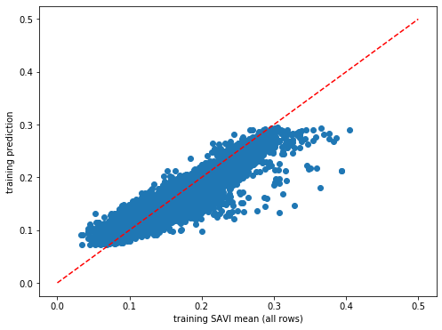
    


```python
impt = [rfReg.feature_importances_, np.std([tree.feature_importances_ for tree in rfReg.estimators_],axis=1)] 
ind = np.argsort(impt[0])
```


```python
ind
```


    array([8, 9, 7, 5, 6, 4, 3, 2, 0, 1])


```python
#feature importance
plt.rcParams["figure.figsize"] = (6,12)
plt.barh(range(len(feat)),impt[0][ind],color="b", xerr=impt[1][ind], align="center")
plt.yticks(range(len(feat)),feat[ind]);
```


    
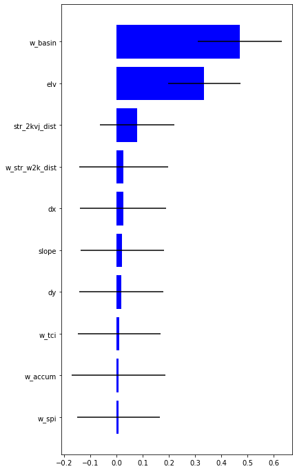
    


**import and stack datasets for prediction**


```python
#Import datasets
elv = rasterio.open("/home/user/my_SE_data/exercise/grassout/elv.tif")
w_basin = rasterio.open("/home/user/my_SE_data/exercise/grassout/w_basin.tif")
str_2kvj_dist = rasterio.open("/home/user/my_SE_data/exercise/grassout/str_2kvj_dist.tif")
w_str_w2k_dist = rasterio.open("/home/user/my_SE_data/exercise/grassout/w_str_w2k_dist.tif")
dx = rasterio.open("/home/user/my_SE_data/exercise/grassout/dx.tif")
dy = rasterio.open("/home/user/my_SE_data/exercise/grassout/dy.tif")
slope = rasterio.open("/home/user/my_SE_data/exercise/grassout/slope.tif")
w_tci = rasterio.open("/home/user/my_SE_data/exercise/grassout/w_tci.tif")
w_spi = rasterio.open("/home/user/my_SE_data/exercise/grassout/w_spi.tif")
w_accum = rasterio.open("/home/user/my_SE_data/exercise/grassout/w_accum.tif")
```


```python
predictors_rasters = [elv, w_basin, str_2kvj_dist, w_str_w2k_dist, dx, dy, slope, w_tci, w_spi, w_accum]
stack = Raster(predictors_rasters)
```


```python
result = stack.predict(estimator=rfReg, dtype='float64', nodata=-1)
```


```python
# plot regression result
plt.rcParams["figure.figsize"] = (12,12)
result.iloc[0].cmap = "plasma"
result.plot()
plt.show()
```


    
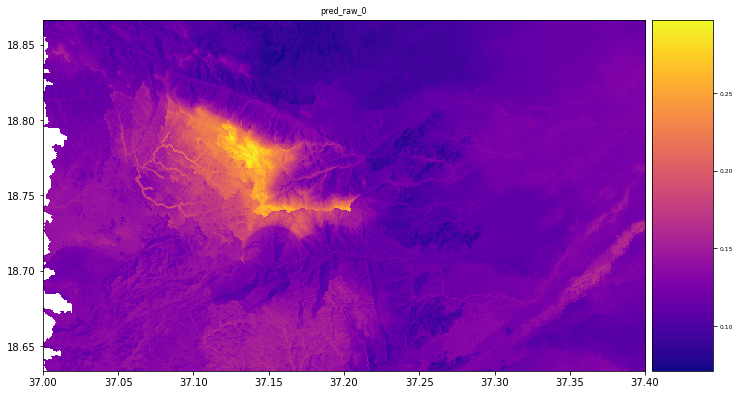
    


```python
import rasterio
from matplotlib import pyplot

src = rasterio.open("/home/user/my_SE_data/exercise/landsat/mean_pyjeo.tif")
pyplot.imshow(src.read(1), cmap='plasma')
pyplot.show()
```


    
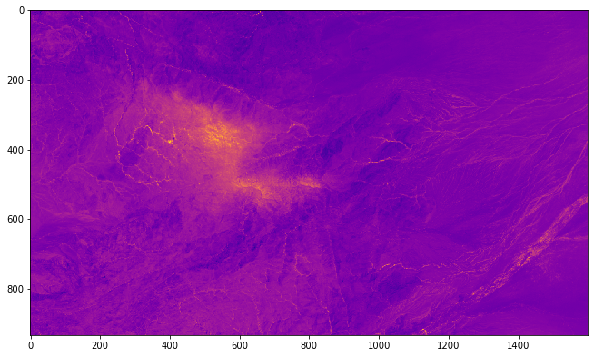
    


## 5 Follow up 

This case study was primarily for learning the tools and how bash, python, grass etc can be combined in one environment. Obviously there are many improvements that can be done for the case study itself. Some are listed below
- consider more explanatory variables and remove w_basin
- test deep learning methods
- look into other response variables that better catch the variability of the environment and try to distinguish among the long-lived and short-lived vegetation
- expand the area to include larger environmental variability

