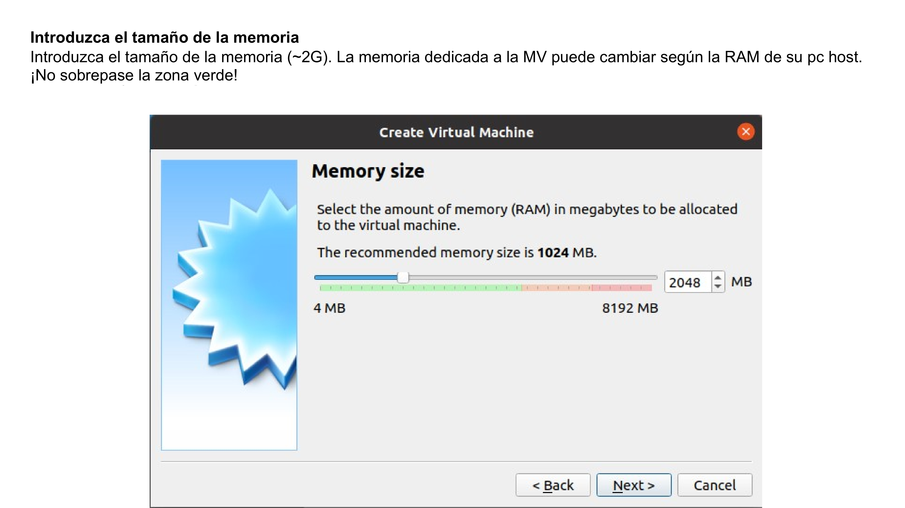
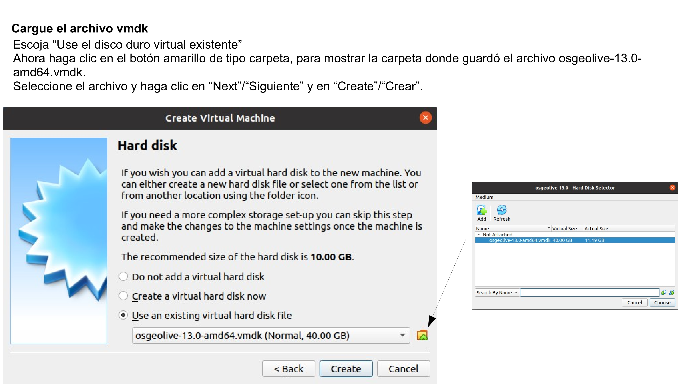
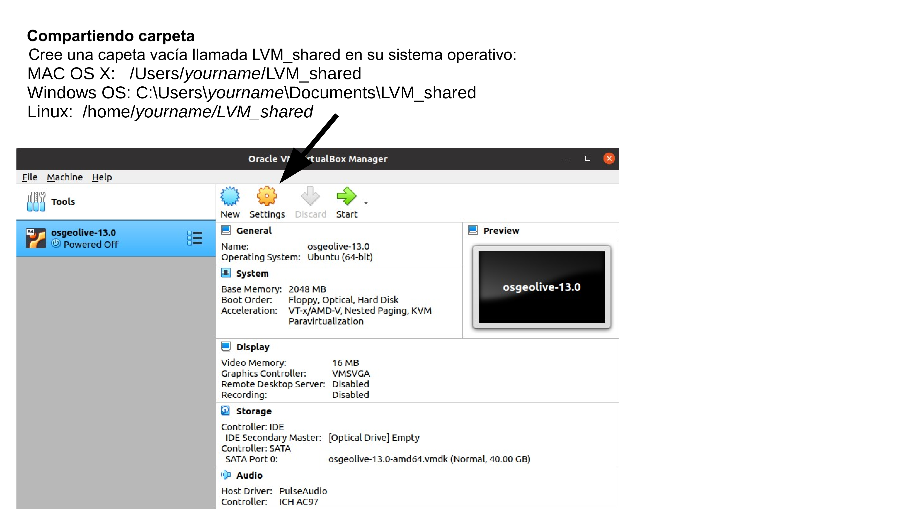
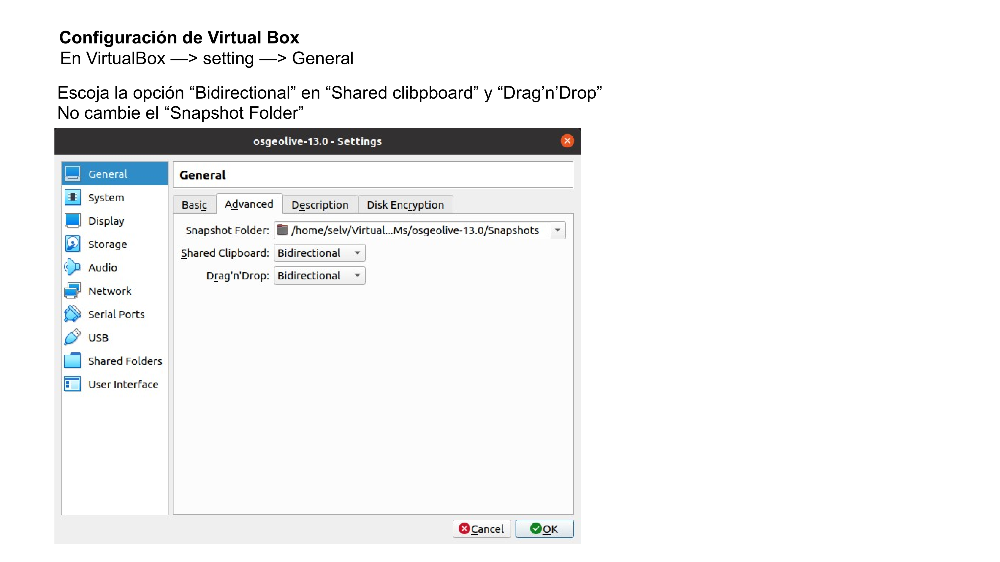
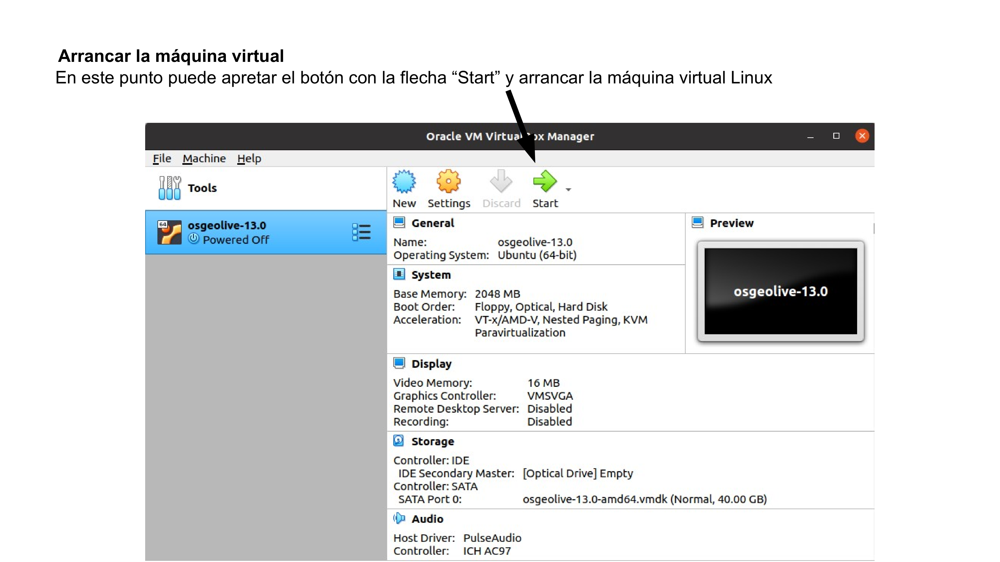
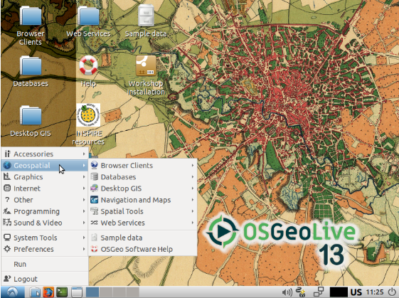

# Prepare OSGeoLive para el curso de ecología espacial

Para ejecutar el ejercicio de Ecología espacial, primero necesitaremos instalar la máquina virtual OSGeoLive Linux y luego completar con software y datos adicionales.

[OSGeoLive](https://live.osgeo.org/en/index.html) es una máquina virtual basada en Lubuntu que se puede arrancar desde un DVD de arranque autónomo o una unidad flash USB. Le permite probar una amplia variedad de aplicaciones geoespaciales, todas ellas de código abierto,  sin instalar nada. Está compuesto completamente de software libre, lo que permite que se distribuya, duplique y pase libremente (fuente https://live.osgeo.org/en/index.html)

Puede seguir las instrucciones a continuación; además, el [video de YouTube de instalación de OSGeoLive](https://youtu.be/wnRkkpaxqBU) le puede servir de guía a lo largo del procedimiento completo.

Para ejecutar una máquina virtual en su sistema operativo, necesitamos un software de virtualización como [Virtualbox](https://www.virtualbox.org/) y un archivo vmdk que contiene el sistema operativo virtualizado.

**Instalación de Virtualbox**

Abra su navegador y vaya a [https://www.virtualbox.org/wiki/Downloads](https://www.virtualbox.org/wiki/Downloads) y, basándose en su sistema operativo, descargue el ejecutable de Virtualbox e instálelo.

**Descarga de OSGeoLive**

Abra su navegador y vaya a [https://sourceforge.net/projects/osgeo-live/files/](https://sourceforge.net/projects/osgeo-live/files/). Haga clic en la carpeta de la última versión y descargue el osgeolive-??.0-amd64.vmdk.7z. En el momento de escribir este artículo, la última versión es la 13, por lo que el archivo vmdk es osgeolive-13.0-amd64.vmdk.7z. El osgeolive-13.0-amd64.vmdk.7z es un archivo bastante grande, por lo tanto, según su conexión a Internet, puede tardar varias horas. 

Cuando finalice la descarga, descomprímalo usando [7zip](https://www.7-zip.org). Los usuarios de Mac pueden usar [The Unarchiver](https://apps.apple.com/in/app/the-unarchiver/id425424353?mt=12) para descomprimir el archivo osgeolive-13.0-amd64.vmdk.7z. En este punto, está listo para cargar el osgeolive-13.0-amd64.vmdk dentro de Virtualbox.

**Instalación de OSGeoLive dentro de Virtualbox**

Lance Virtualbox desde el sistema operativo y siga las instrucciones que tiene a continuación.

**Prueba de la máquina virtual de OSGeoLive**

Si sigue todos los pasos correctamente, la máquina virtual OSGeoLive debería aparecer en la ventana de Virtual Box mostrando algo como esto:

Si la pantalla es muy pequeña, intente ampliarla, y si la ampliación no funciona correctamente, intente reiniciar. En algún momento, la edición para invitados de Virtual Box no se activa, por lo que debe volver a realizar el procedimiento.

Abra el terminal bash (icono verde en la esquina inferior izquierda) y ejecute, línea por línea, los siguientes códigos. La contraseña de sudo es "user" (si no funciona, pruebe "usuario" y, si tampoco funciona, revise cuál es la contraseña sudo en la página de OsGeo desde donde ha descargado la máquina virtual). Por seguridad, lo que escribe no se muestra, de todos modos se registra. Después de escribir la contraseña, presione enter.

Actualice el sistema operativo. Esta operación puede durar unos minutos. Sea paciente. Si durante la instalación, alguna ventana emergente le hace alguna pregunta, simplemente acepte la opción predeterminada.

    sudo apt update      # update the repositories
    sudo apt upgrade -y  # installation of the sw

Agregue un complemento adicional a Virtualbox para mejorar la interfaz gráfica de usuario de la máquina virtual.
Si durante la instalación aparece alguna ventana emergente con alguna pregunta, simplemente acepte la opción predeterminada.
Desde el menú de Virtualbox presione Dispositivo> Insertar imagen de CD de Adición de Invitado (Device > Insert Guest Addition CD image)

    cd /media/user/VBox_GAs_*
    sudo ./VBoxLinuxAdditions.run

Otra prueba que debe hacer es comprobar si la carpeta compartida se ha creado correctamente. Abra una terminal bash y ejecute

    ls /media/sf_LVM_shared
   
Si puede enumerar la carpeta, significa que la operación de compartir la carpeta se realizó correctamente. Además, intente insertar un archivo de su sistema operativo host en la carpeta LVM_shared y vea si está visible en OSGeoLive.

Si recibe un error "ls: cannot access '/media/sf_LVM_shared': No such file or directory" significa que no realizó correctamente la operación de compartir carpeta, así que intente rehacerla.

**Populate OSGeoLive with additional software**

En este punto, la máquina virtual OSGeoLive está lista para instalar software y datos adicionales para ejecutar cursos de Ecología espacial. En el terminal de bash ejecute las siguientes líneas:

    cd /tmp/
    wget https://raw.githubusercontent.com/selvaje/SE_data/main/exercise/00_install_additional_sw_data_4SE_courses.sh
    sudo bash ./00_install_additional_sw_data_4SE_courses.sh

la contraseña de sudo es la misma que antes, en principio, "user".

**Prueba de software adicional instalado**

En el terminal de bash, ejecute las siguientes líneas una por una. Cierre la ventana que aparece cada vez:

Test [pktools](http://pktools.nongnu.org/html/index.html)

    pkfilter --help
 
Debería ver el manual de instrucciones de pkfilter 
 
Test [OpenEV](http://openev.sourceforge.net)
 
    source ~/.bashrc
    openev /home/user/jupyter/notebook_gallery/Rasterio/data/world.rgb.tif /home/user/.local/share/cartopy/shapefiles/natural_earth/physical/ne_110m_land.shp

Debería ver el popup del software openev software py abrir los archivos tif y shp. 

Test  [R studio](https://rstudio.com)

    rstudio

Debería ver el pop-up de RStudio 

## Configuración de Miniconda

    wget https://repo.anaconda.com/miniconda/Miniconda3-latest-Linux-x86_64.sh

Transforme el script de instalación de Miniconda en ejecutable:

    chmod +x Miniconda3-latest-Linux-x86_64.sh

Ejecute el script de instalación de Miniconda:

    ./Miniconda3-latest-Linux-x86_64.sh

Escoja "yes" durante toda la instalación. 

Salga y abra un nuevo terminal.

después de una instalación exitosa, el terminal se verá de la siguiente manera:

   (base) user@osgeolive$
    
Instale jupyter-lab: 
    
    conda install jupyterlab     

## Configuración de Git 

### Acción de la primera vez

Estas líneas descargan los datos de la carpeta 'SE\_data' de github. Si no tiene la carpeta '/home/user/SE\_data' continúe con la descarga. Si ya tiene la carpeta, aparecerá un error: 'fatal: destination path 'SE_data' already exists and is not an empty directory'. Si pasa eso, haga lo siguiente:

    cd 
    git clone https://github.com/selvaje/SE_data.git 
    cp -r SE_data /media/sf_LVM_shared/my_SE_data

Se puede utilizar el mismo procedimiento para restaurar la carpeta SE_data completa.

### Rutina futura

Carpetas:  

~/SE_data : server copy, sync. with cloud  

/media/sf\_LVM\_shared/my\_SE\_data : copia de trabajo, para usted, siempre trabaje aquí.

Proceed with these lines every time we have new class material.

    cd ~/SE_data
    git pull # synchronise with cloud  
    rsync -hvrPt --ignore-existing ~/SE_data/* /media/sf_LVM_shared/my_SE_data # local sync.
    cd /media/sf_LVM_shared/my_SE_data

starting working here.
