# Prepare OSGeoLive for Spatial Ecology courses

In order to execute the Spatial Ecology exercise we will need first install the OSGeoLive Linux Virtual Machine and then populate with additional software and data.

[OSGeoLive](https://live.osgeo.org/en/index.html) is a self-contained bootable DVD, USB thumb drive or Virtual Machine based on Lubuntu, that allows you to try a wide variety of open source geospatial software without installing anything. It is composed entirely of free software, allowing it to be freely distributed, duplicated and passed around (source https://live.osgeo.org/en/index.html)

You can follow the below instructions, moreover the [OSGeoLive installation YouTube video](https://youtu.be/wnRkkpaxqBU) can guide along the full procedure.  

For running a Virtual Machine in your OS we need a virtualization software such as [Virtualbox](https://www.virtualbox.org/) and a vmdk file that contains the virtualized OS.

**Install Virtualbox**

Open you browser and go to [https://www.virtualbox.org/wiki/Downloads](https://www.virtualbox.org/wiki/Downloads) and base on your OS download the Virtualbox executable and install it. 

**Download OSGeoLive**

Open you browser and go to [https://sourceforge.net/projects/osgeo-live/files/](https://sourceforge.net/projects/osgeo-live/files/). Click on the last version-folder and proceed to  download the osgeolive-??.0-amd64.vmdk.7z. At the time of writing the last version is 14 so vmdk file is osgeolive-14.0-amd64.vmdk.7z. The osgeolive-14.0-amd64.vmdk.7z is a quite large file therefore according to your Internet connection it can take several hours. When the download is finished unzipped using [7zip](https://www.7-zip.org). Mac users can use [The Unarchiver](https://apps.apple.com/in/app/the-unarchiver/id425424353?mt=12) for unzip the osgeolive-14.0-amd64.vmdk.7z. A this point you are ready to load the osgeolive-14.0-amd64.vmdk inside Virtualbox.

**Install OSGeoLive inside Virtualbox**

Lunch Virtualbox from OS and follow the below instructions. 

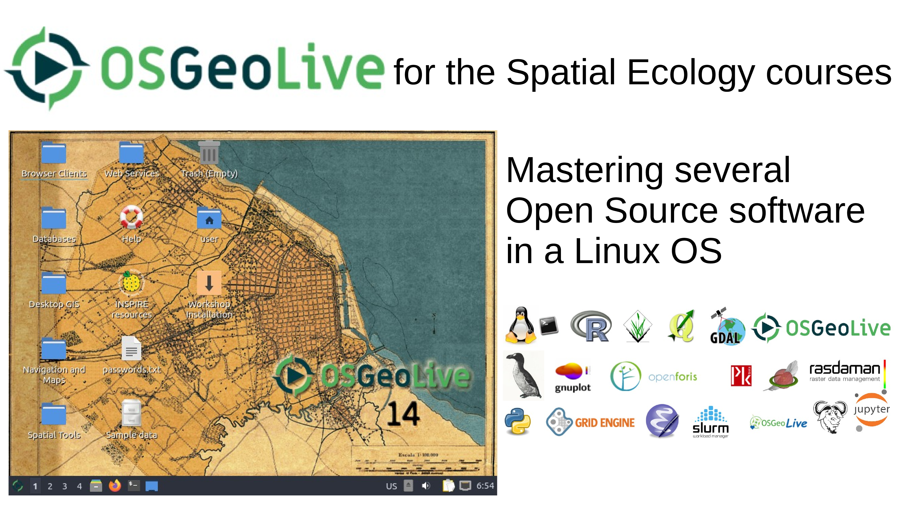

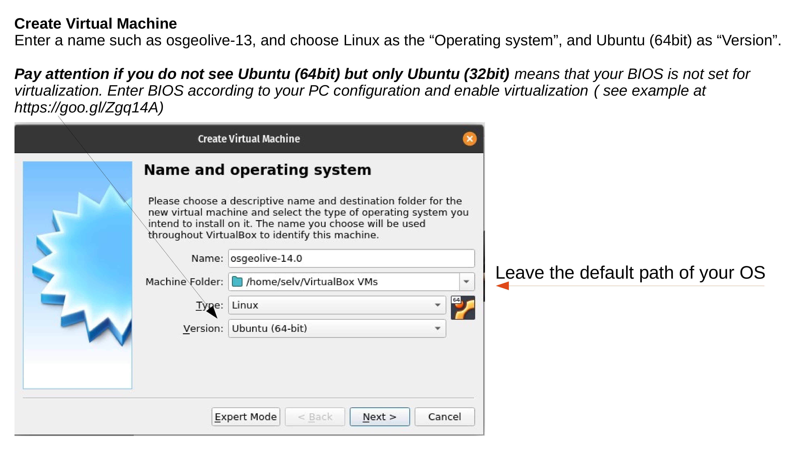

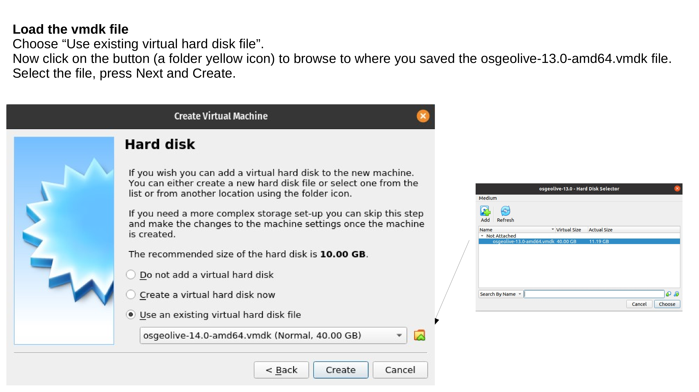
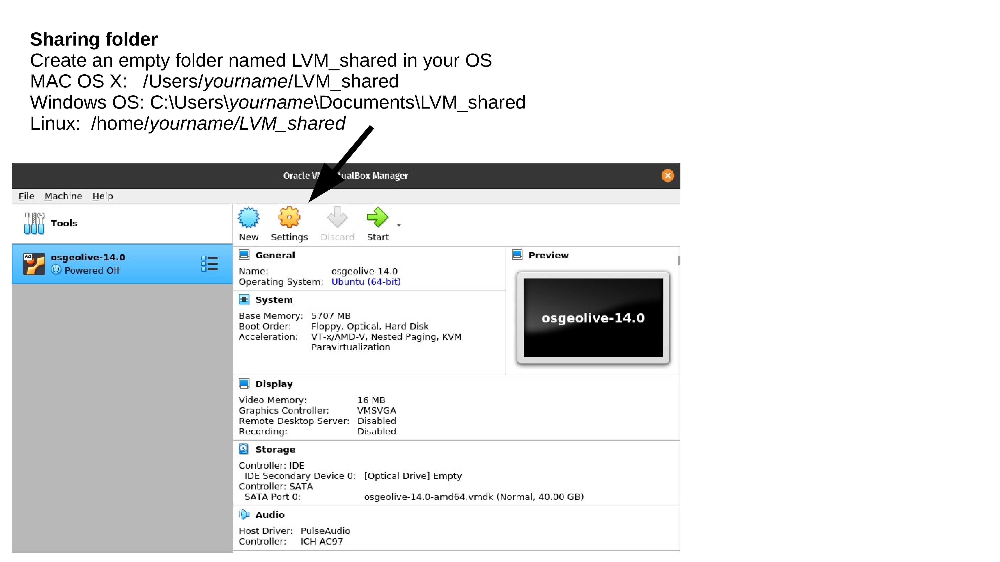
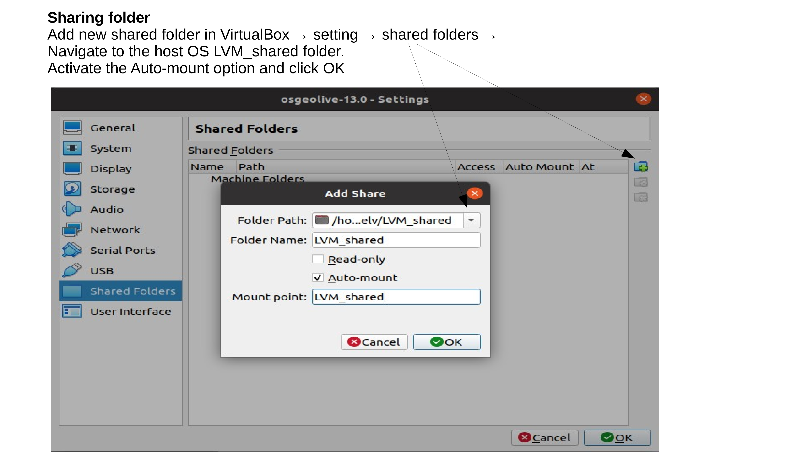

**Test your OSGeoLive Virtual Machine**

If you follow all the steps correctly the OSGeoLive Virtual Machine you should pop-up in the Virtual Box window showing something like this:

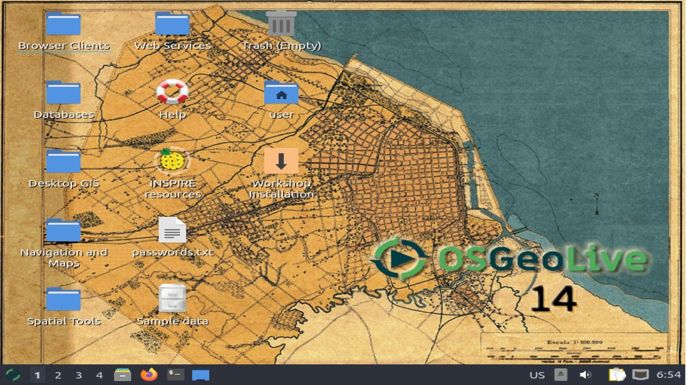

**Setting you keyboard layout**

If are not use the US keyboard you have to add your keyboard layout to the bottom menubar. Therefore on the left bottom corner write "keyboard" in the search box, and select Keyboard and Mouse.

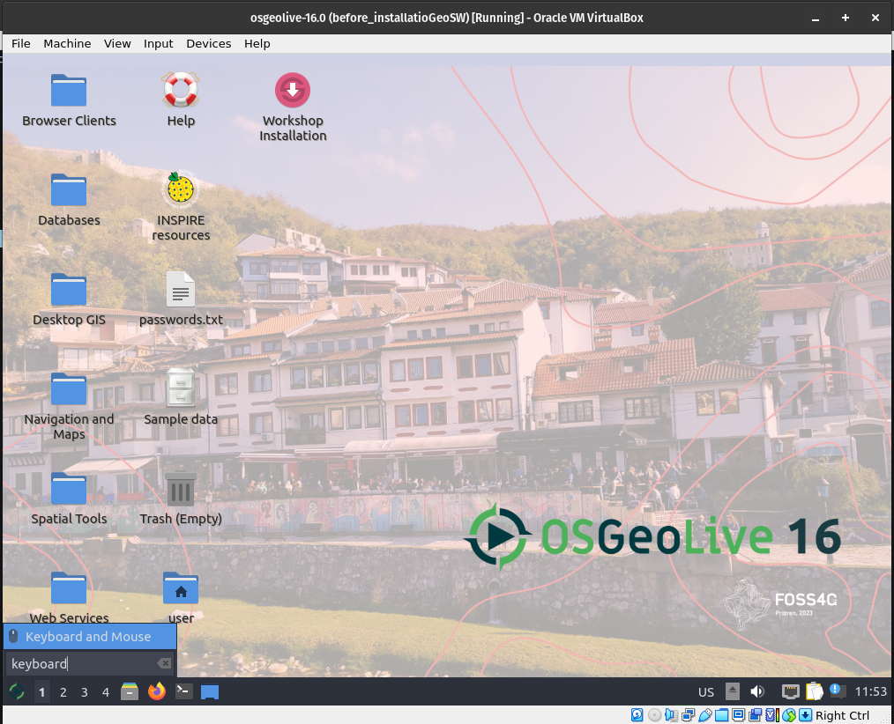

Then select "Keyboard Layout" > "Add" and select your keyboard layout in accordance to your country and language.

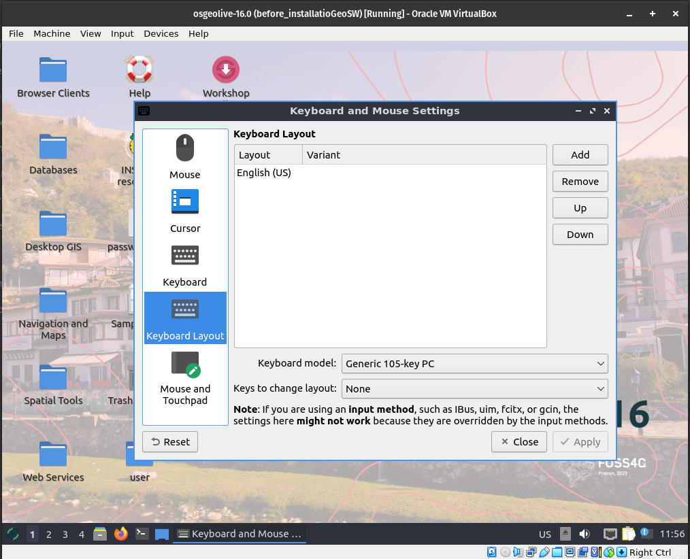

Your keyboard layout will appear as below. Move up to select it as default keyboard layout.

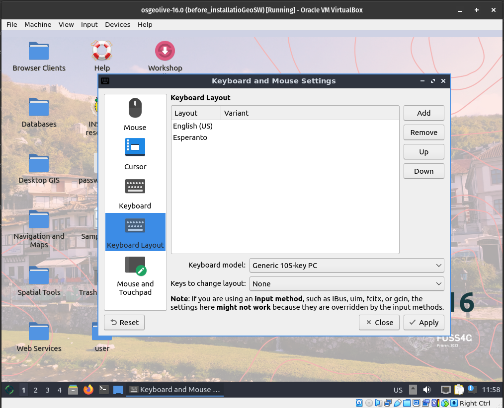

Open the terminal (black icon in the down left corner of the menubar, close to the firefox icon) and test if the keyboard layout is correct. 

**Screen size/resolution of your OSGeoLive Virtual Machine**

If the screen is very small try to enlarge, and if the enlargement is not working properly try to reboot. Sometime the Virtual Box guest edition is not kick-in so you have to do the procedure dscribed below. 

Open the bash terminal and run line by line the following codes. The sudo password is **"user"**. For security what you type is not shown, anyway it is recorded. After typed the password press enter.

Update the OS. This operation can last few minutes. Be patient. If during the installation, some screen pop-up asking some question just accept the default option. 

    sudo apt update      # update the repositories
    sudo apt upgrade -y  # installation of the sw

Add to Virtualbox additional add-on to improve the graphical user interface of the VM.
If during the installation some screen pop-up asking some question just accept the default option.

From the Virtualbox menu press Device > Insert Guest Addition CD image

The download procedure will start and a screen will pop up:

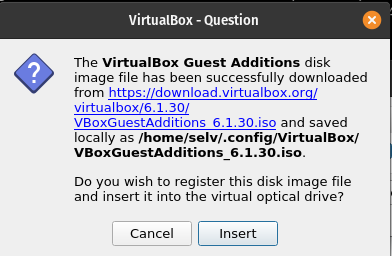

press "insert", and if the below screen pop up 

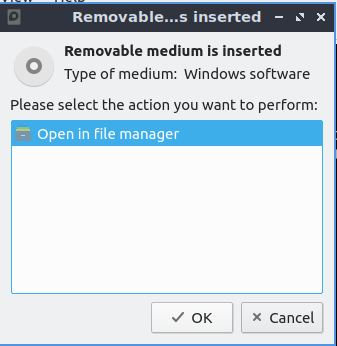

pres "cancel".

Open the terminal and type:

    cd /media/user/VBox_GAs_*
    sudo ./VBoxLinuxAdditions.run

At this point you can reboot your machine. Now all screen setting, screen scale and drag/drop should work properly.

**Test your shared folder**

Another test that you should do, is to see if the shared folder is correctly done. Open a bash terminal and run 

    ls /media/sf_LVM_shared
   
If are able to list the folder then means that the sharing folder operation is properly done. Moreover try to insert a file from your host OS in the LVM_shared folder and see if visible in the OSGeoLive. 

If you get an error "ls: cannot access '/media/sf_LVM_shared': No such file or directory" means that you did not correctly done the sharing folder operation so try to redo it.

**Populate OSGeoLive with additional software**

At this point the OSGeoLive Virtual Machine is ready to install additional software and data for running Spatial Ecology courses. In the bash terminal run the following lines 

    cd /tmp/
    wget https://raw.githubusercontent.com/selvaje/SE_data/main/exercise/install_additional_sw_data_4SE_courses.sh
    sudo bash ./install_additional_sw_data_4SE_courses.sh

as before the sudo password is **"user"**.

**Test installed additional software**

In the bash terminal run the following lines one by one. Close the window that each time pop-up.

Test [pktools](http://pktools.nongnu.org/html/index.html)

    pkfilter --help
 
You should see the pkfilter manual instructions 
 
Test [OpenEV](http://openev.sourceforge.net)
 
    source ~/.bashrc
    openev /home/user/jupyter/notebook_gallery/Rasterio/data/world.rgb.tif

You should see the openev software popup and open the the tif file. 

Test  [R studio](https://rstudio.com)

    rstudio

You should see the rstudio software pop-up

## Git Settings 

The below instructions together with the [Git Setting for the Spatial Ecology courses YouTube video](https://www.youtube.com/watch?v=QzMNHEStG0U&t=6s) can guide along the full procedure to retrive dataset and material for the courses.  

The folder data 'SE\_data' from github will be download and you see under '/home/user/SE\_data'. If you have already the folder it will prompt an error: 'fatal: destination path 'SE_data' already exists and is not an empty directory'.

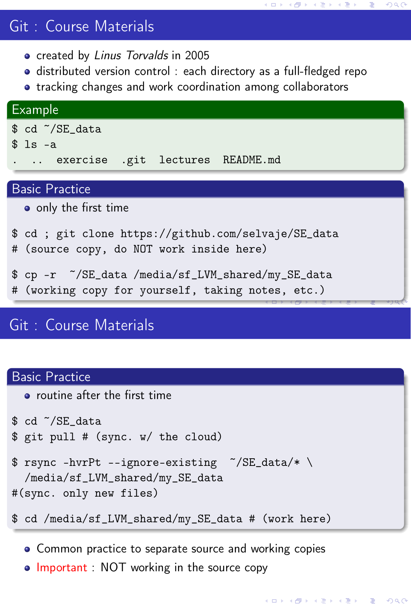

Now you should be ready to follow the lectures of the Spatial Ecology courses.

<!---
## Setting Python Virtual Env.

sudo apt-get install python3-venv
python3 -m venv pyVenv

pip install -U pip
pip install jupyterlab
-->
