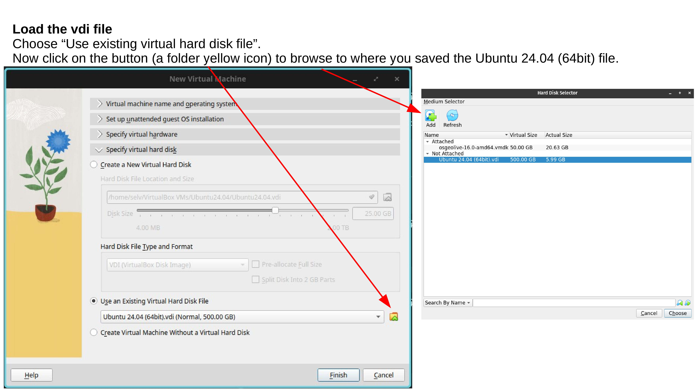
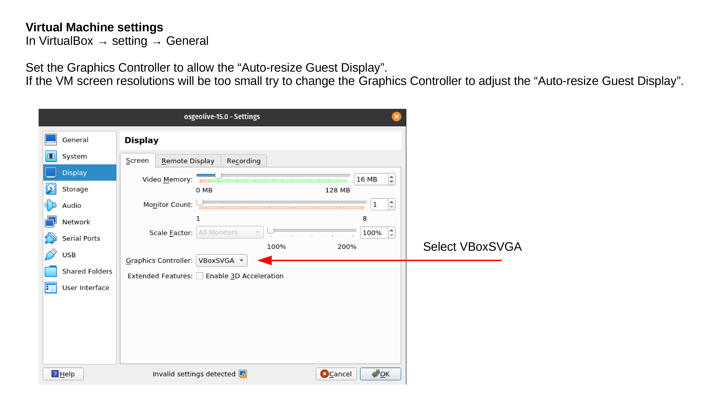
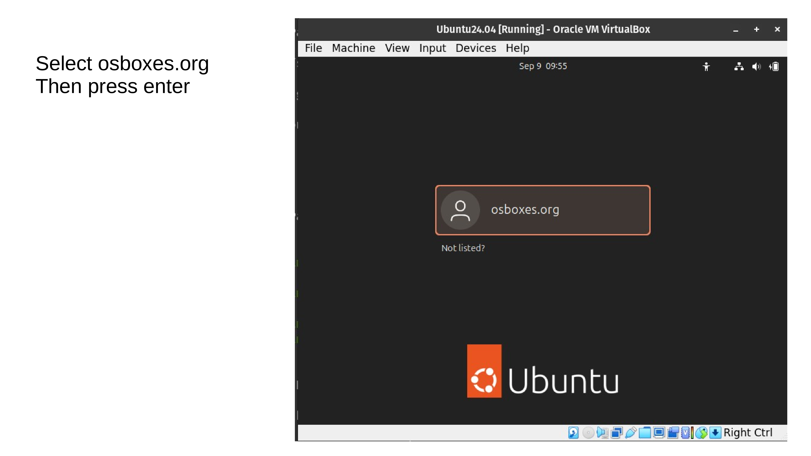
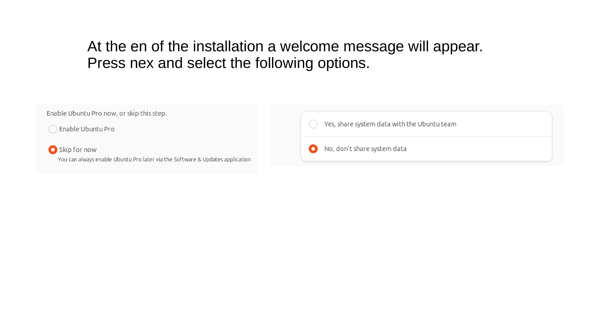

# Prepare Ubuntu 24.04 for Spatial Ecology courses

In order to execute the Spatial Ecology exercise we will need first install the Ubuntu 24.04 Linux Virtual Machine and then populate with additional software and data.

[Ubuntu 24.04 Noble Numbat](https://www.osboxes.org/ubuntu/#ubuntu-24-04-vbox) is a Linux Virtual Machine, that allows you to try a wide variety of open source geospatial software previous installation anything. It is composed entirely of free software, allowing it to be freely distributed, duplicated and passed around.

You can follow the below instructions. Moreover the [Ubuntu 24.04 LTS installation YouTube video](https://youtu.be/wnRkkpaxqBU) even if use another VM image can be used to guide along the full procedure. Pay attention that the video is base on the Osgeolive 13 version, so some differences can be present comparing with the current Ubuntu 24.04 version.

## Software requirements

For running a Virtual Machine in your OS we need a virtualization software such as [Virtualbox](https://www.virtualbox.org/) and a vmdk or vdi  file that contains the virtualized OS.

## Hardware requirements
### Hard disk

Be sure to have at least 60 GIGA of free space in your hard disk before to start the VM installation procedure. Avoid the use of USB-external-hard-disk, due that the USB connection will slow down the VM performance.  

### RAM

Be sure that your computer have at lest 16 GIGA ram (more better). Indeed with the VM running and the zoom session open for following the lecture the 16 GIGA will be barely on the limit.  

## Install Virtualbox

Open you browser and go to [https://www.virtualbox.org/wiki/Downloads](https://www.virtualbox.org/wiki/Downloads) and base on your OS download the Virtualbox executable and install it. Be sure you also install the VirtualBox 7.2.2 Extension Pack.

## Install Ubuntu 24.04 LTS Noble Numbat
### Download Ubuntu 24.04

Open you browser and go to [https://www.osboxes.org](https://www.osboxes.org/ubuntu/#ubuntu-24-04-vbox) and proceed to  download the Ubuntu 24.04 Noble Numbat for VirtualBox. This action will download the 64bit.7z file. The 64bit.7z is a quite large file therefore according to your Internet connection it can take several hours. When the download is finished unzipped using [7zip](https://www.7-zip.org). Mac users can use [The Unarchiver](https://apps.apple.com/in/app/the-unarchiver/id425424353?mt=12) for unzip the 64bit.7z. A this point you are ready to load the Ubuntu 24.04 (64bit).vdi inside Virtualbox.

### Install Ubuntu 24.04 inside Virtualbox

Lunch Virtualbox from OS and follow the below instructions. 

### Test your Ubuntu 24.04 LTS Virtual Machine

If you follow all the steps correctly the Ubuntu 24.04 LTS Virtual Machine  should pop-up in the Virtual Box window showing something like this:

If the Ubuntu 24.04 LTS start with a black screen with a "kernel panic message" means that there are still some settings that are not allowing the virtualization. 
This [page](https://techcult.com/enable-virtualization-windows-10/) is a good tutorial for solving the issues in Windows-10 and [this one](https://www.windowscentral.com/software-apps/windows-11/how-to-enable-virtualization-on-windows-11) for Windows-11. 

### Setting you keyboard layout

If are not use the US keyboard you have to add your keyboard layout to the bottom menubar. Therefore click on the spiral on the left bottom corner and write "keyboard" in the search box, and select in settings Keyboard.

Then select "Add Input Source" > "Add" and select your keyboard layout in accordance to your country and language.

Your keyboard layout will appear as below. Move up to select it as default keyboard layout.

Open the terminal and test if the keyboard layout is correct. 

### Update the OS

The first operation after the installation is to run un update of the OS. Therefore, open the bash terminal and run line by line the following codes. The sudo password is **"user"**. For security what you type is not shown, anyway it is recorded. After typed the password press enter.

Update the OS. This operation can last few minutes. Be patient. If during the installation, some screen pop-up asking some question just accept the default option. 

    sudo apt update      # update the repositories
    sudo apt upgrade -y  # installation of the sw
    sudo apt autoremove -y

## Guest Additions 7.2.2 installation for your Ubuntu 24.04 LTS Virtual Machine

VirtualBox Guest Additions enable better performance and functionality in virtual machines, including shared clipboard/drag and drop, shared folders, improved graphics support, and seamless app windows. **Thus, it is very important that you install it correctly.** 

### Install the Virtual Box guest edition with the GUI

First we will need remove the 7.0 version and then install the 7.2.2.

From the Virtualbox menu press Device > Insert Guest Addition CD image

Then open the terminal and run 

    sudo apt-get remove --purge virtualbox-guest-dkms virtualbox-guest-utils virtualbox-guest-x11 virtualbox-guest-additions-iso -y
    sudo apt autoremove -y  

    sudo apt update
    sudo apt install -y build-essential dkms linux-headers-$(uname -r)

    cd /media/osboxes/VBox_GAs_7.2.2
    sudo sh ./VBoxLinuxAdditions.run

At this point you can reboot your machine. Now all screen setting, screen scale (View -> Auto-resize Guest Display) and drag/drop should work properly.

## Activate the shared folder

Another test that you should do, is to see if the shared folder is correctly done. Open a bash terminal and run 

    ls /media/sf_LVM_shared
   
If are able to list the folder then means that the sharing folder operation is properly done. Moreover try to insert a file from your host OS in the LVM_shared folder and see if visible in the Ubuntu 24.04 LTS. 

If you get an error "ls: cannot access '/media/sf_LVM_shared': No such file or directory" means that you did not correctly done the sharing folder operation or the Virtual Box Guest Additions installation, thus try to redo it.

If you get permission denied in accessing '/media/sf_LVM_shared' run this commands

    sudo usermod -a -G vboxsf osboxes
    sudo chown -R osboxes:osboxes /media/sf_LVM_shared

**You will need to reboot to make the folder accessible.**

## Activate Clipboard and Drag & Drop

To activate the Clipboard and Drag & Drop run this line in the terminal

    VBoxClient --clipboard
    VBoxClient --draganddrop

## Populate Ubuntu 24.04 LTS with additional software
### Install geo-software
At this point the Ubuntu 24.04 LTS Virtual Machine is ready to install additional software and data for running Spatial Ecology courses. In the bash terminal run the following lines 

    cd /tmp/
    wget https://raw.githubusercontent.com/selvaje/SE_data/refs/heads/master/exercise/install_additional_sw_data_4SE_courses.sh 
    sudo bash ./install_additional_sw_data_4SE_courses.sh

as before the sudo password is **osboxes.org**.

### Test installed additional software

In the bash terminal run the following lines one by one. Close the window that each time pop-up.

Test [gdal](https://gdal.org/en/stable/#)

    gdal_translate --version 

You should see the gdal version GDAL 3.8.4, released 2024/02/08

Test [pktools](http://pktools.nongnu.org/html/index.html)

    pkfilter --help
 
You should see the pkfilter manual instructions.
 
Test [OpenEV](http://openev.sourceforge.net)
 
    source ~/.bashrc
    openev /home/user/jupyter/notebook_gallery/Rasterio/data/world.rgb.tif

You should see the openev software popup and open the the tif file. 

<!---

Test  [R studio](https://rstudio.com)

    rstudio

You should see the rstudio software pop-up

--->

## Git Settings 

The below instructions together with the [Git Setting for the Spatial Ecology courses YouTube video](https://www.youtube.com/watch?v=QzMNHEStG0U&t=6s) can guide along the full procedure to retrieve dataset and material for the courses.   

We are going to retrieve dataset and material for the first time using *git clone*.

    
    cd                                 # enter in user home
    git clone https://github.com/selvaje/SE_data  # download the data 

If the download succeed you should see the *SE_data* folder 

    ls -l $HOME/SE_data 

Now we need copy the $HOME/SE_data to an independent directory the:  
*/media/sf\_\LVM\_shared/my\_SE\_data*

    rsync -hvrPt --ignore-existing ~/SE_data/* /media/sf_LVM_shared/my_SE_data
    cd /media/sf_LVM_shared/my_SE_data

The */media/sf_LVM_shared/my_SE_data* is your working directory. Do not touch the *~/SE_data* folder!! 

---

Every time that we need to download more data from the git repository, follow this procedure 

    cd $HOME/SE_data
    git pull
    rsync -hvrPt --ignore-existing $HOME/SE_data/* /media/sf_LVM_shared/my_SE_data
    cd /media/sf_LVM_shared/my_SE_data

Now you should be ready to follow the lectures of the Spatial Ecology courses.  
Remember always to work on */media/sf\_LVM\_shared/my\_SE\_data*

---

If for any reason the *git pull* commands give a synchronized error you need to remove the *$HOME/SE_data* and repeat the *git clone* and *rsync* operation.

    cd
    rm -ry $HOME/SE_data
    git clone https://github.com/selvaje/SE_data
    rsync -hvrPt --ignore-existing $HOME/SE_data/* /media/sf_LVM_shared/my_SE_data
    cd /media/sf_LVM_shared/my_SE_data

## Install jupyter lab

We are going to use jupyter lab as main scripting editor. Here how to install 

    sudo apt install pipx
    pipx ensurepath
    pipx install jupyterlab
    echo 'export PATH=$PATH:$HOME/.local/bin' >> ~/.bashrc
    source ~/.bashrc

Test jupyter lab

    jupyter lab /media/sf_LVM_shared/my_SE_data/exercise/grass_hydro.ipynb

Get familiar with the jupyter lab GUI.

<!---

## Settings for running jupyterlab

The below instructions are needed to create a python virtual environment (in this case juplab_env) that need to be activate via "source ~/juplab__env/bin/activate" everytime that you wanna use jupyterlab 

    sudo apt install python3.8-venv
    python3 -m venv juplab_env
    ## allow to use system python packages
    sed 's/false/true/g' ~/juplab_env/pyvenv.cfg > ~/juplab_env/pyvenv_tmp.cfg ;
    mv ~/juplab_env/pyvenv_tmp.cfg ~/juplab_env/pyvenv.cfg
    
    source ~/juplab_env/bin/activate    ### run this line everytime wanna use jupyterlab
    pip install -U pip
    pip3 install jupyterlab

--->