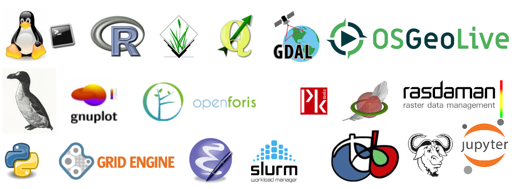

.. _mainindex:

===================================================================
Free & OpenSource Software Documentation for BigGeoData Processing
===================================================================

**Welcome to the Spatial Ecology's documentation!** The content of this documentation is free and open source, (CC-BY-SA license) it can be used, but WITHOUT ANY WARRANTY. You can remix, tweak, and build upon our work as long as you credit us and license your new creations under the identical terms. Software we use have a GNU General Public License GPL or GPL / MIT compatible licenses.

Table of Contents 
============================================

.. toctree::
   :maxdepth: 1
   :caption: COURSE TRAINERS

   COURSETRAINERS/index

.. toctree::
   :maxdepth: 1      
   :caption: COURSES AROUND THE WORLD

   COURSESAROUNDTHEWORLD/index

.. toctree::
   :maxdepth: 1      
   :caption: GEO DATA

   GEODATA/index

.. toctree::
   :maxdepth: 1      
   :caption: LINUX VIRTUAL MACHINE

   VIRTUALMACHINE/index
   
.. toctree::
   :maxdepth: 1      
   :caption: WEB SEMINARS

   WEBSEMINAR/index
      
.. toctree::
   :maxdepth: 1
   :caption: BASH

   BASH/index

.. toctree::
   :maxdepth: 1
   :caption: AWK

   AWK/index

.. toctree::
   :maxdepth: 1   
   :caption: GDAL

   GDAL/index
   
.. toctree::
   :maxdepth: 1      
   :caption: PKTOOLS

   PKTOOLS/index

.. toctree::
   :maxdepth: 1         
   :caption: R

   R/index

.. toctree::
   :maxdepth: 1            
   :caption: PYTHON

   PYTHON/index

.. toctree::
   :maxdepth: 1            
   :caption: GRASS

   GRASS/index

.. toctree::
   :maxdepth: 1               
   :caption: CASE STUDY

   CASESTUDY/index

.. toctree::
   :numbered:                         
   :caption: Students Projects
	      
   STUDENTSPROJECTS/index
	     
.. toctree::
   :titlesonly:                      
   :caption: OUTDOOR
   
   OUTDOOR/index

.. toctree::
   :maxdepth: 1                        
   :caption: TALKS

   TALKS/index
   
.. toctree::
   :maxdepth: 1                        
   :caption: ADMIN

   ADMIN/index

Indices and tables
==================

* :ref:`genindex`
* :ref:`modindex`
* :ref:`search`

